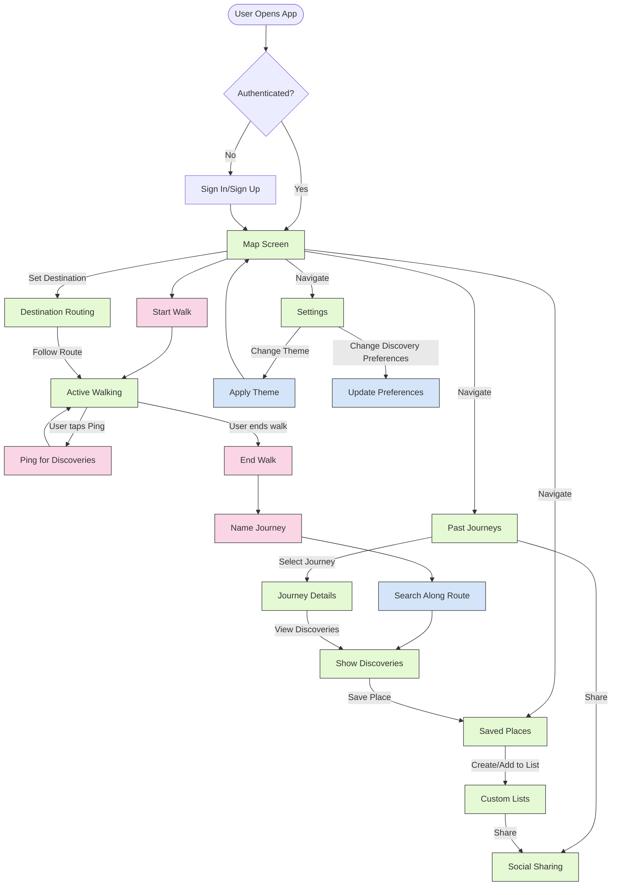
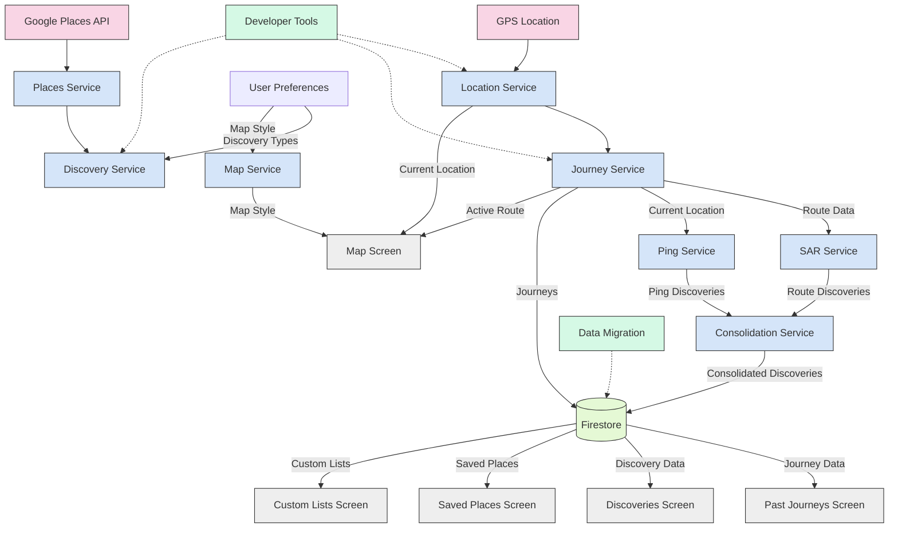

# Hero's Path - Feature Map

This document provides a visual overview of all features in the Hero's Path application and their relationships, based on our comprehensive specification system.

## Core Feature Architecture

```mermaid
graph TD
    %% Tier 1 - Critical Core Features
    Auth[User Authentication] --> UserContext[User Context]
    MapNav[Map Navigation & GPS] --> BgLocation[Background Location]
    BgLocation --> JourneyTrack[Journey Tracking]
    JourneyTrack --> SAR[Search Along Route]
    
    %% Tier 2 - Important User Features
    JourneyTrack --> PastJourneys[Past Journeys Review]
    SAR --> DiscoveryConsol[Discovery Consolidation]
    Ping[Ping Discovery] --> DiscoveryConsol
    DiscoveryPref[Discovery Preferences] --> SAR
    DiscoveryPref --> Ping
    DiscoveryConsol --> SavedPlaces[Saved Places]
    
    %% Developer Tools (Core) - Reprioritized to Tier 2
    DevTools[Developer Tools (Core)] -.-> MapNav
    DevTools -.-> JourneyTrack
    DevTools -.-> Ping
    DevTools -.-> SAR
    
    %% Data Migration (Core) - Reprioritized to Tier 2
    DataMigration[Data Migration (Core)] -.-> Auth
    DataMigration -.-> JourneyTrack
    DataMigration -.-> SavedPlaces
    
    %% Tier 3 - Enhancement Features
    ThemeSystem[Theme & Map Style] --> MapNav
    JourneyTrack --> JourneyCompletion[Journey Completion]
    SavedPlaces --> CustomLists[Custom Lists]
    EnhancedPlaces[Enhanced Places Integration] --> SAR
    EnhancedPlaces --> Ping
    PerfOpt[Performance Optimization] --> DiscoveryConsol
    PerfOpt --> PastJourneys
    MapNav --> DestRouting[Destination Routing]
    JourneyTrack --> Gamification
    SavedPlaces --> Gamification
    
    %% Tier 4 - Advanced Features
    Auth --> SocialSharing[Social Sharing]
    CustomLists --> SocialSharing
    PastJourneys --> SocialSharing
    Gamification --> SocialSharing
    
    DevToolsAdv[Developer Tools (Advanced)] -.-> Gamification
    DevToolsAdv -.-> SocialSharing
    
    DataMigrationAdv[Data Migration (Advanced)] -.-> CustomLists
    DataMigrationAdv -.-> SocialSharing
    
    SavedPlaces --> GMapsIE[Google Maps Import/Export]
    CustomLists --> GMapsIE
    
    %% Styling
    classDef tier1 fill:#f9d5e5,stroke:#333,stroke-width:2px;
    classDef tier2 fill:#eeeeee,stroke:#333,stroke-width:1px;
    classDef tier3 fill:#d5e5f9,stroke:#333,stroke-width:1px;
    classDef tier4 fill:#e5f9d5,stroke:#333,stroke-width:1px;
    
    %% Apply styles
    class Auth,UserContext,MapNav,JourneyTrack,BgLocation,SAR tier1;
    class Ping,DiscoveryPref,PastJourneys,SavedPlaces,DiscoveryConsol,DevTools,DataMigration tier2;
    class ThemeSystem,JourneyCompletion,EnhancedPlaces,PerfOpt,CustomLists,DestRouting,Gamification tier3;
    class SocialSharing,DevToolsAdv,DataMigrationAdv,GMapsIE tier4;
```

## User Flow Diagram



## Data Flow Diagram



## Feature Dependency Matrix

| Feature                     | Dependencies                                                | Extension Points                                |
| --------------------------- | ----------------------------------------------------------- | ---------------------------------------------- |
| User Authentication         | Firebase                                                    | Social profiles, Third-party auth              |
| Map Navigation & GPS        | Google Maps API, Location Permissions                       | Custom overlays, Multiple visualization modes  |
| Journey Tracking            | Background Location Service, User Context                   | Metadata extensions, Social attributes         |
| Background Location         | Platform Location Permissions                               | Multiple tracking modes, Accuracy levels       |
| Search Along Route (SAR)    | Google Places API, Journey Tracking                         | Enhanced filtering, AI recommendations         |
| Ping Discovery              | Google Places API, Location Tracking                        | Enhanced animations, Gamification integration  |
| Discovery Preferences       | User Profiles, Places API                                   | Theme-based discovery, Additional preferences  |
| Past Journeys Review        | Journey Storage, Map Integration                            | Social sharing, Gamification overlays         |
| Saved Places Management     | Discovery System, Google Places API                         | Custom list associations, Export capabilities  |
| Discovery Consolidation     | SAR System, Ping System                                     | Enhanced place data, Performance optimizations |
| Developer Tools (Core)      | Development Environment                                     | Advanced testing capabilities                  |
| Data Migration (Core)       | Database Schema, Version Management                         | Complex migration paths                        |
| Theme & Map Style           | Theme Context, Google Maps Styling                          | Additional themes, Custom styling              |
| Journey Completion          | Journey Tracking, User Interface                            | Enhanced metadata, Social sharing              |
| Enhanced Places Integration | Google Places API, API Keys                                 | Additional data sources, AI enhancements       |
| Performance Optimization    | Database Optimization, Caching Strategy                     | Predictive caching, Analytics                  |
| Custom Lists                | Saved Places Management                                     | Sharing, Templates, Tags                       |
| Destination Routing         | Map Navigation, Journey Tracking                            | Additional routing modes, Waypoints            |
| Gamification               | Journey Tracking, Saved Places                              | Achievements, Levels, Challenges               |
| Social Sharing              | User Authentication, Past Journeys, Custom Lists            | Friend system, Activity feed, Challenges       |
| Google Maps Import/Export   | Saved Places, Custom Lists                                 | Additional platform integrations               |

## Recommended Development Sequence

Based on dependencies and feature priorities, here's the recommended development sequence:

### Phase 1: Foundation
1. User Authentication
2. Map Navigation & GPS
3. **Developer Tools (Core)**
4. Background Location
5. **Data Migration (Core)**

### Phase 2: Core Features
1. Journey Tracking
2. Search Along Route (SAR)
3. Discovery Preferences
4. Ping Discovery
5. **Performance Optimization (Core)**

### Phase 3: User Experience
1. Discovery Consolidation
2. Past Journeys Review
3. Saved Places
4. Theme & Map Style
5. Journey Completion

### Phase 4: Enhancements
1. Enhanced Places Integration
2. **Developer Tools (Enhanced)**
3. **Data Migration (Enhanced)**
4. **Performance Optimization (Enhanced)**
5. Custom Lists
6. Destination Routing

### Phase 5: Advanced Features
1. Gamification
2. Social Sharing
3. **Developer Tools (Advanced)**
4. **Data Migration (Advanced)**
5. Google Maps Import/Export

## Implementation Status

| Feature                     | Status      | Completion % | Notes                                |
| --------------------------- | ----------- | ------------ | ------------------------------------ |
| User Authentication         | Implemented | 100%         | Firebase-based                       |
| Map Navigation & GPS        | Implemented | 100%         | Google Maps integration              |
| Journey Tracking            | Implemented | 100%         | Complete with metadata               |
| Background Location         | Implemented | 100%         | With permission management           |
| Search Along Route          | Implemented | 100%         | Using Google Places API              |
| Ping Discovery              | Implemented | 90%          | Animation needs enhancement          |
| Discovery Preferences       | Implemented | 100%         | Complete with UI                     |
| Past Journeys Review        | Implemented | 100%         | With visualization                   |
| Saved Places Management     | Implemented | 100%         | Complete with UI                     |
| Discovery Consolidation     | Implemented | 100%         | With deduplication                   |
| Developer Tools (Core)      | Planned     | 0%           | **Reprioritized from Tier 4**        |
| Data Migration (Core)       | Planned     | 0%           | **Reprioritized from Tier 4**        |
| Theme & Map Style           | Implemented | 100%         | 3 themes, 5 map styles               |
| Journey Completion          | Implemented | 100%         | With naming workflow                 |
| Enhanced Places Integration | Implemented | 100%         | With AI summaries                    |
| Performance Optimization    | Implemented | 100%         | 95% API call reduction               |
| Custom Lists                | Planned     | 0%           | New feature                          |
| Destination Routing         | Planned     | 0%           | New feature                          |
| Gamification               | Planned     | 0%           | New feature                          |
| Social Sharing              | Partial     | 30%          | Basic implementation                 |
| Google Maps Import/Export   | Planned     | 0%           | New feature                          |

## Relationship to Steering Files

This feature map aligns with and complements the steering files:

- **product.md**: Reflects the product description, core features, and value proposition
- **tech.md**: Aligns with the technical stack, dependencies, and architecture
- **structure.md**: Follows the project structure and organization patterns

For more details on the overall product vision and technical approach, refer to the steering files in `.kiro/steering/`.