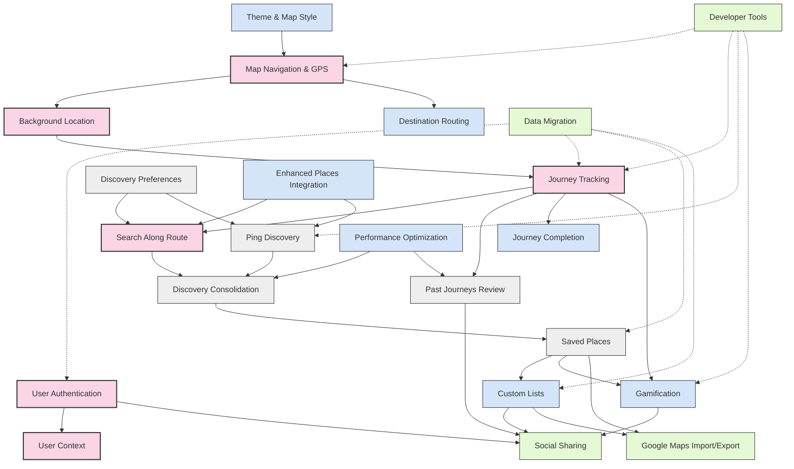

# Hero's Path - Feature Dependency Analysis

## Dependency Graph

## Key Dependencies and Extension Points

### Tier 1 (Critical) Features - Extension Points Needed

1. **User Authentication**
   - **Extension Points Needed**:
     - User profile data structure should support social features
     - Authentication flow should allow for third-party auth (Google for Maps integration)
   - **Dependent Features**: Social Sharing, Google Maps Import/Export

2. **Map Navigation & GPS**
   - **Extension Points Needed**:
     - Map component should support multiple overlay types (for Gamification)
     - Route visualization should be extensible (for custom styling)
     - Map controls should be modular (for Destination Routing)
   - **Dependent Features**: Theme & Map Style, Destination Routing, Gamification

3. **Journey Tracking**
   - **Extension Points Needed**:
     - Journey data model should support metadata extensions (for Gamification)
     - Journey storage should support social sharing attributes
     - Route data should support "painted streets" concept
   - **Dependent Features**: Journey Completion, Gamification, Social Sharing

4. **Background Location**
   - **Extension Points Needed**:
     - Location tracking should support different modes (for Destination Routing)
     - Location data should include accuracy for street coverage calculation
   - **Dependent Features**: Destination Routing, Gamification

5. **Search Along Route (SAR)**
   - **Extension Points Needed**:
     - Discovery algorithm should support preference-based filtering
     - API integration should support Enhanced Places features
   - **Dependent Features**: Discovery Consolidation, Enhanced Places Integration

### Tier 2 (Important) Features - Extension Points Needed

1. **Ping Discovery**
   - **Extension Points Needed**:
     - Animation system should support enhanced animations
     - Credit system should integrate with Gamification
   - **Dependent Features**: Enhanced Ping Animation, Gamification

2. **Discovery Preferences**
   - **Extension Points Needed**:
     - Preference system should support theme-based discovery (for Destination Routing)
     - UI should be extensible for additional preference types
   - **Dependent Features**: Destination Routing, Enhanced Places Integration

3. **Past Journeys Review**
   - **Extension Points Needed**:
     - Journey list should support social sharing indicators
     - Journey data should support gamification overlays
   - **Dependent Features**: Social Sharing, Gamification

4. **Saved Places**
   - **Extension Points Needed**:
     - Place data model should support custom list associations
     - UI should allow for Google Maps export options
   - **Dependent Features**: Custom Lists, Google Maps Import/Export

5. **Discovery Consolidation**
   - **Extension Points Needed**:
     - Consolidation logic should support enhanced place data
     - Performance optimizations should be built-in
   - **Dependent Features**: Enhanced Places Integration, Performance Optimization

## Potential Conflicts and Gaps

### Identified Conflicts

1. **Gamification vs. Data Privacy**
   - **Conflict**: Gamification features track extensive user behavior, which may conflict with privacy principles
   - **Resolution**: Ensure clear opt-in for gamification features and separate data storage

2. **Performance Optimization vs. Enhanced Features**
   - **Conflict**: Performance optimizations may limit data richness needed for enhanced features
   - **Resolution**: Implement tiered data loading with progressive enhancement

3. **Developer Tools Priority**
   - **Conflict**: Developer Tools are in Tier 4 but needed earlier for testing other features
   - **Resolution**: Consider moving core Developer Tools components to Tier 2

4. **Data Migration Priority**
   - **Conflict**: Data Migration is in Tier 4 but needed for evolving data structures
   - **Resolution**: Consider moving to Tier 2 or implementing incrementally across tiers

### Identified Gaps

1. **Offline Support**
   - **Gap**: No clear specification for offline functionality across features
   - **Recommendation**: Add offline support requirements to relevant specs

2. **Error Handling Consistency**
   - **Gap**: Inconsistent error handling approaches across features
   - **Recommendation**: Standardize error handling patterns across all specs

3. **Accessibility Requirements**
   - **Gap**: Varying levels of accessibility consideration across features
   - **Recommendation**: Establish consistent accessibility requirements

4. **Cross-Platform Testing**
   - **Gap**: Insufficient cross-platform testing specifications
   - **Recommendation**: Enhance Developer Tools spec with platform-specific testing

## Terminology Consistency

The following terms should be used consistently across all specs:

1. **Journey** (not "route", "path", or "walk") - A recorded walking session
2. **Discovery** (not "place" or "POI") - A point of interest found during a journey
3. **Ping** (not "scan" or "search") - The action of discovering nearby places in real-time
4. **Saved Place** (not "favorite" or "bookmark") - A discovery saved by the user

## Recommendations for Spec Updates

### Priority Adjustments

1. **Move to Tier 2**:
   - Core components of Developer Tools (journey simulation, location simulation)
   - Basic Data Migration framework

2. **Phased Implementation**:
   - Implement Developer Tools incrementally across tiers
   - Build Data Migration capabilities alongside feature development

### Extension Point Additions

1. **User Authentication**:
   - Add social profile data structure
   - Include third-party auth support

2. **Map Navigation & GPS**:
   - Add support for custom overlays
   - Implement modular map controls

3. **Journey Tracking**:
   - Extend data model for gamification
   - Add sharing attributes

4. **Saved Places**:
   - Add custom list associations
   - Include export capabilities

### Consistency Improvements

1. **Standardize Error Handling**:
   - Define common error handling patterns
   - Update all specs to follow these patterns

2. **Align with Steering Files**:
   - Ensure all specs follow technical guidance in tech.md
   - Verify feature descriptions match product.md
   - Confirm implementation follows structure.md patterns