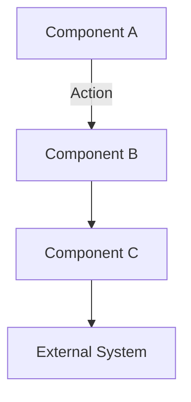

# Design Document: [Feature Name]

## Overview

[Provide a comprehensive overview of the feature's design, including its purpose, scope, and how it fits into the overall architecture of the application.]

## Architecture

[Describe the high-level architecture of the feature, including its major components and how they interact.]

### System Context Diagram



[Explain the diagram and key interactions.]

## Components and Interfaces

### Component 1: [Name]

[Describe the component's purpose and responsibilities.]

```javascript
// Example code or interface definition
function componentOneFunction(param1, param2) {
  // Implementation details
}
```

#### Key Features:
- [Feature 1]
- [Feature 2]
- [Feature 3]

### Component 2: [Name]

[Describe the component's purpose and responsibilities.]

```javascript
// Example code or interface definition
class ComponentTwo {
  constructor(dependencies) {
    // Initialization
  }
  
  methodOne() {
    // Implementation
  }
}
```

## Data Models

### Model 1: [Name]

```javascript
{
  property1: Type,
  property2: Type,
  nestedProperty: {
    subProperty1: Type,
    subProperty2: Type
  }
}
```

[Explain the data model, its properties, and their purposes.]

### Model 2: [Name]

```javascript
{
  property1: Type,
  property2: Type
}
```

[Explain the data model, its properties, and their purposes.]

## Error Handling

### Potential Failure Points and Mitigations

1. **[Failure Point 1]**
   - **Detection**: [How the failure is detected]
   - **Mitigation**: [How the failure is mitigated]
   - **Fallback**: [Fallback strategy if mitigation fails]

2. **[Failure Point 2]**
   - **Detection**: [How the failure is detected]
   - **Mitigation**: [How the failure is mitigated]
   - **Fallback**: [Fallback strategy if mitigation fails]

## Testing Strategy

### Unit Tests

[Describe the approach to unit testing this feature.]

- Test [specific functionality 1]
- Test [specific functionality 2]
- Test [edge case 1]

### Integration Tests

[Describe the approach to integration testing this feature.]

- Test [integration point 1]
- Test [integration point 2]

### User Testing

[Describe any user testing considerations for this feature.]

## Accessibility Considerations

[Describe how the feature addresses accessibility requirements.]

1. **[Accessibility Consideration 1]**
   - [Implementation details]

2. **[Accessibility Consideration 2]**
   - [Implementation details]

## Performance Considerations

[Describe performance considerations and optimizations for this feature.]

1. **[Performance Consideration 1]**
   - [Implementation details]

2. **[Performance Consideration 2]**
   - [Implementation details]

## Implementation Plan

[Outline the high-level implementation plan for this feature.]

1. **Phase 1: [Name]**
   - [Implementation step 1]
   - [Implementation step 2]

2. **Phase 2: [Name]**
   - [Implementation step 1]
   - [Implementation step 2]

## Integration Points

[Describe how this feature integrates with other parts of the application.]

### Integration with [Component/Feature]

```javascript
// Example integration code
import { ComponentX } from '../components/ComponentX';

// Integration code
```

[Explain the integration details.]

## Future Enhancements

[Describe potential future enhancements for this feature.]

1. **[Enhancement 1]**: [Description]
2. **[Enhancement 2]**: [Description]