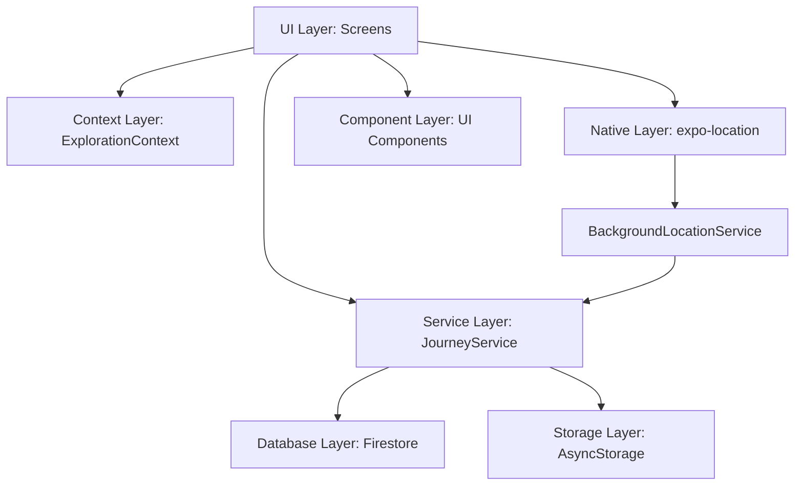

# Design Document: Journey Tracking & Recording

## Overview

The Journey Tracking & Recording feature is a core component of the Hero's Path application that enables users to record their walking routes with GPS coordinates, visualize their paths in real-time, and save completed journeys for later review. This document outlines the technical design and architecture for implementing this feature, ensuring it meets all the requirements specified in the requirements document.

The feature consists of several key components:
1. Real-time GPS tracking with background location support
2. Route visualization with animated polylines
3. Journey data management and storage
4. Journey completion workflow with naming and metadata
5. Past journeys review and management interface
6. Integration with discovery systems

## Architecture

The Journey Tracking & Recording feature follows a layered architecture pattern that separates concerns and promotes maintainability:



### Key Components:

1. **UI Layer**: 
   - MapScreen.js: Primary interface for journey tracking and visualization
   - PastJourneysScreen.js: Interface for viewing and managing saved journeys
   - Journey naming modal component for the completion workflow

2. **Service Layer**:
   - JourneyService.js: Core service for journey data management
   - BackgroundLocationService.js: Handles location tracking in background

3. **Context Layer**:
   - ExplorationContext.js: Manages exploration history and segments
   - UserContext.js: Provides user authentication and profile data

4. **Database Layer**:
   - Firestore collections for persistent journey storage
   - AsyncStorage for local caching and temporary data

5. **Native Layer**:
   - expo-location: Provides access to device location services
   - react-native-maps: Renders map and route visualization

## Dependencies and Extensions

### Dependent Features
- [Ping Discovery](link-to-spec) - Uses journey data for discovery consolidation
- [Past Journeys Review](link-to-spec) - Displays journey history and statistics
- [Discovery Consolidation](link-to-spec) - Associates discoveries with journey segments
- [Gamification](link-to-spec) - Tracks journey completion for achievements
- [Social Sharing](link-to-spec) - Enables sharing of journey routes and statistics

### Extension Points
- **Metadata Extensions**: Support for gamification metadata and social sharing attributes
  - Used by: [Gamification](link-to-spec), [Social Sharing](link-to-spec)
  - Implementation: Journey metadata includes achievement triggers and sharing preferences

- **Route Visualization**: Extensible route display for custom styling
  - Used by: [Theme & Map Style](link-to-spec), [Gamification](link-to-spec)
  - Implementation: Route rendering supports custom styles and gamification overlays

- **Completion Tracking**: Journey completion and achievement integration
  - Used by: [Gamification](link-to-spec), [Journey Completion](link-to-spec)
  - Implementation: Journey completion events trigger achievement system

- **Migration Support**: Schema version tracking and migration history
  - Used by: [Data Migration](link-to-spec)
  - Implementation: Journey data includes version tracking and migration utilities

### Migration Considerations
- Schema version: 1.0
- Migration requirements: Journey data structure changes require version tracking
- Backward compatibility: Yes, with migration utilities for legacy data

### Developer Tools Integration
- Testing support: Journey simulation and mock location data
- Mock data support: Generate test journeys with predefined routes
- Simulation capabilities: Simulate journey tracking for testing

### Performance Optimization
- Caching strategy: Journey data cached locally with periodic sync
- Optimization hooks: Batch processing for coordinate storage
- Performance considerations: Adaptive location sampling and route simplification

## Components and Interfaces

### 1. JourneyService

The central service responsible for managing journey data throughout its lifecycle.

```typescript
interface JourneyService {
  // Create a new journey record
  createJourney(userId: string, journeyData: JourneyData): Promise<Result>;
  
  // Get a specific journey by ID
  getJourney(userId: string, journeyId: string): Promise<Result>;
  
  // Get all journeys for a user
  getUserJourneys(userId: string): Promise<Result>;
  
  // Update journey information
  updateJourney(userId: string, journeyId: string, updates: Partial<JourneyData>): Promise<Result>;
  
  // Delete a journey and associated data
  deleteJourney(userId: string, journeyId: string): Promise<Result>;
  
  // Get journey statistics
  getJourneyStats(userId: string): Promise<Result>;
  
  // Consolidate discoveries for a journey
  consolidateJourneyDiscoveries(userId: string, journeyId: string, routeCoords: Coordinates[]): Promise<Result>;
  
  // NEW: Migration support
  migrateJourneyData(userId: string, fromVersion: number, toVersion: number): Promise<Result>;
  
  // NEW: Developer tools support
  createMockJourney(userId: string, mockData: MockJourneyData): Promise<Result>;
  
  // NEW: Performance optimization
  batchUpdateJourneys(userId: string, updates: JourneyUpdate[]): Promise<Result>;
  
  // NEW: Extension points
  updateJourneyMetadata(journeyId: string, metadata: JourneyMetadata): Promise<Result>;
}
```

### 2. BackgroundLocationService

Handles location tracking with background support, ensuring continuous recording even when the app is minimized.

```typescript
interface BackgroundLocationService {
  // Initialize the service
  initialize(): Promise<boolean>;
  
  // Start tracking a new journey
  startTracking(journeyId: string, options?: TrackingOptions): Promise<boolean>;
  
  // Stop tracking and return journey data
  stopTracking(): Promise<JourneyData | null>;
  
  // Pause tracking temporarily
  pauseTracking(): Promise<void>;
  
  // Resume tracking after pause
  resumeTracking(): Promise<boolean>;
  
  // Get current location
  getCurrentLocation(): Promise<LocationCoordinates>;
  
  // Set callback for location updates
  setLocationUpdateCallback(callback: LocationUpdateCallback): void;
  
  // Clean up resources
  cleanup(): Promise<void>;
  
  // NEW: Different tracking modes
  setTrackingMode(mode: 'continuous' | 'destination' | 'optimized'): Promise<void>;
  
  // NEW: Accuracy tracking
  getAccuracyStats(): Promise<AccuracyStats>;
  
  // NEW: Developer tools
  simulateLocation(coordinates: LocationCoordinates[]): Promise<void>;
  
  // NEW: Performance optimization
  setOptimizationLevel(level: 'battery' | 'accuracy' | 'balanced'): Promise<void>;
}
```

### 3. MapScreen

The primary UI component for journey tracking, implementing the following functionality:

```typescript
interface MapScreenState {
  currentPosition: LocationCoordinates | null;
  tracking: boolean;
  currentJourneyId: string | null;
  pathToRender: LocationCoordinates[];
  savedRoutes: Journey[];
  savedPlaces: Place[];
  showSavedPlaces: boolean;
  locationAccuracy: number | null;
  
  // NEW: Extension points
  customOverlays: MapOverlay[];
  routeStyles: RouteStyle[];
  gamificationOverlays: GamificationOverlay[];
}
```

### 4. PastJourneysScreen

Interface for viewing and managing saved journeys:

```typescript
interface PastJourneysScreenState {
  journeys: Journey[];
  loading: boolean;
  journeyStatuses: Record<string, boolean>;
  
  // NEW: Extension points
  socialSharingEnabled: boolean;
  gamificationStats: GamificationStats;
}
```

### 5. ExplorationContext

Context for tracking explored segments and journey history:

```typescript
interface ExplorationContextState {
  segments: RouteSegment[];
  currentJourney: Journey | null;
  
  // NEW: Extension points
  achievementProgress: AchievementProgress;
  socialSharingData: SocialSharingData;
}
```

## Data Models

### 1. Journey Model

Represents a saved walking journey with route data and metadata.

```typescript
interface Journey {
  id: string;
  userId: string;
  name: string;
  startTime: number;
  endTime: number;
  route: LocationCoordinates[];
  distance: number;
  duration: number;
  status: 'completed' | 'in_progress';
  isCompleted?: boolean;
  reviewedDiscoveriesCount?: number;
  totalDiscoveriesCount?: number;
  completionPercentage?: number;
  createdAt: Timestamp;
  updatedAt: Timestamp;
  
  // NEW: Migration framework support
  schemaVersion: number;
  lastMigrationAt?: string;
  migrationHistory?: {
    version: number;
    migratedAt: string;
    changes: string[];
  }[];
  
  // NEW: Developer tools support
  devMode?: boolean;
  mockData?: boolean;
  
  // NEW: Performance optimization
  lastUpdated: string;
  cacheKey?: string;
  
  // NEW: Extension points for future features
  metadata?: {
    gamification?: {
      achievementTriggers: string[];
      progressMetrics: string[];
      completionRewards: string[];
    };
    socialSharing?: {
      shareable: boolean;
      privacyLevel: 'public' | 'friends' | 'private';
      shareableContent: string[];
    };
    routeVisualization?: {
      customStyle?: string;
      overlayData?: any;
      animationSettings?: any;
    };
  };
  extensions?: Record<string, any>;
}
```

### 2. LocationCoordinates Model

Represents a single GPS coordinate with timestamp and accuracy data.

```typescript
interface LocationCoordinates {
  latitude: number;
  longitude: number;
  timestamp: number;
  accuracy?: number;
  altitude?: number;
  heading?: number;
  speed?: number;
  
  // NEW: Enhanced accuracy tracking
  accuracyLevel?: 'high' | 'medium' | 'low';
  streetCoverage?: boolean;
  
  // NEW: Performance optimization
  processed?: boolean;
  cacheKey?: string;
}
```

### 3. JourneyData Model

Represents the data collected during a journey tracking session.

```typescript
interface JourneyData {
  id: string;
  coordinates: LocationCoordinates[];
  startTime: number;
  endTime: number;
  distance: number;
  duration: number;
  startLocation?: string;
  endLocation?: string;
  
  // NEW: Migration framework support
  schemaVersion: number;
  lastMigrationAt?: string;
  
  // NEW: Developer tools support
  devMode?: boolean;
  mockData?: boolean;
  
  // NEW: Performance optimization
  lastUpdated: string;
  cacheKey?: string;
  
  // NEW: Extension points
  metadata?: Record<string, any>;
  extensions?: Record<string, any>;
}
```

### 4. RouteSegment Model

Represents a segment of a route for exploration tracking.

```typescript
interface RouteSegment {
  start: LocationCoordinates;
  end: LocationCoordinates;
  timestamp: number;
  
  // NEW: Extension points
  metadata?: {
    discoveries?: string[];
    achievements?: string[];
    socialData?: any;
  };
}
```

### 5. NEW: JourneyMetadata Model

Represents extensible metadata for journeys.

```typescript
interface JourneyMetadata {
  gamification?: {
    achievementTriggers: string[];
    progressMetrics: string[];
    completionRewards: string[];
    levelProgress?: number;
    experienceGained?: number;
  };
  
  socialSharing?: {
    shareable: boolean;
    privacyLevel: 'public' | 'friends' | 'private';
    shareableContent: string[];
    sharedAt?: string;
    shareCount?: number;
  };
  
  routeVisualization?: {
    customStyle?: string;
    overlayData?: any;
    animationSettings?: any;
    themeCompatible?: boolean;
  };
  
  completion?: {
    achievements?: string[];
    badges?: string[];
    completionDate?: string;
    completionTime?: number;
  };
}
```

### 6. NEW: MockJourneyData Model

Represents mock data for developer tools.

```typescript
interface MockJourneyData {
  name: string;
  route: LocationCoordinates[];
  startTime: number;
  endTime: number;
  distance: number;
  duration: number;
  mockType: 'test' | 'demo' | 'simulation';
  metadata?: JourneyMetadata;
}
```

### 7. NEW: AccuracyStats Model

Represents accuracy statistics for location tracking.

```typescript
interface AccuracyStats {
  averageAccuracy: number;
  accuracyDistribution: {
    high: number;
    medium: number;
    low: number;
  };
  streetCoveragePercentage: number;
  totalCoordinates: number;
  filteredCoordinates: number;
}
```

## Error Handling

The Journey Tracking & Recording feature implements comprehensive error handling to ensure reliability:

1. **Location Permission Errors**:
   - Clear user prompts for required permissions
   - Graceful degradation when permissions are denied
   - Automatic retry mechanisms for temporary permission issues

2. **Network Connectivity Issues**:
   - Local caching of journey data during offline periods
   - Automatic synchronization when connectivity is restored
   - Clear user feedback about sync status

3. **GPS Accuracy Problems**:
   - Filtering of low-accuracy coordinates
   - Visual indicators of current GPS accuracy
   - Adaptive sampling rates based on accuracy

4. **Storage Failures**:
   - Transaction-based updates to prevent partial data
   - Retry mechanisms for failed storage operations
   - Data integrity validation before storage

5. **Background Tracking Interruptions**:
   - Detection of tracking interruptions
   - Recovery mechanisms for app restarts
   - Data persistence for journey information

## Testing Strategy

### 1. Unit Tests:
   - Test JourneyService methods for CRUD operations
   - Test distance calculation algorithms
   - Test coordinate processing and filtering
   - Test journey naming and validation logic

2. **Integration Tests**:
   - Test interaction between MapScreen and BackgroundLocationService
   - Test journey saving and loading workflow
   - Test deletion with associated data cleanup
   - Test background tracking with app state changes

3. **End-to-End Tests**:
   - Test complete journey recording workflow
   - Test background tracking functionality
   - Test journey review and management
   - Test integration with discovery system

4. **Performance Tests**:
   - Test with large route datasets
   - Test background tracking battery usage
   - Test storage requirements for journey data
   - Test UI responsiveness during tracking

## Security Considerations

1. **User Data Protection**:
   - Journey data is associated with user accounts
   - Access control rules in Firestore
   - No sharing of journey data without explicit consent

2. **Location Privacy**:
   - Clear permission requests with purpose explanation
   - No location tracking when not explicitly enabled
   - Option to delete location history

3. **Local Processing**:
   - Process location data on-device when possible
   - Only upload journey data when explicitly saved by user

4. **Secure Storage**:
   - Encrypt locally stored location data
   - Use secure Firebase storage for saved journeys

5. **User Control**:
   - Allow users to delete their journey data
   - Provide clear tracking indicators

## Implementation Plan

The implementation will follow these high-level steps:

1. Set up data models and storage schema
2. Implement BackgroundLocationService with expo-location
3. Develop JourneyService for data management
4. Implement tracking UI in MapScreen
5. Create journey completion workflow with naming
6. Develop PastJourneysScreen for journey management
7. Integrate with discovery systems
8. Implement comprehensive error handling
9. Add performance optimizations
10. Conduct thorough testing

## Platform-Specific Considerations

### iOS:
- Request "Always" location permission for background tracking
- Handle iOS-specific background mode restrictions
- Optimize for battery usage with significant location changes

### Android:
- Implement foreground service for reliable background tracking
- Handle Android location permission model differences
- Use Android-specific optimizations for battery efficiency

## Future Enhancements

1. Journey statistics and analytics
2. Route sharing capabilities
3. Journey categorization and tagging
4. Integration with health and fitness data
5. Advanced visualization options
6. Journey comparison features
7. Offline maps for remote areas
8. Journey export to standard formats (GPX, KML)
9. Journey search and filtering
10. AI-powered insights about walking patterns