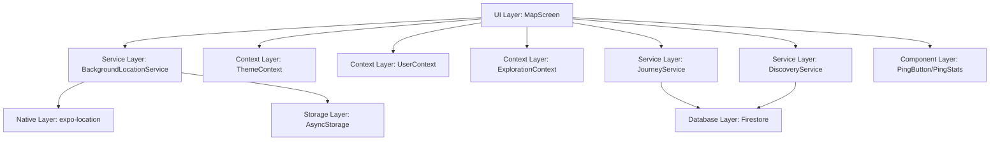

# Design Document

## Overview

The Map Navigation & GPS feature is the central experience of Hero's Path, combining interactive maps, real-time location tracking, route visualization, and character animation to create an engaging walking experience. This document outlines the technical design and architecture of this feature, detailing how the various components work together to deliver a seamless user experience.

The feature transforms ordinary walks into adventures by displaying an animated Link sprite that moves and changes direction as the user walks, drawing a glowing path behind them, and enabling discovery of interesting places along their route. It handles complex challenges like GPS accuracy, background tracking, battery optimization, and cross-platform compatibility.

## ⚠️ Critical Migration Note (Dec 2024)

**RESOLVED ISSUE**: A critical bug was discovered where the app was configured for `expo-maps` but the MapScreen component was using `react-native-maps` API, causing white screen issues. The migration from react-native-maps to expo-maps was incomplete.

**Solution Implemented**: Updated MapScreen.js to use expo-maps API (`AppleMaps` for iOS, `GoogleMaps` for Android) with platform-specific components and data-driven marker/polyline rendering instead of JSX children.

**Key Changes Made**:
- Import: `import { AppleMaps, GoogleMaps } from 'expo-maps'` instead of `import MapView from 'react-native-maps'`
- Platform-specific components: iOS uses `AppleMaps`, Android uses `GoogleMaps`
- Data-driven rendering: Markers and polylines passed as props, not JSX children
- Camera positioning: `cameraPosition` instead of `initialRegion`
- Removed provider logic: expo-maps handles providers automatically

## Architecture

The Map Navigation & GPS feature follows a layered architecture pattern:



### Key Components:

1. **MapScreen (UI Layer)**: The main interface component that renders the map, sprite, controls, and handles user interactions.

2. **BackgroundLocationService (Service Layer)**: Manages all location-related functionality, including permissions, tracking, filtering, and background operation.

3. **ThemeContext (Context Layer)**: Provides theme-aware styling for the map and UI elements.

4. **JourneyService (Service Layer)**: Handles saving, loading, and managing journey data.

5. **DiscoveryService (Service Layer)**: Manages place discovery functionality along routes.

## Components and Interfaces

### 1. MapScreen Component

The MapScreen is the primary UI component that users interact with. It integrates all the other components and services.

**Key Responsibilities:**
- Render the map with appropriate styling
- Display the animated Link sprite
- Show route polylines for current and past journeys
- Provide UI controls for tracking, locating, and map interactions
- Handle permission requests and warnings
- Manage journey saving workflow

**Interface:**
```typescript
interface MapScreenProps {
  navigation: NavigationProp;
  route: RouteProp;
}

// State Interface
interface MapScreenState {
  currentPosition: LocationCoordinates | null;
  tracking: boolean;
  currentJourneyId: string | null;
  pathToRender: LocationCoordinates[];
  savedRoutes: Journey[];
  savedPlaces: Place[];
  showSavedPlaces: boolean;
  isLocating: boolean;
  spriteState: SpriteState;
  backgroundPermissionWarning: boolean;
  mapError: string | null;
  locationAccuracy: number | null;
}
```

### 2. BackgroundLocationService

This service centralizes all location-related functionality, providing a clean API for the UI layer.

**Key Responsibilities:**
- Request and manage location permissions
- Track user location in foreground and background
- Filter and smooth location data
- Manage location subscriptions and lifecycle
- Provide callbacks for location updates
- Handle app state transitions (foreground/background)

**Interface:**
```typescript
interface BackgroundLocationService {
  initialize(): Promise<boolean>;
  startTracking(journeyId: string, options?: TrackingOptions): Promise<boolean>;
  stopTracking(): Promise<JourneyData | null>;
  pauseTracking(): Promise<void>;
  resumeTracking(): Promise<boolean>;
  getCurrentLocation(options?: LocationOptions): Promise<LocationCoordinates>;
  setLocationUpdateCallback(callback: LocationUpdateCallback): void;
  getStatus(): LocationStatus;
  checkPermissions(): Promise<PermissionStatus>;
  cleanup(): void;
}

interface LocationCoordinates {
  latitude: number;
  longitude: number;
  timestamp: number;
  accuracy?: number;
}

interface JourneyData {
  id: string;
  startTime: number;
  endTime: number;
  coordinates: LocationCoordinates[];
  isActive: boolean;
  duration: number;
}
```

### 3. Sprite Animation System

The sprite animation system visualizes the user's movement with a character that changes direction based on movement.

**Key Components:**
- Sprite state management
- Direction calculation
- Animation rendering

**Interface:**
```typescript
enum SpriteState {
  IDLE = 'idle',
  WALK_DOWN = 'walk_down',
  WALK_UP = 'walk_up',
  WALK_LEFT = 'walk_left',
  WALK_RIGHT = 'walk_right'
}

interface SpriteProps {
  position: LocationCoordinates;
  state: SpriteState;
  size: number;
}

function getDirection(points: [LocationCoordinates, LocationCoordinates]): SpriteState;
```

### 4. Map Styling System

The map styling system allows users to customize the map appearance with different themes and styles.

**Key Components:**
- Theme-aware map styling
- Custom style definitions for different modes
- Platform-specific provider handling

**Interface:**
```typescript
interface MapStyle {
  name: string;
  styleArray: any[];
  preview: string;
}

interface MapProviderOptions {
  provider: 'google' | 'default';
  platform: 'ios' | 'android';
}
```

## Data Models

### 1. Journey Model

Represents a saved walking journey with route data and metadata.

```typescript
interface Journey {
  id: string;
  userId: string;
  name: string;
  startTime: number;
  endTime: number;
  route: LocationCoordinates[];
  distance: number;
  duration: number;
  status: 'in_progress' | 'completed';
}
```

### 2. Location Model

Represents a single GPS location point with accuracy information.

```typescript
interface Location {
  coords: {
    latitude: number;
    longitude: number;
    altitude: number | null;
    accuracy: number;
    heading: number | null;
    speed: number | null;
  };
  timestamp: number;
}
```

### 3. Place Model

Represents a saved place or point of interest.

```typescript
interface Place {
  id: string;
  name: string;
  latitude: number;
  longitude: number;
  vicinity: string;
  placeId: string;
  types: string[];
  saved: boolean;
  
  // NEW: Migration framework support
  schemaVersion: number;
  lastMigrationAt?: string;
  
  // NEW: Developer tools support
  devMode?: boolean;
  mockData?: boolean;
  
  // NEW: Performance optimization
  lastUpdated: string;
  cacheKey?: string;
  
  // NEW: Extension points for future features
  metadata?: Record<string, any>;
  extensions?: Record<string, any>;
}
```

### 4. NEW: Map Overlay Model

Represents custom overlays for gamification and enhanced features.

```typescript
interface MapOverlay {
  id: string;
  type: 'gamification' | 'custom' | 'achievement' | 'social';
  coordinates: LocationCoordinates[];
  style: OverlayStyle;
  data: Record<string, any>;
  visible: boolean;
  priority: number;
  
  // Migration framework support
  schemaVersion: number;
  lastMigrationAt?: string;
  
  // Developer tools support
  devMode?: boolean;
  mockData?: boolean;
  
  // Performance optimization
  lastUpdated: string;
  cacheKey?: string;
}

interface OverlayStyle {
  color: string;
  opacity: number;
  width: number;
  pattern?: 'solid' | 'dashed' | 'dotted';
  animation?: 'pulse' | 'fade' | 'none';
}
```

### 5. NEW: Map Control Model

Represents modular map controls for extensible functionality.

```typescript
interface MapControl {
  id: string;
  type: 'button' | 'slider' | 'toggle' | 'custom';
  position: 'top-left' | 'top-right' | 'bottom-left' | 'bottom-right' | 'center';
  icon?: string;
  label: string;
  action: string;
  enabled: boolean;
  visible: boolean;
  
  // Migration framework support
  schemaVersion: number;
  lastMigrationAt?: string;
  
  // Developer tools support
  devMode?: boolean;
  mockData?: boolean;
  
  // Performance optimization
  lastUpdated: string;
  cacheKey?: string;
}
```

## Error Handling

The Map Navigation & GPS feature implements comprehensive error handling to ensure a smooth user experience even when things go wrong:

1. **Permission Denials**: 
   - Clear explanations when permissions are denied
   - Guidance on how to enable permissions
   - Graceful degradation of functionality

2. **GPS Signal Issues**:
   - Visual indicators for poor GPS signal
   - Filtering of inaccurate readings
   - Fallback to last known location
   - Automatic retry mechanisms

3. **Map Rendering Errors**:
   - Error boundary for map components (AppleMaps/GoogleMaps)
   - Fallback UI when map fails to load
   - Detailed error logging for debugging
   - **CRITICAL**: Library API mismatch detection (expo-maps vs react-native-maps)

4. **Background Tracking Issues**:
   - Detection of tracking interruptions
   - Recovery mechanisms for app restarts
   - Data persistence for journey information

5. **API Key Issues**:
   - Validation of Google Maps API key
   - Clear error messages for API key problems
   - Instructions for fixing configuration issues

6. **Migration Issues** (NEW):
   - Detection of incomplete library migrations
   - White screen debugging when map fails to render
   - API compatibility validation between app.json config and component imports

## Testing Strategy

The testing strategy for the Map Navigation & GPS feature includes:

1. **Unit Tests**:
   - Test location filtering and smoothing algorithms
   - Test distance calculation functions
   - Test sprite direction calculation
   - Test permission handling logic

2. **Integration Tests**:
   - Test interaction between MapScreen and BackgroundLocationService
   - Test journey saving and loading workflow
   - Test theme changes and map style application

3. **End-to-End Tests**:
   - Test complete journey recording workflow
   - Test background tracking functionality
   - Test permission request flows

4. **Manual Testing Scenarios**:
   - Walking with the app in different environments (urban, rural)
   - Testing with different GPS signal strengths
   - Testing background tracking with screen locked
   - Testing on different devices and OS versions

5. **Performance Testing**:
   - Battery usage monitoring
   - Memory usage profiling
   - CPU usage during tracking
   - Storage requirements for journey data

## Platform-Specific Considerations

### iOS:
- **NEW**: Uses `AppleMaps` component from expo-maps (not react-native-maps)
- Uses Apple Maps by default for standard style
- Requires specific permission request workflow
- Background location indicator in status bar
- Higher accuracy GPS in general

### Android:
- **NEW**: Uses `GoogleMaps` component from expo-maps (not react-native-maps)
- Uses Google Maps for all styles
- Different permission model (runtime permissions)
- Foreground service notification required
- More aggressive battery optimization

### Library Migration Considerations:
- **CRITICAL**: Ensure app.json plugins and component imports are consistent
- expo-maps: Uses platform-specific components (`AppleMaps`/`GoogleMaps`)
- react-native-maps: Uses single `MapView` with provider prop
- Data rendering: expo-maps uses props, react-native-maps uses JSX children
- Camera control: expo-maps uses `cameraPosition`, react-native-maps uses `initialRegion`

## Dependencies and Extensions

### Dependent Features
- [Theme & Map Style](../tier-3-enhancement/theme-map-style/) - Requires theme integration and dynamic map styling
- [Destination Routing](../tier-3-enhancement/destination-routing/) - Requires modular map controls and route visualization
- [Gamification](../tier-3-enhancement/gamification/) - Requires custom overlays and achievement display

## Lessons Learned & Migration Best Practices

### Library Migration Checklist

When migrating between map libraries (learned from react-native-maps → expo-maps migration):

1. **Configuration Consistency**:
   - ✅ Verify app.json plugins match component imports
   - ✅ Update package.json dependencies
   - ✅ Remove conflicting dependencies

2. **API Compatibility**:
   - ✅ Update import statements (`react-native-maps` → `expo-maps`)
   - ✅ Change component usage (`MapView` → `AppleMaps`/`GoogleMaps`)
   - ✅ Update data rendering (JSX children → props)
   - ✅ Update camera control (`initialRegion` → `cameraPosition`)

3. **Provider Logic**:
   - ✅ Remove manual provider configuration (expo-maps handles automatically)
   - ✅ Update platform-specific logic
   - ✅ Remove PROVIDER_GOOGLE references

4. **Testing Protocol**:
   - ✅ Test map rendering on both platforms
   - ✅ Verify API keys work with new library
   - ✅ Test custom styling and themes
   - ✅ Validate marker and polyline rendering

### Common Migration Pitfalls

1. **Incomplete Migration**: Updating configuration but not component code
2. **API Mismatch**: Using old API patterns with new libraries
3. **Provider Confusion**: Manual provider logic when library handles it automatically
4. **Testing Gaps**: Not testing both platforms after migration

### White Screen Debugging

If maps show white screen with only Google logo:
1. Check app.json plugins vs component imports consistency
2. Verify API keys are correctly configured
3. Check for library API mismatches
4. Validate error boundaries and logging
- [Journey Tracking](../tier-1-critical/journey-tracking/) - Provides route data for visualization
- [Background Location](../tier-1-critical/background-location/) - Provides location data for tracking

### Extension Points
- **Custom Overlays**: Enables gamification overlays and custom map styles
  - Used by: [Gamification](../tier-3-enhancement/gamification/), [Theme & Map Style](../tier-3-enhancement/theme-map-style/)
  - Implementation: MapOverlay interface and overlay management system

- **Modular Controls**: Enables extensible map controls for destination routing
  - Used by: [Destination Routing](../tier-3-enhancement/destination-routing/)
  - Implementation: MapControl interface and control management system

- **Theme Integration**: Enables dynamic theme changes and map styling
  - Used by: [Theme & Map Style](../tier-3-enhancement/theme-map-style/)
  - Implementation: Theme-aware map rendering and style switching

- **Performance Hooks**: Enables caching and optimization integration
  - Used by: [Performance Optimization](../tier-3-enhancement/performance-optimization/)
  - Implementation: Caching strategies and optimization hooks

### Migration Considerations
- Schema version: 2.0
- Migration requirements: Support for overlays, controls, and enhanced styling
- Backward compatibility: Yes - new features are optional

### Developer Tools Integration
- Testing support: Map simulation and location testing
- Mock data support: Mock location data and journey simulation
- Simulation capabilities: GPS signal simulation and map interaction testing

### Performance Optimization
- Caching strategy: Map tile caching and overlay data caching
- Optimization hooks: Lazy loading for overlays and controls
- Performance considerations: Efficient map rendering and location updates

## Security and Privacy

The Map Navigation & GPS feature is designed with privacy and security in mind:

1. **Data Minimization**:
   - Only collect location data necessary for the feature
   - Clear data when no longer needed

2. **Transparent Permission Requests**:
   - Clear explanations of why permissions are needed
   - Privacy-focused permission dialogs

3. **Local Processing**:
   - Process location data on-device when possible
   - Only upload journey data when explicitly saved by user

4. **Secure Storage**:
   - Encrypt locally stored location data
   - Use secure Firebase storage for saved journeys

5. **User Control**:
   - Allow users to delete their journey data
   - Provide clear tracking indicators

6. **NEW: Overlay Security**:
   - Validate overlay data before rendering
   - Implement overlay access controls
   - Secure overlay data storage

7. **NEW: Control Security**:
   - Validate control actions before execution
   - Implement control access controls
   - Secure control configuration storage