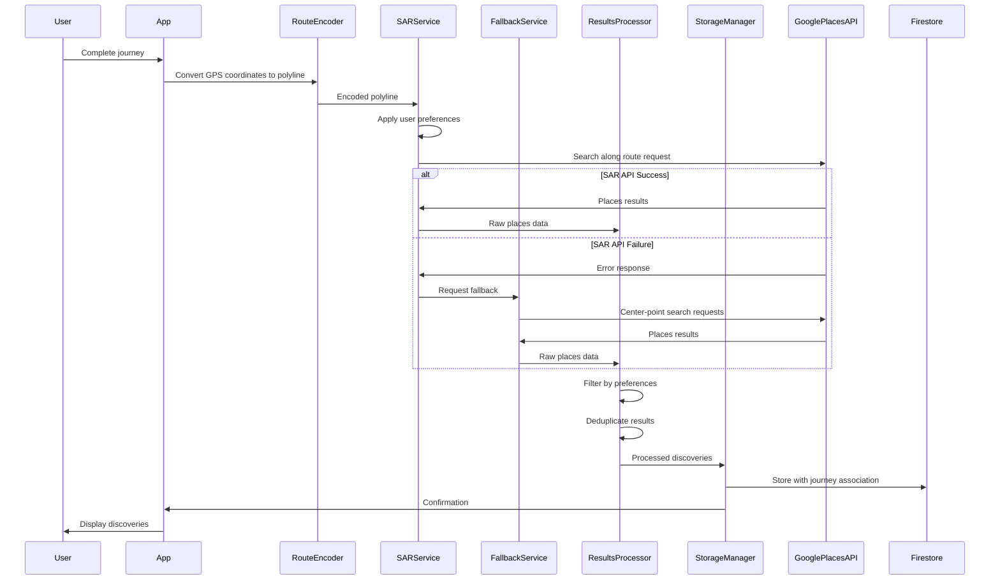

# Design Document: Search Along Route

## Overview

Search Along Route (SAR) is a feature that enhances the discovery experience in Hero's Path by finding points of interest along a user's entire walking route rather than just at a center point. This document outlines the technical design for implementing this feature, including architecture, components, data models, and testing strategy.

The SAR feature will leverage Google Places API's searchAlongRouteParameters to discover places along the polyline of a user's journey. It will respect user preferences for place types and minimum ratings, and will fall back to center-point search if the SAR API call fails.

## Architecture

The SAR feature will be implemented as an extension to the existing discovery system, with the following components:

1. **Route Encoder**: Converts GPS coordinates to Google's encoded polyline format
2. **SAR Service**: Handles API calls to Google Places API with route parameters
3. **Fallback Service**: Implements center-point search as a fallback mechanism
4. **Results Processor**: Filters, deduplicates, and processes discovery results
5. **Storage Manager**: Persists discoveries to Firestore with proper journey association

### System Flow



## Dependencies and Extensions

### Dependent Features
- [Journey Tracking](link-to-spec) - Provides route data for discovery along routes
- [Discovery Preferences](link-to-spec) - Uses user preferences for filtering discoveries
- [Enhanced Places](link-to-spec) - Integrates with enhanced place data and recommendations
- [Performance Optimization](link-to-spec) - Uses optimization strategies for discovery processing
- [Developer Tools](link-to-spec) - Uses discovery simulation and testing capabilities

### Extension Points
- **Preference-Based Filtering**: Support for Discovery Preferences integration
  - Used by: [Discovery Preferences](link-to-spec)
  - Implementation: SAR respects user preferences for place types and ratings

- **Enhanced Places**: Integration points for Enhanced Places (Tier 3)
  - Used by: [Enhanced Places](link-to-spec)
  - Implementation: SAR can leverage enhanced place data and recommendation algorithms

- **Performance Optimization**: Caching and batch processing support
  - Used by: [Performance Optimization](link-to-spec)
  - Implementation: SAR includes caching strategies and batch processing capabilities

- **Custom Algorithms**: Extensible discovery algorithm framework
  - Used by: [Enhanced Places](link-to-spec), [Performance Optimization](link-to-spec)
  - Implementation: SAR supports custom discovery algorithms and processing pipelines

### Migration Considerations
- Schema version: 1.0
- Migration requirements: Discovery data structure changes require version tracking
- Backward compatibility: Yes, with migration utilities for legacy data

### Developer Tools Integration
- Testing support: Discovery simulation and mock route data
- Mock data support: Generate test discoveries for development
- Simulation capabilities: Simulate various discovery scenarios and conditions

### Performance Optimization
- Caching strategy: Discovery results cached locally with periodic refresh
- Optimization hooks: Batch processing for discovery operations
- Performance considerations: API call optimization and result processing efficiency

## Components and Interfaces

### RouteEncoder

```javascript
/**
 * Converts an array of GPS coordinates to Google's encoded polyline format
 * @param {Array<{latitude: number, longitude: number}>} coordinates - Array of GPS coordinates
 * @returns {string} - Encoded polyline string
 */
function encodeRoute(coordinates) {
  // Implementation details
}

/**
 * Validates coordinates to ensure they are within valid latitude/longitude ranges
 * @param {Array<{latitude: number, longitude: number}>} coordinates - Array of GPS coordinates
 * @returns {boolean} - True if all coordinates are valid
 */
function validateCoordinates(coordinates) {
  // Implementation details
}

// NEW: Enhanced route analysis
function analyzeRoute(coordinates) {
  // Implementation details
}

// NEW: Performance optimization
function optimizeRouteForSAR(coordinates) {
  // Implementation details
}
```

### SARService

```javascript
/**
 * Searches for places along a route using Google Places API
 * @param {string} encodedPolyline - Google encoded polyline string
 * @param {Object} preferences - User's discovery preferences
 * @param {number} minRating - Minimum rating threshold
 * @returns {Promise<Array<Object>>} - Array of discovered places
 */
async function searchAlongRoute(encodedPolyline, preferences, minRating) {
  // Implementation details
}

/**
 * Determines if a route is long enough for SAR
 * @param {Array<{latitude: number, longitude: number}>} coordinates - Array of GPS coordinates
 * @returns {boolean} - True if route is long enough for SAR
 */
function isRouteLongEnough(coordinates) {
  // Implementation details
}

// NEW: Enhanced discovery algorithms
async function searchWithCustomAlgorithm(route, preferences, algorithm) {
  // Implementation details
}

// NEW: Performance optimization
async function searchWithCaching(route, preferences, cacheKey) {
  // Implementation details
}
```

### FallbackService

```javascript
/**
 * Performs center-point search as fallback when SAR fails
 * @param {Array<{latitude: number, longitude: number}>} coordinates - Array of GPS coordinates
 * @param {Object} preferences - User's discovery preferences
 * @param {number} minRating - Minimum rating threshold
 * @returns {Promise<Array<Object>>} - Array of discovered places
 */
async function performCenterPointSearch(coordinates, preferences, minRating) {
  // Implementation details
}

/**
 * Calculates the center point of a route
 * @param {Array<{latitude: number, longitude: number}>} coordinates - Array of GPS coordinates
 * @returns {{latitude: number, longitude: number}} - Center point coordinates
 */
function calculateCenterPoint(coordinates) {
  // Implementation details
}

// NEW: Enhanced fallback strategies
async function performEnhancedFallback(coordinates, preferences, strategy) {
  // Implementation details
}
```

### ResultsProcessor

```javascript
/**
 * Processes raw discovery results
 * @param {Array<Object>} results - Raw discovery results
 * @param {Object} preferences - User's discovery preferences
 * @param {number} minRating - Minimum rating threshold
 * @param {Array<string>} previouslyDiscoveredIds - IDs of previously discovered places
 * @returns {Array<Object>} - Processed discovery results
 */
function processResults(results, preferences, minRating, previouslyDiscoveredIds) {
  // Implementation details
}

/**
 * Deduplicates discovery results
 * @param {Array<Object>} results - Discovery results
 * @returns {Array<Object>} - Deduplicated results
 */
function deduplicateResults(results) {
  // Implementation details
}

// NEW: Enhanced processing algorithms
function processWithCustomAlgorithm(results, algorithm, parameters) {
  // Implementation details
}

// NEW: Performance optimization
function processWithBatchOperations(results, batchSize) {
  // Implementation details
}
```

### StorageManager

```javascript
/**
 * Stores discoveries in Firestore with journey association
 * @param {Array<Object>} discoveries - Processed discoveries
 * @param {string} journeyId - ID of the associated journey
 * @param {string} discoverySource - Source of discovery (SAR or center-point)
 * @returns {Promise<void>}
 */
async function storeDiscoveries(discoveries, journeyId, discoverySource) {
  // Implementation details
}

// NEW: Enhanced storage with migration support
async function storeDiscoveriesWithMigration(discoveries, journeyId, source) {
  // Implementation details
}

// NEW: Developer tools support
async function storeMockDiscoveries(mockData, journeyId) {
  // Implementation details
}
```

## Data Models

### Journey

```javascript
/**
 * Journey data model
 * @typedef {Object} Journey
 * @property {string} id - Unique identifier
 * @property {string} userId - ID of the user who created the journey
 * @property {Date} startTime - When the journey started
 * @property {Date} endTime - When the journey ended
 * @property {Array<{latitude: number, longitude: number, timestamp: number}>} coordinates - GPS coordinates with timestamps
 * @property {number} distance - Total distance in meters
 * @property {number} duration - Total duration in seconds
 * @property {Array<string>} discoveryIds - IDs of discoveries associated with this journey
 * 
 * // NEW: Migration framework support
 * @property {number} schemaVersion - Schema version for migration tracking
 * @property {string} lastMigrationAt - Migration timestamp
 * 
 * // NEW: Developer tools support
 * @property {boolean} devMode - Developer mode indicator
 * @property {boolean} mockData - Mock data indicator
 * 
 * // NEW: Performance optimization
 * @property {string} lastUpdated - Last update timestamp
 * @property {string} cacheKey - Caching support
 * 
 * // NEW: Extension points
 * @property {Object} metadata - Extensible metadata
 * @property {Object} extensions - Future extensibility
 */
```

### Discovery

```javascript
/**
 * Discovery data model
 * @typedef {Object} Discovery
 * @property {string} id - Unique identifier
 * @property {string} journeyId - ID of the associated journey
 * @property {string} placeId - Google Places API place_id
 * @property {string} name - Name of the place
 * @property {string} type - Primary type of the place
 * @property {Array<string>} types - All types of the place
 * @property {string} category - Category of the place (Food & Dining, etc.)
 * @property {number} rating - Rating of the place (0-5)
 * @property {{latitude: number, longitude: number}} location - Coordinates of the place
 * @property {string} discoverySource - Source of discovery (SAR or center-point)
 * @property {Date} discoveredAt - When the place was discovered
 * @property {boolean} saved - Whether the user has saved this discovery
 * @property {boolean} dismissed - Whether the user has dismissed this discovery
 * 
 * // NEW: Migration framework support
 * @property {number} schemaVersion - Schema version for migration tracking
 * @property {string} lastMigrationAt - Migration timestamp
 * 
 * // NEW: Developer tools support
 * @property {boolean} devMode - Developer mode indicator
 * @property {boolean} mockData - Mock data indicator
 * 
 * // NEW: Performance optimization
 * @property {string} lastUpdated - Last update timestamp
 * @property {string} cacheKey - Caching support
 * 
 * // NEW: Extension points for future features
 * @property {Object} metadata - Extensible metadata for enhanced features
 * @property {Object} extensions - Future extensibility
 */
```

### NEW: SARConfiguration Model

Represents configuration for SAR operations.

```typescript
interface SARConfiguration {
  // Basic configuration
  minRouteLength: number;
  maxRouteLength: number;
  searchRadius: number;
  maxResults: number;
  
  // Preference integration
  useUserPreferences: boolean;
  defaultPlaceTypes: string[];
  defaultMinRating: number;
  
  // Performance settings
  enableCaching: boolean;
  cacheExpiry: number;
  batchSize: number;
  
  // Algorithm settings
  customAlgorithms: string[];
  fallbackStrategies: string[];
  
  // NEW: Migration framework support
  schemaVersion: number;
  lastMigrationAt?: string;
  
  // NEW: Developer tools support
  devMode?: boolean;
  mockData?: boolean;
  
  // NEW: Performance optimization
  lastUpdated: string;
  cacheKey?: string;
  
  // NEW: Extension points
  metadata?: Record<string, any>;
  extensions?: Record<string, any>;
}
```

### NEW: DiscoveryAlgorithm Model

Represents custom discovery algorithms.

```typescript
interface DiscoveryAlgorithm {
  id: string;
  name: string;
  description: string;
  version: string;
  
  // Algorithm configuration
  parameters: Record<string, any>;
  supportedPlaceTypes: string[];
  performanceMetrics: {
    averageProcessingTime: number;
    successRate: number;
    accuracyScore: number;
  };
  
  // Implementation details
  implementation: string;
  dependencies: string[];
  
  // NEW: Migration framework support
  schemaVersion: number;
  lastMigrationAt?: string;
  
  // NEW: Developer tools support
  devMode?: boolean;
  mockData?: boolean;
  
  // NEW: Performance optimization
  lastUpdated: string;
  cacheKey?: string;
  
  // NEW: Extension points
  metadata?: Record<string, any>;
  extensions?: Record<string, any>;
}
```

### NEW: MockDiscoveryData Model

Represents mock data for developer tools.

```typescript
interface MockDiscoveryData {
  route: LocationCoordinates[];
  preferences: DiscoveryPreferences;
  discoveries: Discovery[];
  algorithm: string;
  mockType: 'test' | 'demo' | 'simulation';
  scenario: 'urban' | 'suburban' | 'rural' | 'mixed';
  
  // NEW: Migration framework support
  schemaVersion: number;
  lastMigrationAt?: string;
  
  // NEW: Developer tools support
  devMode?: boolean;
  mockData?: boolean;
  
  // NEW: Performance optimization
  lastUpdated: string;
  cacheKey?: string;
  
  // NEW: Extension points
  metadata?: Record<string, any>;
  extensions?: Record<string, any>;
}
```

## Error Handling

The SAR feature will implement robust error handling to ensure a smooth user experience:

1. **API Failures**: If the SAR API call fails, the system will automatically fall back to center-point search.
2. **Invalid Coordinates**: The system will validate coordinates before encoding to prevent errors.
3. **Empty Results**: If no places are found, the system will log this and return an empty array rather than throwing an error.
4. **Rate Limiting**: The system will handle rate limiting by implementing exponential backoff for retries.
5. **Storage Failures**: If Firestore storage fails, the system will retry and log the error.

### Error Logging

All errors will be logged with the following information:
- Error type and message
- Context (route length, number of coordinates, etc.)
- Timestamp
- User ID (anonymized)
- Action taken (fallback, retry, etc.)

## Testing Strategy

### Unit Tests

1. **RouteEncoder**:
   - Test encoding of various route patterns (straight lines, curves, etc.)
   - Test coordinate validation
   - Test edge cases (very short routes, single point routes, etc.)

2. **SARService**:
   - Test API call construction
   - Test preference filtering
   - Test route length validation

3. **FallbackService**:
   - Test center point calculation
   - Test fallback API call construction

4. **ResultsProcessor**:
   - Test deduplication logic
   - Test preference filtering
   - Test rating filtering

5. **StorageManager**:
   - Test Firestore integration
   - Test error handling

### Integration Tests

1. **End-to-End Flow**:
   - Test complete flow from journey completion to discovery storage
   - Test fallback mechanism when SAR fails
   - Test with various user preferences

2. **API Integration**:
   - Test integration with Google Places API
   - Test handling of various API responses

3. **Storage Integration**:
   - Test integration with Firestore
   - Test journey-discovery association

### Performance Tests

1. **Large Routes**:
   - Test with routes containing many coordinates
   - Measure encoding time and memory usage

2. **Result Processing**:
   - Test with large result sets
   - Measure processing time and memory usage

3. **API Efficiency**:
   - Measure API call frequency and data transfer
   - Optimize to minimize API usage