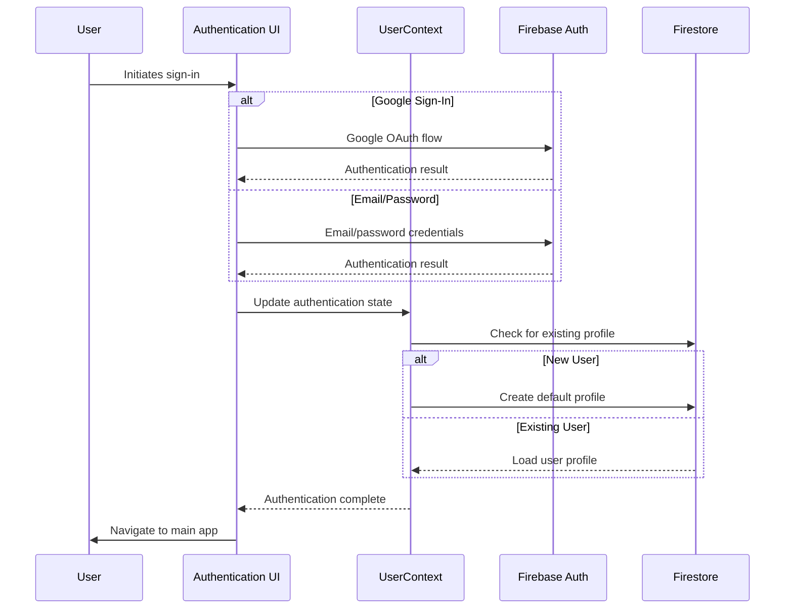
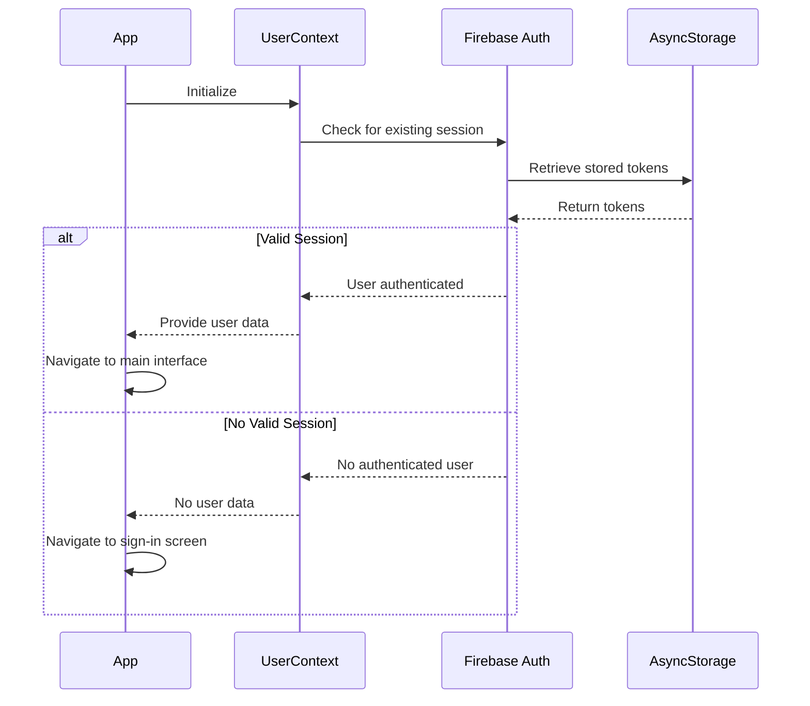

# Design Document: User Authentication

## Overview

The User Authentication feature provides a secure, reliable, and user-friendly authentication system for Hero's Path. It enables users to create accounts, sign in using multiple methods (Google OAuth and email/password), maintain persistent sessions, and securely access their personalized data. This design document outlines the architecture, components, data models, and implementation details for the authentication system.

The authentication system is built on Firebase Authentication, which provides secure user management, session persistence, and integration with various authentication providers. The system is designed to be robust, handling edge cases such as network failures, invalid credentials, and service unavailability.

## Architecture

The User Authentication feature follows a layered architecture pattern:

1. **Presentation Layer**: Authentication UI screens (SignInScreen, EmailAuthScreen)
2. **State Management Layer**: UserContext for managing authentication state
3. **Service Layer**: Firebase Authentication integration
4. **Data Layer**: Firestore for user profile storage

### Authentication Flow



### Session Management Flow



## Components and Interfaces

### 1. Firebase Configuration (firebase.js)

This module initializes Firebase services, including Authentication and Firestore. It provides functions for email/password authentication and configures persistent authentication.

**Key Functions:**
- `initializeApp`: Configure Firebase with API keys and project settings
- `initializeAuth`: Set up authentication with AsyncStorage persistence
- `signUpWithEmail`: Create new user accounts with email/password
- `signInWithEmail`: Authenticate existing users with email/password

### 2. User Context (contexts/UserContext.js)

This React Context manages authentication state throughout the application. It provides user data, authentication status, and profile management functions to all components.

**Key Functions:**
- `useUser`: Hook for accessing user context
- `UserProvider`: Context provider component
- Authentication state management
- User profile creation and management
- Session persistence handling
- Error handling and recovery

**Interface:**
```javascript
interface UserContextValue {
  user: FirebaseUser | null;
  userProfile: UserProfile | null;
  loading: boolean;
  profileLoading: boolean;
  error: string | null;
  
  // Core authentication methods
  createOrUpdateProfile: (profileData: Partial<UserProfile>) => Promise<UserProfile>;
  updateProfile: (updates: Partial<UserProfile>) => Promise<void>;
  signOutUser: () => Promise<void>;
  refreshProfile: () => Promise<void>;
  
  // NEW: Enhanced authentication methods for future features
  signInWithProvider: (provider: AuthProvider) => Promise<void>;
  linkAccount: (provider: AuthProvider) => Promise<void>;
  unlinkAccount: (providerId: string) => Promise<void>;
  
  // NEW: Social features support
  updateSocialProfile: (socialData: Partial<UserProfile['socialProfile']>) => Promise<void>;
  
  // NEW: Gamification support
  updateGamificationStats: (stats: Partial<UserProfile['gamification']>) => Promise<void>;
  
  // NEW: Developer tools support
  enableDevMode: (options: DeveloperAuthOptions) => void;
  disableDevMode: () => void;
  isDevMode: boolean;
  
  // NEW: Migration support
  migrateProfile: (targetVersion: number) => Promise<void>;
  getProfileVersion: () => number;
  needsMigration: boolean;
  
  // NEW: Performance optimization
  preloadProfile: () => Promise<void>;
  cacheProfile: (profile: UserProfile) => void;
  clearCache: () => void;
  updateProfileOptimistically: (updates: Partial<UserProfile>) => void;
  syncProfileChanges: () => Promise<void>;
}
```

### 3. Authentication Screens

#### SignInScreen (screens/SignInScreen.js)

Primary authentication screen providing Google Sign-In and navigation to email authentication.

**Key Components:**
- Google Sign-In button
- Email authentication navigation
- Loading indicators
- Error handling and display
- Theme integration

#### EmailAuthScreen (screens/EmailAuthScreen.js)

Secondary authentication screen for email/password sign-up and sign-in.

**Key Components:**
- Email input field
- Password input field
- Sign-up button
- Sign-in button
- Form validation
- Error handling and display
- Theme integration

### 4. Navigation Integration (App.js)

The main application component integrates authentication state with navigation, showing different navigation stacks based on authentication status.

**Key Features:**
- Conditional navigation based on authentication state
- Protected routes for authenticated users
- Public routes for unauthenticated users
- Loading states during authentication checks

## Data Models

### User Authentication Data

Firebase Authentication manages the core authentication data:

```typescript
interface FirebaseUser {
  uid: string;
  email: string | null;
  displayName: string | null;
  photoURL: string | null;
  emailVerified: boolean;
  isAnonymous: boolean;
  metadata: {
    creationTime: string;
    lastSignInTime: string;
  };
  providerData: Array<{
    providerId: string;
    uid: string;
    displayName: string | null;
    email: string | null;
    phoneNumber: string | null;
    photoURL: string | null;
  }>;
}
```

### User Profile Data

User profiles are stored in Firestore and contain additional user-specific data:

```typescript
interface UserProfile {
  // Core user data
  uid: string;
  email: string;
  displayName: string;
  photoURL: string | null;
  emailVerified: boolean;
  lastSignInAt: string;
  isNewUser: boolean;
  bio: string;
  location: string;
  
  // NEW: Migration framework support
  schemaVersion: number;
  lastMigrationAt?: string;
  migrationHistory?: {
    version: number;
    migratedAt: string;
    changes: string[];
  }[];
  
  // NEW: Developer tools support
  devMode?: boolean;
  mockData?: boolean;
  
  // NEW: Performance optimization
  lastUpdated: string;
  cacheKey?: string;
  
  // NEW: Social features extension points
  socialProfile?: {
    username: string;
    socialLinks: {
      instagram?: string;
      twitter?: string;
      website?: string;
    };
    followers: string[];
    following: string[];
    isPublicProfile: boolean;
  };
  
  // NEW: Gamification extension points
  gamification?: {
    level: number;
    experience: number;
    achievements: string[];
    badges: string[];
    totalPings: number;
    totalDiscoveries: number;
    streakDays: number;
  };
  
  // Enhanced preferences with extension points
  preferences: {
    notifications: boolean;
    privacy: 'public' | 'friends' | 'private';
    units: 'metric' | 'imperial';
    // NEW: Discovery preferences for future features
    discoveryPreferences: {
      categories: string[];
      radius: number;
      autoPing: boolean;
    };
    // NEW: Theme preferences for Theme & Map Style
    theme: 'light' | 'dark' | 'auto';
    mapStyle: 'default' | 'satellite' | 'terrain';
  };
  
  // Enhanced stats with gamification support
  stats: {
    totalWalks: number;
    totalDistance: number;
    totalTime: number;
    discoveries: number;
    // NEW: Enhanced stats for gamification
    totalPings: number;
    averageWalkDistance: number;
    longestWalk: number;
    favoriteDiscoveryTypes: string[];
  };
  
  friends?: string[]; // Array of user IDs
  
  // NEW: Extension points for future features
  metadata?: Record<string, any>;
  extensions?: Record<string, any>;
}

// NEW: Authentication provider interface for future OAuth providers
interface AuthProvider {
  id: string;
  name: string;
  icon: string;
  isEnabled: boolean;
  requiresSetup: boolean;
}

// NEW: Developer tools options
interface DeveloperAuthOptions {
  bypassAuthentication: boolean;
  mockUserProfile?: Partial<UserProfile>;
  simulateNetworkIssues: boolean;
  simulateAuthFailures: boolean;
}
```

## Dependencies and Extensions

### Dependent Features
- [Social Sharing](../tier-4-advanced/social-sharing/) - Requires social profile data and third-party auth support
- [Gamification](../tier-3-enhancement/gamification/) - Requires user stats and achievement tracking
- [Theme & Map Style](../tier-3-enhancement/theme-map-style/) - Requires theme preferences in user profile
- [Discovery Preferences](../tier-2-important/discovery-preferences/) - Requires discovery preferences in user profile
- [Past Journeys Review](../tier-2-important/past-journeys-review/) - Requires user profile for journey association

### Extension Points
- **Social Profile Data**: Enables Social Sharing features by providing social profile structure
  - Used by: [Social Sharing](../tier-4-advanced/social-sharing/)
  - Implementation: Social profile fields in UserProfile interface

- **Third-Party Auth Support**: Enables additional OAuth providers beyond Google
  - Used by: [Social Sharing](../tier-4-advanced/social-sharing/), [Google Maps Import/Export](../tier-4-advanced/google-maps-import-export/)
  - Implementation: AuthProvider interface and provider management functions

- **Gamification Support**: Enables achievement tracking and user progress
  - Used by: [Gamification](../tier-3-enhancement/gamification/)
  - Implementation: Gamification fields in UserProfile and update functions

- **Theme Preferences**: Enables dynamic theme switching
  - Used by: [Theme & Map Style](../tier-3-enhancement/theme-map-style/)
  - Implementation: Theme preferences in user profile

- **Discovery Preferences**: Enables personalized discovery experience
  - Used by: [Discovery Preferences](../tier-2-important/discovery-preferences/)
  - Implementation: Discovery preferences in user profile

### Migration Considerations
- Schema version: 2.0
- Migration requirements: Support for social profile, gamification, and enhanced preferences
- Backward compatibility: Yes - new fields are optional

### Developer Tools Integration
- Testing support: Authentication bypass and mock user profiles
- Mock data support: Complete user profile simulation
- Simulation capabilities: Network issues and auth failure simulation

### Performance Optimization
- Caching strategy: Profile data caching with optimistic updates
- Optimization hooks: Preloading and background sync capabilities
- Performance considerations: Minimize authentication network requests

## Error Handling

The authentication system implements comprehensive error handling to provide a robust user experience:

1. **Network Connectivity Issues**
   - Detect offline status
   - Provide appropriate error messages
   - Retry mechanisms where appropriate

2. **Authentication Failures**
   - Specific error messages for different failure types
   - User-friendly error display
   - Suggested recovery actions

3. **Service Unavailability**
   - Graceful degradation when Firebase services are unavailable
   - Clear user feedback
   - Automatic retry when services become available

4. **Token Management**
   - Automatic token refresh
   - Session recovery
   - Secure token storage

5. **NEW: Migration Errors**
   - Profile migration failure handling
   - Rollback capabilities
   - Version compatibility checks

6. **NEW: Developer Tools Errors**
   - Dev mode error simulation
   - Mock data error handling
   - Testing scenario error management

## Testing Strategy

### Unit Testing

1. **UserContext Tests**
   - Authentication state management
   - Profile creation and updates
   - Error handling
   - NEW: Social profile management
   - NEW: Gamification stats updates
   - NEW: Developer tools integration
   - NEW: Migration functionality

2. **Firebase Integration Tests**
   - Authentication functions
   - Token management
   - Session persistence
   - NEW: Third-party provider integration

### Integration Testing

1. **Authentication Flow Tests**
   - Complete sign-in flows
   - Session persistence across app restarts
   - Navigation based on authentication state
   - NEW: Social profile integration
   - NEW: Gamification integration

2. **Error Handling Tests**
   - Network failure scenarios
   - Invalid credential handling
   - Service unavailability
   - NEW: Migration error scenarios
   - NEW: Developer tools error simulation

### End-to-End Testing

1. **User Journeys**
   - New user registration and onboarding
   - Returning user sign-in
   - Profile management
   - NEW: Social profile setup
   - NEW: Gamification progression

2. **Edge Cases**
   - Session expiration
   - Account recovery
   - Multiple device sign-in
   - NEW: Profile migration scenarios
   - NEW: Developer tools testing

## Security Considerations

1. **Secure Token Storage**
   - Use AsyncStorage with React Native persistence
   - Implement proper token encryption
   - Clear tokens on sign-out

2. **Firebase Security Rules**
   - Implement proper Firestore security rules
   - Ensure user data is only accessible to the owner
   - Validate data operations server-side

3. **Authentication Best Practices**
   - Follow OAuth 2.0 standards
   - Implement proper error handling
   - Use secure communication channels

4. **Data Protection**
   - Minimize sensitive data storage
   - Implement proper data access controls
   - Follow data protection regulations

5. **NEW: Social Features Security**
   - Social profile data access controls
   - Third-party provider token management
   - Social sharing privacy controls

6. **NEW: Developer Tools Security**
   - Dev mode access controls
   - Mock data security considerations
   - Testing environment isolation

7. **NEW: Migration Security**
   - Migration process security
   - Data integrity during migration
   - Rollback security considerations

## Implementation Notes

1. **Firebase Configuration**
   - Store API keys securely
   - Implement proper error handling for configuration issues
   - Support different environments (development, production)

2. **Performance Considerations**
   - Minimize authentication-related network requests
   - Implement efficient profile data loading
   - Optimize token refresh operations
   - NEW: Profile caching and background sync
   - NEW: Optimistic updates for better UX

3. **Cross-Platform Compatibility**
   - Ensure consistent behavior across iOS and Android
   - Handle platform-specific authentication requirements
   - Test on multiple device types

4. **Accessibility**
   - Ensure authentication screens are accessible
   - Provide clear error messages
   - Support screen readers and other assistive technologies

5. **NEW: Migration Framework**
   - Implement version tracking for all data models
   - Provide migration utilities for profile updates
   - Ensure backward compatibility during transitions

6. **NEW: Developer Tools Integration**
   - Implement authentication bypass for testing
   - Provide mock profile data injection
   - Support simulation of various auth scenarios

7. **NEW: Extension Point Implementation**
   - Design interfaces for future feature integration
   - Implement hooks for social and gamification features
   - Ensure extensible data model structure