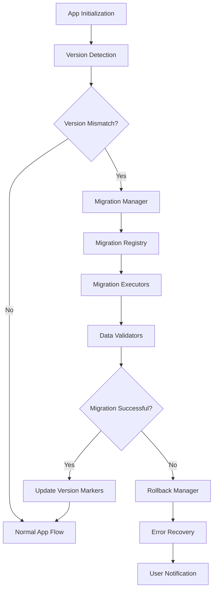
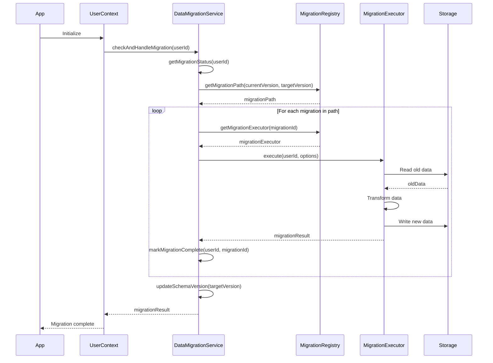

# Design Document: Data Migration System

## Overview

The Data Migration System is a critical infrastructure component that ensures data integrity and continuity as the Hero's Path application evolves. It provides a structured framework for migrating data between different storage systems, adapting to schema changes, and ensuring backward compatibility across app versions.

This design document outlines the architecture, components, and implementation strategy for a comprehensive data migration system that can handle various migration scenarios while maintaining data integrity and providing a seamless user experience.

## Architecture

The Data Migration System follows a modular architecture with the following key components:

### High-Level Architecture



### Core Components

1. **Version Manager**
   - Tracks app and data schema versions
   - Detects version mismatches
   - Determines required migration paths

2. **Migration Registry**
   - Maintains registry of available migrations
   - Maps version transitions to migration executors
   - Handles migration dependencies and ordering

3. **Migration Executors**
   - Specialized modules for specific migration types
   - Implements data transformation logic
   - Handles storage system transitions

4. **Validation System**
   - Validates data before and after migration
   - Ensures data integrity and consistency
   - Reports validation errors for debugging

5. **Rollback Manager**
   - Creates data backups before migrations
   - Provides mechanisms to restore previous state
   - Handles partial migration failures

6. **Progress Reporting**
   - Tracks migration progress
   - Provides user feedback for long-running migrations
   - Logs detailed migration statistics

7. **Error Recovery**
   - Handles migration failures gracefully
   - Implements retry mechanisms
   - Provides diagnostic information

## Components and Interfaces

### DataMigrationService

The central service that orchestrates the migration process.

```javascript
class DataMigrationService {
  // Version management
  async getCurrentSchemaVersion();
  async updateSchemaVersion(newVersion);
  
  // Migration status
  async hasMigrated(userId);
  async markMigrationComplete(userId, migrationId);
  async getMigrationStatus(userId);
  
  // Migration execution
  async migrateAllData(userId);
  async executeMigration(migrationId, userId);
  async rollbackMigration(migrationId, userId);
  
  // Validation
  async validateMigratedData(userId, dataType);
}
```

### MigrationRegistry

Maintains a registry of all available migrations and their dependencies.

```javascript
class MigrationRegistry {
  constructor() {
    this.migrations = new Map();
    this.registerCoreMigrations();
  }
  
  registerMigration(migrationId, migrationExecutor, dependencies = []);
  getMigrationPath(fromVersion, toVersion);
  getMigrationExecutor(migrationId);
}
```

### BaseMigrationExecutor

Base class for all migration executors.

```javascript
class BaseMigrationExecutor {
  async execute(userId, options);
  async validate(userId);
  async rollback(userId);
  getProgress();
  getMigrationMetadata();
}
```

### Specialized Migration Executors

```javascript
class JourneyMigrationExecutor extends BaseMigrationExecutor {
  async migrateJourneys(userId);
}

class PlacesMigrationExecutor extends BaseMigrationExecutor {
  async migrateSavedPlaces(userId);
  async migrateDismissedPlaces(userId);
}

class UserProfileMigrationExecutor extends BaseMigrationExecutor {
  async migrateUserProfile(userId);
}

class StorageMigrationExecutor extends BaseMigrationExecutor {
  async migrateFromAsyncStorageToFirestore(userId, dataType);
}
```

### MigrationProgressReporter

Handles progress reporting and user feedback.

```javascript
class MigrationProgressReporter {
  startMigration(migrationId, totalItems);
  updateProgress(itemsProcessed);
  completeMigration(success, stats);
  showUserFeedback(message, type);
}
```

## Data Models

### Migration Definition

```javascript
{
  id: "journey-storage-v1-to-v2",
  name: "Journey Storage Migration V1 to V2",
  description: "Migrates journey data from AsyncStorage to Firestore",
  fromVersion: "1.0.0",
  toVersion: "2.0.0",
  dataTypes: ["journeys"],
  dependencies: [],
  critical: true
}
```

### Migration Status

```javascript
{
  userId: "user123",
  completedMigrations: [
    {
      id: "journey-storage-v1-to-v2",
      completedAt: "2025-07-21T15:30:00Z",
      success: true,
      stats: {
        itemsProcessed: 42,
        itemsSucceeded: 42,
        itemsFailed: 0,
        duration: 3500 // ms
      }
    }
  ],
  pendingMigrations: [
    {
      id: "places-schema-v2-to-v3",
      requiredForVersion: "3.0.0"
    }
  ],
  currentSchemaVersion: "2.0.0",
  targetSchemaVersion: "3.0.0"
}
```

### Migration Result

```javascript
{
  success: true,
  migrationId: "journey-storage-v1-to-v2",
  stats: {
    totalItems: 42,
    processedItems: 42,
    failedItems: 0,
    duration: 3500 // ms
  },
  errors: [],
  warnings: []
}
```

## Error Handling

The Data Migration System implements a comprehensive error handling strategy:

1. **Graceful Degradation**
   - Non-critical migrations can be skipped if they fail
   - App can continue with limited functionality if migrations partially succeed

2. **Atomic Operations**
   - Each migration step is designed to be atomic
   - Either completes fully or rolls back completely

3. **Error Classification**
   - Transient errors (network issues) - implement retry logic
   - Data errors (invalid format) - implement repair strategies
   - Critical errors (data corruption) - trigger rollback

4. **User Communication**
   - Clear error messages for user-facing issues
   - Detailed logging for developer troubleshooting
   - Recovery instructions when user action is required

5. **Rollback Mechanisms**
   - Data backups before critical migrations
   - Transaction-based operations where possible
   - Restore points for complex migrations

## Testing Strategy

The Data Migration System requires thorough testing to ensure reliability:

1. **Unit Testing**
   - Test individual migration executors
   - Validate transformation logic
   - Verify error handling

2. **Integration Testing**
   - Test migration sequences
   - Verify dependencies are respected
   - Test interaction with storage systems

3. **Migration Path Testing**
   - Test all supported version upgrade paths
   - Verify multi-step migrations work correctly
   - Test skipped version scenarios

4. **Performance Testing**
   - Test with large datasets
   - Measure migration duration
   - Verify memory usage remains acceptable

5. **Error Recovery Testing**
   - Simulate various failure scenarios
   - Verify rollback mechanisms work correctly
   - Test partial migration recovery

6. **User Experience Testing**
   - Verify progress reporting is accurate
   - Test user notifications
   - Ensure app remains responsive during migration

## Implementation Strategy

### Integration with App Lifecycle

The Data Migration System integrates with the app's lifecycle in the following ways:

1. **App Initialization**
   - Version check during app startup
   - Automatic migration for minor version changes
   - User prompt for major migrations

2. **User Context Integration**
   - Migration status stored in user profile
   - User-specific migration tracking
   - Migration history for troubleshooting

3. **Settings Screen Integration**
   - Migration status display
   - Manual migration triggers
   - Migration history and statistics

### Migration Execution Flow



### Batch Processing for Large Datasets

For large datasets, the migration system uses a batched approach:

1. Query data in manageable chunks (e.g., 100 records)
2. Process each batch completely
3. Track progress to enable resuming if interrupted
4. Use background processing when possible
5. Implement throttling to prevent overloading resources

### Offline Support

The migration system handles offline scenarios by:

1. Detecting network connectivity before starting migrations
2. Queuing migrations that require online access
3. Completing local migrations even when offline
4. Resuming online migrations when connectivity is restored
5. Prioritizing critical offline-capable migrations first

## Security Considerations

1. **Data Access Control**
   - Migrations maintain existing access controls
   - No elevation of privileges during migration
   - User data remains isolated during multi-user migrations

2. **Sensitive Data Handling**
   - Encryption maintained during migration
   - Secure handling of credentials and tokens
   - Proper sanitization of logs and error reports

3. **Backup Security**
   - Temporary backups encrypted at rest
   - Automatic cleanup of backup data after successful migration
   - Access controls on backup data match original data

## Performance Considerations

1. **Minimizing App Startup Impact**
   - Quick version check with minimal overhead
   - Defer non-critical migrations
   - Background processing for lengthy migrations

2. **Resource Utilization**
   - Controlled memory usage through batching
   - CPU throttling during intensive operations
   - Network bandwidth management for cloud operations

3. **Progress Tracking**
   - Accurate progress estimation
   - Cancellable long-running migrations
   - Background continuation of interrupted migrations

## Future Extensibility

The Data Migration System is designed for extensibility:

1. **Pluggable Migration Executors**
   - New migration types can be added without modifying core system
   - Custom migration logic for specific data types

2. **Version-Independent Design**
   - Migration paths determined dynamically
   - Support for non-linear version progression

3. **Cross-Platform Support**
   - Consistent migration behavior across platforms
   - Platform-specific optimizations where needed

4. **Analytics Integration**
   - Hooks for migration analytics
   - Performance monitoring integration
   - User experience tracking