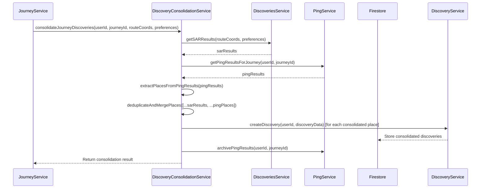

# Design Document: Discovery Consolidation

## Overview

The Discovery Consolidation feature is a data quality system that merges discoveries from multiple sources (Search Along Route and Ping results) into a unified, deduplicated set of high-quality points of interest. This design document outlines the architecture, components, data models, and implementation strategy for this feature.

The consolidation process occurs after a journey is completed, taking all discoveries from both SAR (Search Along Route) and real-time Pings during the walk, identifying duplicates, merging them intelligently, and storing the consolidated results in Firestore. This ensures users see a clean, consistent view of discoveries regardless of how they were found.

## Architecture

The Discovery Consolidation feature follows a service-oriented architecture pattern, with the `DiscoveryConsolidationService` as the central component. This service orchestrates the entire consolidation process, interacting with other services to gather data, process it, and store the results.

### High-Level Flow



### Component Interactions

1. **JourneyService** triggers the consolidation process after a journey is completed
2. **DiscoveryConsolidationService** orchestrates the entire process
3. **DiscoveriesService** provides SAR results for the route
4. **PingService** provides ping results collected during the journey
5. **DiscoveryService** handles storing consolidated discoveries in Firestore
6. **Firestore** serves as the persistent storage for all discovery data

## Components and Interfaces

### DiscoveryConsolidationService

The core service responsible for the consolidation process.

#### Key Methods:

```javascript
// Main consolidation method
async consolidateJourneyDiscoveries(userId, journeyId, routeCoords, preferences)

// Get SAR results for the route
async getSARResults(routeCoords, preferences)

// Get ping results for the journey
async getPingResults(userId, journeyId)

// Extract places from ping results
extractPlacesFromPingResults(pingResults)

// Deduplicate and merge places from different sources
deduplicateAndMergePlaces(places)

// Merge a group of places with the same placeId
mergePlaceGroup(placeGroup)

// Save consolidated discoveries to Firestore
async saveConsolidatedDiscoveries(userId, journeyId, places)

// Get consolidation statistics for a journey
async getConsolidationStats(userId, journeyId)
```

### Integration with Existing Services

#### DiscoveriesService
- Provides SAR (Search Along Route) results
- Handles user discovery preferences
- Manages place type filtering and validation

#### PingService
- Provides ping results for a journey
- Archives ping results after consolidation
- Manages ping data lifecycle

#### DiscoveryService
- Creates discovery records in Firestore
- Updates journey completion status
- Manages discovery data lifecycle

## Data Models

### Consolidated Discovery Model

```javascript
{
  id: string,                  // Unique identifier
  placeId: string,             // Google Place ID
  placeName: string,           // Place name
  placeType: string,           // Primary place type
  placeData: {                 // Detailed place data
    name: string,
    types: string[],
    primaryType: string,
    rating: number | null,
    userRatingsTotal: number,
    location: {
      lat: number,
      lng: number
    },
    formatted_address: string,
    photos: array
  },
  location: {                  // Geographic location
    lat: number,
    lng: number
  },
  journeyId: string,           // Associated journey
  source: string,              // Primary source (sar, ping, consolidated)
  allSources: string[],        // All sources that found this place
  pingCount: number,           // Number of pings that found this place
  sarCount: number,            // Number of SAR results that found this place
  saved: boolean,              // Whether the user has saved this place
  dismissed: boolean,          // Whether the user has dismissed this place
  createdAt: timestamp,        // Creation timestamp
  updatedAt: timestamp         // Last update timestamp
}
```

### Consolidation Result Model

```javascript
{
  success: boolean,            // Whether consolidation was successful
  sarPlaces: number,           // Number of places from SAR
  pingPlaces: number,          // Number of places from pings
  consolidatedPlaces: number,  // Number of consolidated places
  savedCount: number           // Number of places saved to Firestore
}
```

### Consolidation Statistics Model

```javascript
{
  totalDiscoveries: number,       // Total number of discoveries
  sarDiscoveries: number,         // Number of discoveries from SAR only
  pingDiscoveries: number,        // Number of discoveries from pings only
  mixedSourceDiscoveries: number  // Number of discoveries from multiple sources
}
```

## Error Handling

The consolidation process implements comprehensive error handling to ensure robustness:

1. **Service-Level Error Handling**: Each service method catches and logs errors, returning appropriate error responses.
2. **Data Validation**: Input data is validated before processing to prevent errors from invalid data.
3. **Graceful Degradation**: If one part of the process fails (e.g., SAR results), the system continues with available data.
4. **Logging**: Detailed logging at each step for debugging and monitoring.
5. **Transaction Safety**: Firestore batch operations ensure data consistency.

### Error Scenarios

1. **SAR Failure**: If SAR fails, consolidation proceeds with ping results only.
2. **Ping Data Retrieval Failure**: If ping data retrieval fails, consolidation proceeds with SAR results only.
3. **Individual Place Processing Failure**: If processing a specific place fails, it's logged and skipped without failing the entire process.
4. **Storage Failure**: If storing consolidated discoveries fails, appropriate error is returned and logged.

## Testing Strategy

### Unit Tests

1. **Service Method Tests**: Test each method in isolation with mocked dependencies.
2. **Deduplication Logic Tests**: Verify that duplicate places are correctly identified and merged.
3. **Data Merging Tests**: Ensure that data from multiple sources is merged correctly with proper prioritization.

### Integration Tests

1. **Service Integration Tests**: Test interaction between DiscoveryConsolidationService and other services.
2. **Firestore Integration Tests**: Verify that consolidated discoveries are correctly stored in Firestore.
3. **End-to-End Flow Tests**: Test the entire consolidation process from journey completion to discovery display.

### Test Cases

1. **Happy Path**: Complete consolidation with both SAR and ping results.
2. **SAR Only**: Consolidation with only SAR results (no pings).
3. **Ping Only**: Consolidation with only ping results (SAR failed).
4. **Duplicate Handling**: Multiple sources finding the same place.
5. **Error Handling**: Various error scenarios to test graceful degradation.
6. **Edge Cases**: Empty results, invalid data, etc.

## Performance Considerations

1. **Batch Processing**: Use Firestore batch operations for efficient writes.
2. **Optimized Deduplication**: Efficient algorithms for identifying and merging duplicates.
3. **Selective Data Loading**: Only load necessary data from Firestore.
4. **Cleanup**: Archive or delete temporary data after consolidation.
5. **Monitoring**: Track performance metrics for optimization.

## Future Enhancements

1. **ML-based Duplicate Detection**: Use machine learning for better duplicate identification.
2. **Place Verification**: Verify place information against multiple data sources.
3. **Quality Scoring**: Score discoveries based on data completeness and accuracy.
4. **User Feedback Integration**: Learn from user corrections and preferences.
5. **Real-time Consolidation**: Consolidate discoveries as they're found.
6. **Cross-journey Deduplication**: Identify places discovered in multiple journeys.
7. **Temporal Consolidation**: Merge discoveries from different time periods.
8. **Social Consolidation**: Merge discoveries with community data.
9. **Place Enrichment**: Enhance discoveries with additional data sources.
10. **Consolidation Analytics**: Detailed metrics about consolidation effectiveness.