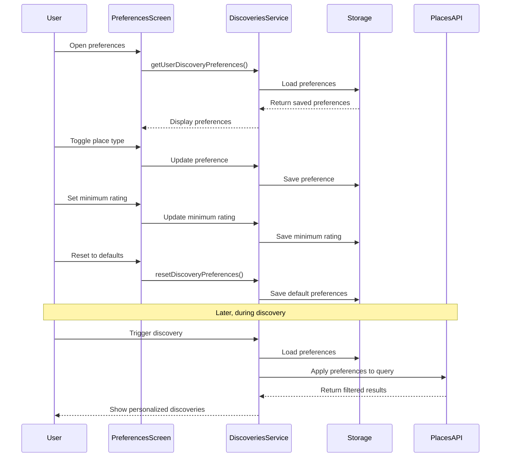

# Design Document: Discovery Preferences

## Overview

The Discovery Preferences feature provides users with a comprehensive system to customize the types of places they discover during their walks in Hero's Path. This design document outlines the architecture, components, data models, and implementation strategy for this feature, ensuring that users can personalize their discovery experience according to their interests and quality standards.

The feature allows users to:
- Select specific place types they're interested in discovering
- Set minimum rating thresholds for place quality
- Organize preferences by logical categories
- Benefit from smart defaults as new users
- Have their preferences persisted across sessions and devices

This design ensures that the Discovery Preferences feature integrates seamlessly with the app's core discovery functionality, including Search Along Route and Ping Discovery features.

## Architecture

The Discovery Preferences feature follows a layered architecture pattern:

1. **Presentation Layer**
   - `DiscoveryPreferencesScreen.js`: The main UI component for managing preferences
   - UI components for category organization, toggles, and rating selection

2. **Business Logic Layer**
   - `DiscoveriesService.js`: Manages preference logic, validation, and application
   - Handles preference synchronization and default values

3. **Data Layer**
   - Local storage (AsyncStorage) for offline preference persistence
   - Cloud storage (Firestore) for cross-device synchronization
   - Constants for place type definitions

4. **Integration Layer**
   - Integration with Google Places API through `NewPlacesService.js`
   - Integration with discovery features through preference filtering

### System Flow



## Components and Interfaces

### 1. DiscoveryPreferencesScreen

The main UI component for managing preferences, with the following features:

- **Category Headers**: Expandable/collapsible sections for organizing place types
- **Place Type Toggles**: Individual switches for each place type
- **Minimum Rating Selector**: UI for selecting rating threshold
- **Reset Button**: Option to restore default preferences
- **Category Counters**: Shows enabled/total count for each category

```javascript
// Component Interface
interface DiscoveryPreferencesScreenProps {
  navigation: NavigationProp;
}

// Component State
interface DiscoveryPreferencesState {
  discoveryPreferences: Record<string, boolean>; // Map of place type keys to enabled state
  minRating: number; // Minimum rating threshold
  expandedCategories: Record<string, boolean>; // Map of category titles to expanded state
}
```

### 2. DiscoveriesService

Service responsible for managing discovery preferences:

```javascript
// Service Interface
interface DiscoveriesService {
  getUserDiscoveryPreferences(): Promise<Record<string, boolean>>;
  getMinRatingPreference(): Promise<number>;
  resetDiscoveryPreferences(): Promise<Record<string, boolean>>;
  syncPreferencesWithPlaceTypes(existingPrefs: Record<string, boolean>): Promise<Record<string, boolean>>;
  filterPlacesByPreferences(places: Place[], preferences: Record<string, boolean>): Place[];
}
```

### 3. Place Types Constants

Defines the available place types and their organization:

```javascript
// Place Type Definition
interface PlaceType {
  key: string; // API key for the place type
  label: string; // User-friendly label
}

// Place Category Definition
interface PlaceCategory {
  title: string; // Category name
  icon: string; // Material icon name
  types: string[]; // Array of place type keys
}
```

## Data Models

### 1. User Preferences Model

```javascript
interface UserPreferences {
  placeTypes: Record<string, boolean>; // Map of place type keys to enabled state
  minRating: number; // Minimum rating threshold (1.0 to 5.0)
  lastUpdated: Timestamp; // When preferences were last modified
}
```

### 2. Place Type Model

```javascript
interface PlaceType {
  key: string; // Must match Google Places API type exactly
  label: string; // User-friendly display name
}
```

### 3. Place Category Model

```javascript
interface PlaceCategory {
  title: string; // Category name
  icon: string; // Icon identifier
  types: string[]; // Array of place type keys in this category
}
```

## Error Handling

1. **Preference Loading Errors**
   - If local preferences fail to load, fall back to default preferences
   - Log errors but don't disrupt the user experience
   - Retry cloud synchronization on next app launch

2. **Preference Saving Errors**
   - Implement retry logic for cloud synchronization
   - Always save to local storage first, then attempt cloud sync
   - Notify user only for critical errors that affect functionality

3. **API Integration Errors**
   - If preference application fails during discovery, fall back to default preferences
   - Log detailed error information for debugging
   - Implement graceful degradation to ensure discovery still works

## Testing Strategy

1. **Unit Tests**
   - Test preference loading/saving functions
   - Test preference synchronization logic
   - Test default preference generation
   - Test place filtering based on preferences

2. **Integration Tests**
   - Test integration with AsyncStorage and Firestore
   - Test integration with Google Places API
   - Test preference application in discovery workflows

3. **UI Tests**
   - Test category expansion/collapse
   - Test toggle state persistence
   - Test minimum rating selection
   - Test reset functionality

4. **User Acceptance Testing**
   - Verify preferences are correctly applied to discoveries
   - Verify preferences persist across app restarts
   - Verify preferences sync across devices
   - Verify UI is intuitive and responsive

## Implementation Details

### Storage Strategy

1. **Local Storage (AsyncStorage)**
   - Key: `@discovery_preferences` for place type preferences
   - Key: `@discovery_min_rating` for minimum rating
   - Format: JSON string of preference object

2. **Cloud Storage (Firestore)**
   - Collection: `users/{userId}/settings`
   - Document: `discoveryPreferences`
   - Fields: `placeTypes` (map), `minRating` (number), `lastUpdated` (timestamp)

### Default Preferences

The default preferences will be set as follows:

1. **Minimum Rating**: 4.0 (to ensure quality discoveries)
2. **Enabled Place Types**:
   - Food & Dining: restaurant, cafe, bar
   - Entertainment & Culture: museum, art_gallery, tourist_attraction
   - Outdoors & Recreation: park
   - (Other categories disabled by default)

### Preference Synchronization

1. **Device to Cloud**:
   - Save to AsyncStorage immediately on change
   - Debounce cloud updates (500ms) to prevent excessive writes
   - Include timestamp for conflict resolution

2. **Cloud to Device**:
   - Fetch on app startup
   - Merge with local preferences (newer wins)
   - Update local storage with merged result

### Place Type Management

1. **Adding New Place Types**:
   - When new place types are added to the system, they will be enabled by default
   - Existing user preferences will be preserved
   - The `syncPreferencesWithPlaceTypes` function will handle this logic

2. **Removing Place Types**:
   - If a place type is removed from the system, it will be removed from user preferences
   - This prevents errors when applying preferences to API queries

## Performance Considerations

1. **Preference Loading**:
   - Load from AsyncStorage first for immediate display
   - Fetch from cloud in background and merge if newer
   - Cache in memory during app session to reduce storage reads

2. **UI Rendering**:
   - Use collapsible categories to reduce initial render load
   - Implement virtualized lists if place type count grows significantly
   - Optimize toggle components to prevent unnecessary re-renders

3. **API Integration**:
   - Filter preferences before API calls to reduce data transfer
   - Cache filtered results when appropriate
   - Implement batch updates for cloud synchronization