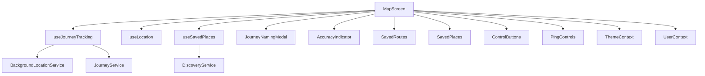

# Design Document: MapScreen Refactor & Performance Optimization

## Overview

This feature refactors the large MapScreen.js file into a modular, maintainable, and performant set of components, hooks, and utilities. The goal is to improve code readability, enable easier future enhancements, and optimize runtime performance, while preserving all existing user-facing features and UI.

## Architecture

The refactored MapScreen will be composed of smaller, focused components and hooks:
- **MapScreen (container):** Orchestrates state and layout.
- **Subcomponents:** UI elements (e.g., JourneyNamingModal, AccuracyIndicator, SavedRoutes, SavedPlaces, ControlButtons, PingControls).
- **Custom Hooks:** Encapsulate logic (e.g., useJourneyTracking, useLocation, useSavedPlaces).
- **Utils:** Shared utility functions (e.g., geo calculations, direction logic).

### System Context Diagram



## Components and Interfaces

### Component 1: MapScreen (Container)
- Orchestrates state, hooks, and layout.
- Passes props to subcomponents.

### Component 2: JourneyNamingModal
- Handles journey naming UI and logic.

### Component 3: AccuracyIndicator
- Displays GPS accuracy status.

### Component 4: SavedRoutes
- Renders saved journey polylines.

### Component 5: SavedPlaces
- Renders saved place markers and clustering.

### Component 6: ControlButtons
- Renders floating action buttons for map controls.

### Component 7: PingControls
- Handles ping button and stats.

### Custom Hooks
- **useJourneyTracking:** Manages journey start/stop, saving, and state.
- **useLocation:** Handles location permissions, updates, and errors.
- **useSavedPlaces:** Loads and manages saved places.

### Utils
- **geo.js:** Distance, direction, and clustering calculations.

#### Example Interface
```javascript
// useJourneyTracking.js
export function useJourneyTracking(user, onSave) { ... }

// SavedRoutes.js
export default function SavedRoutes({ routes, colors }) { ... }
```

## Data Models
- No changes to existing models; interfaces remain as in current implementation.

## Error Handling
- Each subcomponent handles its own errors (e.g., loading, permissions).
- MapScreen provides fallback UI for critical errors.
- Logging is centralized for debugging.

## Testing Strategy
- **Unit Tests:** For hooks and utils (distance, direction, state transitions).
- **Integration Tests:** For MapScreen with mocked services.
- **Manual QA:** Ensure no regression in user experience.

## Accessibility Considerations
- All subcomponents must maintain or improve accessibility (labels, roles, color contrast).
- Modal and buttons must be accessible via screen readers.

## Performance Considerations
- Memoize subcomponents and hooks to avoid unnecessary re-renders.
- Use React.memo and useCallback/useMemo where appropriate.
- Optimize marker and polyline rendering (clustering, virtualization if needed).

## Implementation Plan
1. Extract utility functions to utils/geo.js.
2. Extract UI subcomponents to components/ui/.
3. Create custom hooks in hooks/.
4. Refactor MapScreen to use new modules.
5. Test and validate all features.
6. Code review and documentation.

## Integration Points
- Integrates with BackgroundLocationService, JourneyService, DiscoveryService, ThemeContext, UserContext.

## Future Enhancements
1. Further split logic for overlays and modular controls.
2. Add automated tests for extracted hooks and components. 