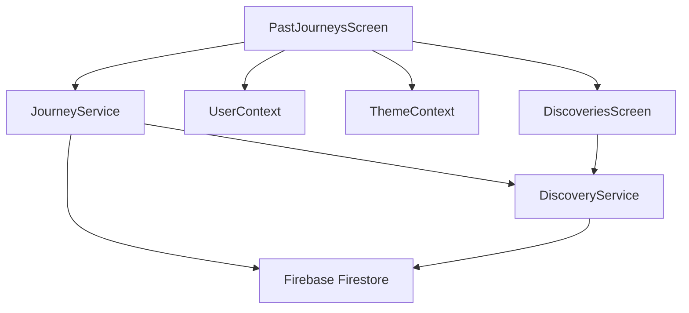

# Design Document: Past Journeys Review

## Overview

The Past Journeys Review feature provides users with a comprehensive history of their completed journeys, allowing them to track their exploration progress, visualize routes, manage their journey history, and access associated discoveries. This document outlines the technical design and architecture for implementing this feature in the Hero's Path app.

The feature serves as both a personal walking diary and a gateway to reviewing discoveries from past walks, enhancing the overall user experience by providing historical context to exploration activities. It includes journey completion status tracking, journey management capabilities, and performance optimizations to ensure a smooth user experience even with large numbers of journeys.

## Architecture

The Past Journeys Review feature follows the existing app architecture, which separates concerns into:

1. **UI Layer** - React Native components in the `screens` directory
2. **Service Layer** - Business logic in the `services` directory
3. **Data Layer** - Firebase Firestore for persistent storage
4. **Context Layer** - React Context for state management

### Key Components



### Data Flow

1. User navigates to Past Journeys screen
2. PastJourneysScreen requests journey data from JourneyService
3. JourneyService retrieves data from Firestore
4. PastJourneysScreen renders journey list with completion status
5. User interacts with journeys (view details, delete)
6. Actions are processed through appropriate services
7. UI is updated to reflect changes

## Components and Interfaces

### 1. PastJourneysScreen Component

The main UI component for displaying and managing journey history.

**Responsibilities:**

- Display chronological list of journeys with metadata
- Show journey completion status indicators
- Provide journey management options (delete)
- Handle navigation to journey details
- Implement pagination and grouping for large journey lists
- Display appropriate loading and empty states

**Interface:**

```javascript
// PastJourneysScreen.js
export default function PastJourneysScreen({ navigation }) {
	// State
	const [journeys, setJourneys] = useState([]);
	const [loading, setLoading] = useState(false);
	const [page, setPage] = useState(1);
	const [groupedJourneys, setGroupedJourneys] = useState({});

	// Methods
	const loadJourneys = async () => {
		/* ... */
	};
	const deleteJourney = async (id) => {
		/* ... */
	};
	const navigateToJourneyDetails = (journeyId) => {
		/* ... */
	};
	const groupJourneysByMonth = (journeys) => {
		/* ... */
	};
	const renderJourneyItem = ({ item }) => {
		/* ... */
	};
	const renderMonthHeader = ({ section }) => {
		/* ... */
	};

	// UI Rendering
	return (
		<View>
			<SectionList
				sections={groupedJourneys}
				renderItem={renderJourneyItem}
				renderSectionHeader={renderMonthHeader}
				/* ... */
			/>
		</View>
	);
}
```

### 2. JourneyService Enhancements

Extends the existing JourneyService to support journey completion status tracking and comprehensive journey management.

**New Methods:**

```javascript
// JourneyService.js
class JourneyService {
	// Existing methods...

	// Get user's journeys with pagination
	async getUserJourneysPaginated(userId, page, pageSize) {
		/* ... */
	}

	// Get journey completion status
	async getJourneyCompletionStatus(userId, journeyId) {
		/* ... */
	}

	// Delete journey with comprehensive cleanup
	async deleteJourney(userId, journeyId) {
		/* ... */
	}
}
```

### 3. Journey Card Component

A reusable component for displaying journey information in the list.

**Interface:**

```javascript
// JourneyCard.js
export default function JourneyCard({
	journey,
	onPress,
	onDelete,
	showCompletionStatus = true,
}) {
	// Render journey card with metadata and actions
	return (
		<Card>
			<TouchableOpacity onPress={onPress}>
				<View>
					<Text>{journey.name || formatDate(journey.date)}</Text>
					<Text>
						Distance: {journey.distance}m | Duration:{" "}
						{formatDuration(journey.duration)}
					</Text>
					{showCompletionStatus && (
						<CompletionStatusBadge
							isCompleted={journey.isCompleted}
							completionPercentage={journey.completionPercentage}
						/>
					)}
				</View>
			</TouchableOpacity>
			<TouchableOpacity onPress={onDelete}>
				<Icon name="delete" />
			</TouchableOpacity>
		</Card>
	);
}
```

### 4. CompletionStatusBadge Component

A small, reusable component for displaying journey completion status.

**Interface:**

```javascript
// CompletionStatusBadge.js
export default function CompletionStatusBadge({
	isCompleted,
	completionPercentage,
}) {
	return (
		<View
			style={[styles.badge, isCompleted ? styles.completed : styles.pending]}
		>
			<Text style={styles.badgeText}>
				{isCompleted ? "✅ All Reviewed" : `Review (${completionPercentage}%)`}
			</Text>
		</View>
	);
}
```

## Data Models

### Journey Model

```javascript
{
  id: string,                    // Unique identifier
  userId: string,                // User who owns this journey
  name: string | null,           // Optional journey name
  route: Array<{                 // Array of coordinates
    latitude: number,
    longitude: number,
    timestamp: number
  }>,
  distance: number,              // Distance in meters
  duration: number,              // Duration in seconds
  startLocation: {               // Starting point
    latitude: number,
    longitude: number,
    name: string | null
  },
  endLocation: {                 // Ending point
    latitude: number,
    longitude: number,
    name: string | null
  },
  createdAt: Timestamp,          // When journey was created
  updatedAt: Timestamp,          // When journey was last updated

  // Completion status fields
  isCompleted: boolean,          // Whether all discoveries have been reviewed
  reviewedDiscoveriesCount: number, // Number of reviewed discoveries
  totalDiscoveriesCount: number, // Total number of discoveries
  completionPercentage: number,  // Percentage of reviewed discoveries
  lastStatusUpdate: Timestamp,   // When status was last updated

  // NEW: Migration framework support
  schemaVersion: Number,         // Schema version for migration tracking
  lastMigrationAt: String,       // Timestamp of last migration
  migrationHistory: Array,       // Array of migration records

  // NEW: Developer tools support
  devMode: Boolean,              // Whether in developer mode
  mockData: Boolean,             // Whether using mock data

  // NEW: Performance optimization
  lastUpdated: String,           // Last update timestamp
  cacheKey: String,              // Cache key for optimization

  // NEW: Extension points for future features
  metadata: Object,              // Extensible metadata
  extensions: Object,            // Extension points for future features

  // NEW: Social sharing support
  socialData: {
    shareCount: Number,          // Number of times shared
    likes: Number,               // Number of likes from other users
    comments: Array,             // Comments from other users
    privacyLevel: String,        // public, friends, private
    shareHistory: Array,         // History of sharing events
    tags: Array                  // User-generated tags
  },

  // NEW: Gamification overlays
  gamificationData: {
    experienceGained: Number,    // Experience points earned
    achievementsUnlocked: Array, // Achievements unlocked during journey
    badges: Array,               // Badges earned
    streakContribution: Number,  // Contribution to user streaks
    rarityScore: Number,         // Rarity score of discoveries
    completionBonus: Number      // Bonus for completing the journey
  },

  // NEW: Enhanced visualization
  visualizationData: {
    mapStyle: String,            // Map style used for visualization
    routeStyle: Object,          // Custom route styling
    markerStyles: Array,         // Custom marker styles for discoveries
    timelapseData: Object,       // Data for timelapse visualization
    elevationProfile: Array,     // Elevation data for route
    weatherData: Object,         // Weather conditions during journey
    photos: Array                // Photos taken during journey
  }
}
```

### Discovery Model (Reference)

```javascript
{
  id: string,                    // Unique identifier
  journeyId: string,             // Reference to parent journey
  placeId: string,               // Google Places ID
  placeName: string,             // Place name
  placeType: string,             // Primary place type
  location: {                    // Coordinates
    lat: number,
    lng: number
  },
  saved: boolean,                // Whether user saved this place
  dismissed: boolean,            // Whether user dismissed this place
  createdAt: Timestamp,          // When discovery was created
  updatedAt: Timestamp,          // When discovery was last updated

  // NEW: Migration framework support
  schemaVersion: Number,         // Schema version for migration tracking
  lastMigrationAt: String,       // Timestamp of last migration

  // NEW: Developer tools support
  devMode: Boolean,              // Whether in developer mode
  mockData: Boolean,             // Whether using mock data

  // NEW: Performance optimization
  lastUpdated: String,           // Last update timestamp
  cacheKey: String,              // Cache key for optimization

  // NEW: Extension points for future features
  metadata: Object,              // Extensible metadata
  extensions: Object,            // Extension points for future features

  // NEW: Enhanced discovery data for visualization
  visualizationData: {
    importance: Number,          // Importance score for visualization
    category: String,            // Visual category for grouping
    color: String,               // Custom color for map markers
    icon: String,                // Custom icon identifier
    highlightLevel: Number,      // Highlight intensity (0-10)
    animationStyle: String       // Animation style for revealing
  }
}
```

## Error Handling

1. **Network Errors**

   - Implement retry logic for Firestore operations
   - Cache journey data locally for offline access
   - Display appropriate error messages to users

2. **Data Consistency Errors**

   - Implement validation checks before saving data
   - Use transactions for critical operations to maintain consistency
   - Add recovery mechanisms for inconsistent states

3. **User Experience**
   - Show loading indicators during operations
   - Provide feedback for successful/failed actions
   - Implement graceful degradation for unavailable features

## Testing Strategy

1. **Unit Tests**

   - Test JourneyService methods for proper data handling
   - Test utility functions for journey grouping and formatting
   - Test completion status calculation logic

2. **Integration Tests**

   - Test interaction between JourneyService and DiscoveryService
   - Test Firestore operations for data consistency
   - Test navigation flow between screens

3. **UI Tests**

   - Test rendering of journey list with various data states
   - Test pagination and grouping functionality
   - Test journey deletion flow
   - Test completion status indicators

4. **Performance Tests**
   - Test rendering performance with large journey lists
   - Test API call reduction mechanisms
   - Test caching effectiveness

## Performance Considerations

### Smart Caching

Implement a caching strategy to minimize Firestore reads:

1. Cache journey data in memory during app session
2. Store basic journey metadata in AsyncStorage for quick initial rendering
3. Implement time-based cache invalidation (e.g., refresh if data is older than 5 minutes)
4. Use Firestore offline persistence for automatic caching

### Pagination and Virtualization

For users with many journeys:

1. Implement pagination in Firestore queries (limit + startAfter)
2. Use FlatList's `onEndReached` to load more journeys as user scrolls
3. Implement virtualized rendering to only render visible items
4. Use `getItemLayout` for optimized rendering performance

### Journey Grouping

Group journeys by time periods to improve navigation:

1. Group journeys by month/year
2. Use SectionList for rendering grouped journeys
3. Implement collapsible sections for better navigation
4. Cache grouped data structure to avoid recalculation

## UI Design

### Journey List Screen

```
┌─────────────────────────────────┐
│ ← Past Journeys                 │
├─────────────────────────────────┤
│ ┌─────────────────────────────┐ │
│ │ July 2025                   │ │
│ ├─────────────────────────────┤ │
│ │ ┌─────────────────────────┐ │ │
│ │ │ Jul 15, 2025 - 10:30 AM │ │ │
│ │ │ 2.3 km | 35 min         │ │ │
│ │ │ [Review (60%)]  [Delete]│ │ │
│ │ └─────────────────────────┘ │ │
│ │                             │ │
│ │ ┌─────────────────────────┐ │ │
│ │ │ Jul 10, 2025 - 8:15 AM  │ │ │
│ │ │ 1.8 km | 25 min         │ │ │
│ │ │ [✅ All Reviewed][Delete]│ │ │
│ │ └─────────────────────────┘ │ │
│ └─────────────────────────────┘ │
│                                 │
│ ┌─────────────────────────────┐ │
│ │ June 2025                   │ │
│ ├─────────────────────────────┤ │
│ │ ┌─────────────────────────┐ │ │
│ │ │ Jun 28, 2025 - 4:45 PM  │ │ │
│ │ │ 3.1 km | 50 min         │ │ │
│ │ │ [✅ All Reviewed][Delete]│ │ │
│ │ └─────────────────────────┘ │ │
│ └─────────────────────────────┘ │
└─────────────────────────────────┘
```

### Journey Deletion Confirmation

```
┌─────────────────────────────────┐
│                                 │
│      Delete Journey?            │
│                                 │
│  Are you sure you want to       │
│  delete this journey?           │
│                                 │
│  This will remove all           │
│  associated discoveries.        │
│                                 │
│  [Cancel]         [Delete]      │
│                                 │
└─────────────────────────────────┘
```

## Implementation Plan

1. **Phase 1: Core Journey List**

   - Implement basic journey list display
   - Add journey metadata rendering
   - Implement journey deletion with confirmation

2. **Phase 2: Completion Status**

   - Add completion status fields to journey model
   - Implement status calculation logic
   - Add status indicators to UI

3. **Phase 3: Performance Optimizations**

   - Implement pagination and virtualization
   - Add journey grouping by time periods
   - Implement smart caching

4. **Phase 4: Data Consistency**

   - Ensure comprehensive journey deletion
   - Implement real-time status updates
   - Add data validation and error handling

5. **Phase 5: Testing and Refinement**
   - Conduct performance testing
   - Implement UI improvements based on testing
   - Add final polish and documentation

## Dependencies and Extensions

### Dependent Features

- [Social Sharing](../tier-4-advanced/social-sharing/design.md) - Uses social data for sharing journey summaries and achievements
- [Gamification](../tier-3-enhancement/gamification/design.md) - Uses gamification data for progress tracking and achievement display
- [Enhanced Visualization](../tier-3-enhancement/enhanced-visualization/design.md) - Uses visualization data for rich journey display
- [Performance Optimization](../tier-3-enhancement/performance-optimization/design.md) - Uses caching and optimization strategies for large journey datasets

### Extension Points

#### **Social Sharing Indicators**: Support for social sharing features
- **Used by**: [Social Sharing](../tier-4-advanced/social-sharing/design.md)
- **Implementation**: Extended `socialData` object in Journey Model
- **Features**:
  - Share count and engagement metrics display
  - Privacy level indicators for journey sharing
  - Comment and like system integration
  - Sharing history tracking and analytics
  - Tag-based journey organization

#### **Gamification Overlays**: Achievement and progress display
- **Used by**: [Gamification](../tier-3-enhancement/gamification/design.md)
- **Implementation**: Enhanced `gamificationData` object in Journey Model
- **Features**:
  - Experience points and achievement badge display
  - Streak contribution indicators
  - Rarity scoring for unique discoveries
  - Completion bonus calculations
  - Progress tracking across multiple journeys

#### **Enhanced Visualization**: Rich journey display capabilities
- **Used by**: [Enhanced Visualization](../tier-3-enhancement/enhanced-visualization/design.md)
- **Implementation**: Enhanced `visualizationData` object in Journey and Discovery Models
- **Features**:
  - Custom map styles and route styling
  - Timelapse and elevation profile visualization
  - Weather overlay integration
  - Photo integration with journey timeline
  - Custom marker styles and importance scoring

#### **Performance Optimization**: Journey data caching and loading
- **Used by**: [Performance Optimization](../tier-3-enhancement/performance-optimization/design.md)
- **Implementation**: Caching strategies and performance monitoring
- **Features**:
  - Intelligent journey data caching with TTL
  - Pagination optimization for large journey lists
  - Memory management for journey visualization
  - Network-efficient data loading strategies

### Migration Considerations

- **Schema version**: 2.0
- **Migration requirements**:
  - Add new fields to existing journey and discovery models
  - Initialize social data with default privacy settings
  - Migrate completion status for existing journeys
  - Update visualization data with default styling
- **Backward compatibility**: Yes - new fields are optional with sensible defaults
- **Migration strategy**: Progressive migration during journey loading with fallback to calculated values

### Developer Tools Integration

- **Testing support**:
  - Mock journey data with various completion states
  - Social sharing simulation for testing
  - Gamification data simulation with different achievement levels
  - Visualization testing with different data sizes
- **Mock data support**:
  - Configurable journey datasets for testing
  - Simulated social interaction data
  - Achievement and gamification test scenarios
  - Performance benchmark datasets
- **Simulation capabilities**:
  - Journey completion flow simulation
  - Social sharing workflow testing
  - Large dataset performance simulation
  - Network condition simulation for journey loading

### Performance Optimization

- **Caching strategy**:
  - Journey list caching with intelligent invalidation
  - Discovery data caching by journey ID
  - Social and gamification data caching
  - Visualization asset preloading and caching
- **Optimization hooks**:
  - Lazy loading of journey details and discovery data
  - Virtual scrolling for large journey lists
  - Background preloading of frequently accessed journeys
  - Memory cleanup for unused journey data
- **Performance considerations**:
  - UI rendering optimization for complex journey visualizations
  - Network usage minimization for journey synchronization
  - Battery impact reduction through efficient data processing
  - Responsive UI during journey loading and processing
