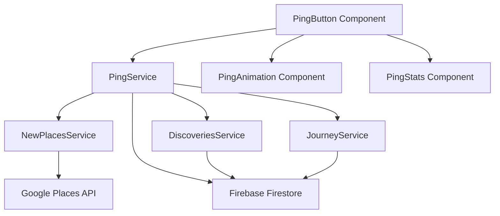

# Design Document

## Overview

The Ping Discovery feature is a core interactive element of Hero's Path that allows users to actively discover nearby points of interest during their walks in real-time. This document outlines the technical design and architecture of the feature, including its components, data models, user interface, and integration with other app systems.

The feature consists of several key components:

1. A credit system that limits usage to control API costs
2. A cooldown mechanism to prevent abuse
3. Visual feedback through animations
4. Integration with user preferences
5. Storage and consolidation of ping results with journey data

This design document provides a comprehensive blueprint for implementing the Ping Discovery feature, ensuring it meets all requirements while maintaining performance, reliability, and user experience standards.

## Architecture

The Ping Discovery feature follows a service-oriented architecture pattern with clear separation of concerns:



### Core Components

1. **PingService**: Central service that manages the ping functionality, including credit management, cooldown enforcement, and API calls.
2. **PingButton**: UI component that users interact with to trigger pings.
3. **PingAnimation**: Visual feedback component that displays animations when a ping is triggered.
4. **PingStats**: Component for displaying ping usage statistics and educational information.
5. **Integration Services**: Services that the ping feature integrates with, including NewPlacesService for API calls and DiscoveriesService for user preferences.

### Data Flow

1. User taps the PingButton
2. PingButton triggers PingAnimation for immediate visual feedback
3. PingButton calls PingService.pingNearbyPlaces()
4. PingService checks eligibility (credits and cooldown)
5. If eligible, PingService gets user preferences from DiscoveriesService
6. PingService calls NewPlacesService to search for nearby places
7. Results are filtered based on user preferences
8. Results are stored in Firestore
9. PingButton displays results and updates UI
10. PingStats is updated with new credit information

## Components and Interfaces

### PingService

The PingService is the core service that manages the ping functionality. It handles credit management, cooldown enforcement, API calls, and result storage.

#### Key Methods

```javascript
class PingService {
  // Get user's ping data (cooldown and credits)
  async getUserPingData(userId)

  // Check if user can ping (cooldown and credits)
  async checkPingEligibility(userId)

  // Reset monthly credits
  async resetMonthlyCredits(userId)

  // Update ping usage (decrement credits and update timestamp)
  async updatePingUsage(userId)

  // Store ping results in Firestore
  async storePingResults(userId, journeyId, places, location)

  // Get all ping results for a journey
  async getPingResultsForJourney(userId, journeyId)

  // Ping for nearby places during active walk
  async pingNearbyPlaces(userId, journeyId, currentLocation)

  // Archive ping results after journey completion
  async archivePingResults(userId, journeyId)

  // Get ping statistics for a user
  async getPingStats(userId)

  // Refund ping credits to a user
  async refundCredits(userId, creditsToRefund)
}
```

### PingButton Component

The PingButton component is the primary UI element that users interact with to trigger pings. It displays the ping button, credit count, and cooldown timer.

#### Props

```javascript
PingButton.propTypes = {
	currentLocation: PropTypes.object.isRequired, // Current user location
	onPingStart: PropTypes.func, // Callback when ping starts
	onPingSuccess: PropTypes.func, // Callback when ping succeeds
	onPingError: PropTypes.func, // Callback when ping fails
	style: PropTypes.object, // Custom styles
	disabled: PropTypes.bool, // Whether the button is disabled
	journeyId: PropTypes.string, // Current journey ID
};
```

### PingAnimation Component

The PingAnimation component provides visual feedback when a ping is triggered. It displays an animation centered on the user's position.

#### Props

```javascript
PingAnimation.propTypes = {
	isVisible: PropTypes.bool.isRequired, // Whether the animation is visible
	onAnimationComplete: PropTypes.func, // Callback when animation completes
	style: PropTypes.object, // Custom styles
	animationType: PropTypes.string, // Type of animation to display
};
```

### PingStats Component

The PingStats component displays ping usage statistics and educational information about the ping feature.

#### Props

```javascript
PingStats.propTypes = {
	style: PropTypes.object, // Custom styles
	onPingUsed: PropTypes.func, // Callback when ping is used
};
```

## Data Models

### Ping Data Model

```javascript
// User ping data stored in Firestore
{
  lastPingTime: Number, // Timestamp of last ping
  creditsRemaining: Number, // Number of credits remaining
  lastCreditReset: Timestamp, // Timestamp of last credit reset
  totalPingsUsed: Number, // Total number of pings used

  // NEW: Migration framework support
  schemaVersion: Number, // Schema version for migration tracking
  lastMigrationAt: String, // Timestamp of last migration
  migrationHistory: Array, // Array of migration records

  // NEW: Developer tools support
  devMode: Boolean, // Whether in developer mode
  mockData: Boolean, // Whether using mock data

  // NEW: Performance optimization
  lastUpdated: String, // Last update timestamp
  cacheKey: String, // Cache key for optimization

  // NEW: Extension points for future features
  metadata: Object, // Extensible metadata for gamification
  extensions: Object, // Extension points for future features

  // NEW: Enhanced animations support
  animationPreferences: {
    enabled: Boolean, // Whether animations are enabled
    intensity: String, // Animation intensity (low/medium/high)
    customAnimations: Array // Custom animation configurations
  },

  // NEW: Credit system enhancements
  gamificationCredits: {
    bonusCredits: Number, // Bonus credits from achievements
    streakMultiplier: Number, // Credit multiplier from streaks
    achievementBonuses: Array // Achievement-based credit bonuses
  }
}
```

### Ping Result Model

```javascript
// Ping result stored in Firestore
{
  id: String, // Unique ID for the ping
  journeyId: String, // ID of the journey
  places: Array, // Array of places found
  location: {
    latitude: Number,
    longitude: Number,
    accuracy: Number,
    timestamp: Number
  },
  timestamp: Timestamp, // Timestamp of the ping
  placesCount: Number, // Number of places found

  // NEW: Migration framework support
  schemaVersion: Number, // Schema version for migration tracking
  lastMigrationAt: String, // Timestamp of last migration
  migrationHistory: Array, // Array of migration records

  // NEW: Developer tools support
  devMode: Boolean, // Whether in developer mode
  mockData: Boolean, // Whether using mock data

  // NEW: Performance optimization
  lastUpdated: String, // Last update timestamp
  cacheKey: String, // Cache key for optimization

  // NEW: Extension points for future features
  metadata: Object, // Extensible metadata
  extensions: Object, // Extension points for future features

  // NEW: Enhanced animation data
  animationData: {
    animationType: String, // Type of animation used
    duration: Number, // Animation duration
    intensity: String, // Animation intensity level
    customEffects: Array // Custom animation effects applied
  },

  // NEW: Gamification integration
  gamificationData: {
    creditsUsed: Number, // Credits used for this ping
    bonusApplied: Boolean, // Whether bonus was applied
    achievementTriggers: Array, // Achievement triggers from this ping
    experienceGained: Number // Experience points gained
  }
}
```

### Place Model

```javascript
// Place model stored in ping results
{
  placeId: String, // Google Places ID
  name: String, // Name of the place
  address: String, // Address of the place
  latitude: Number, // Latitude of the place
  longitude: Number, // Longitude of the place
  rating: Number, // Rating of the place
  userRatingsTotal: Number, // Number of ratings
  types: Array, // Array of place types
  primaryType: String, // Primary place type
  source: String, // Source of the place (ping)
  pingTimestamp: Number, // Timestamp of the ping

  // NEW: Migration framework support
  schemaVersion: Number, // Schema version for migration tracking
  lastMigrationAt: String, // Timestamp of last migration

  // NEW: Developer tools support
  devMode: Boolean, // Whether in developer mode
  mockData: Boolean, // Whether using mock data

  // NEW: Performance optimization
  lastUpdated: String, // Last update timestamp
  cacheKey: String, // Cache key for optimization

  // NEW: Extension points for future features
  metadata: Object, // Extensible metadata
  extensions: Object, // Extension points for future features

  // NEW: Enhanced place data support
  enhancedData: {
    popularity: Number, // Popularity score
    accessibility: Object, // Accessibility information
    amenities: Array, // Available amenities
    operatingHours: Object, // Operating hours information
    priceLevel: String, // Price level indicator
    photos: Array // Photo URLs and metadata
  },

  // NEW: Social sharing support
  socialData: {
    shareCount: Number, // Number of times shared
    likes: Number, // Number of likes
    userComments: Array, // User comments and reviews
    tags: Array // User-generated tags
  }
}
```

## User Interface

### Ping Button UI

The ping button is a circular button with a radio icon that users tap to trigger pings. It displays the number of credits remaining and a cooldown timer when applicable.

```
+------------------+
|                  |
|       [P]        |  <- Ping Button with radio icon
|                  |
+------------------+
|    45 credits    |  <- Credit count
+------------------+
```

When in cooldown:

```
+------------------+
|                  |
|       [P]        |  <- Ping Button with radio icon
|      (8s)        |  <- Cooldown timer
+------------------+
|    45 credits    |  <- Credit count
|  Cooldown: 8s    |  <- Cooldown info
+------------------+
```

### Ping Animation UI

The ping animation is a full-screen overlay that displays a pulse animation centered on the user's position. It uses transparent backgrounds to ensure it doesn't block interaction with the map.

```
+------------------+
|                  |
|                  |
|                  |
|        (((       |
|       (( ))      |  <- Pulse animation centered on user sprite
|        )))       |
|                  |
|                  |
|                  |
+------------------+
```

### Ping Stats UI

The ping stats component displays a compact button showing credits remaining and a status icon. When tapped, it opens a modal with detailed ping statistics and educational information.

Compact view:

```
+------------------+
| ✓ 45/50 ℹ️       |  <- Credits remaining with status icon
+------------------+
```

Modal view:

```
+------------------+
|   Ping Statistics|  <- Modal title
+------------------+
| Credits: 45      |
| Used: 5          |  <- Detailed statistics
| Limit: 50        |
| Cooldown: 10s    |
+------------------+
|   How Ping Works |  <- Educational information
| • Tap to discover|
| • 1 credit/ping  |
| • 10s cooldown   |
| • 50 credits/mo  |
+------------------+
|    [Refresh]     |  <- Refresh button
+------------------+
```

## Error Handling

### Credit System Corruption

The ping feature includes robust error handling for credit system corruption:

1. **Detection**: The system checks if credits are stored as timestamps or have unreasonably large values.
2. **Recovery**: When corruption is detected, the system automatically resets credits to default values.
3. **Prevention**: All credit updates use proper number types to prevent future corruption.
4. **Logging**: Corruption events are logged for monitoring and analysis.

### API Failures

The ping feature handles API failures gracefully:

1. **Timeout Handling**: If the Google Places API doesn't respond within a reasonable time, the request is cancelled and an error is displayed.
2. **Retry Logic**: For transient failures, the system can retry the request with exponential backoff.
3. **Fallback Content**: If the API fails, the system displays an appropriate error message and doesn't deduct credits.
4. **Error Classification**: Errors are classified as user errors (e.g., no credits) or system errors (e.g., API failure) with appropriate messaging.

## Testing Strategy

### Unit Tests

1. **PingService Tests**:

   - Test credit management functions
   - Test cooldown enforcement
   - Test eligibility checking
   - Test result storage and retrieval

2. **UI Component Tests**:
   - Test PingButton states (normal, loading, disabled, cooldown)
   - Test PingAnimation rendering and completion
   - Test PingStats display and modal functionality

### Integration Tests

1. **Service Integration Tests**:

   - Test PingService integration with NewPlacesService
   - Test PingService integration with DiscoveriesService
   - Test PingService integration with Firestore

2. **Component Integration Tests**:
   - Test PingButton integration with PingService
   - Test PingButton integration with PingAnimation
   - Test PingStats integration with PingService

### End-to-End Tests

1. **User Flow Tests**:

   - Test complete ping flow from button press to result display
   - Test credit deduction and cooldown enforcement
   - Test error handling and recovery

2. **Performance Tests**:
   - Test animation performance on various devices
   - Test API response handling and timeout behavior
   - Test UI responsiveness during ping operations## Futur
     e Enhancements

### Enhanced Animation

As outlined in the Enhanced Ping Animation spec at `.kiro/specs/tier-3-enhancement/enhanced-ping-animation/requirements.md`, future enhancements to the ping animation will include:

1. A more dramatic and engaging animation with charging and release phases
2. Haptic feedback for multi-sensory confirmation
3. Performance optimizations for various device capabilities
4. Accessibility improvements

### Additional Enhancements

1. **Dynamic Pricing**: Variable credit costs based on location popularity
2. **Premium Features**: Enhanced ping capabilities for premium users
3. **Ping Prediction**: Suggestions for when/where to ping for best results
4. **Ping Achievements**: Gamification of ping usage with achievements and rewards
5. **Social Pinging**: Sharing ping results with friends or community
6. **Ping Challenges**: Community challenges based on ping discoveries
7. **Ping Analytics**: Detailed insights about ping success patterns
8. **Ping Optimization**: ML-powered suggestions for ping timing
9. **Ping Customization**: Adjustable radius and result count
10. **Ping Scheduling**: Automated pings at interesting locations

## Integration Points

### Integration with MapScreen

The ping feature integrates with the MapScreen component, which is responsible for displaying the map and user location. The MapScreen component:

1. Renders the PingButton component
2. Provides current location data to the PingButton
3. Handles the display of discovered places on the map
4. Re-centers the map when a ping is triggered
5. Manages the user sprite position

### Integration with Journey System

The ping feature integrates with the journey system, which tracks user walks and discoveries:

1. Ping results are stored with journey data
2. When a journey completes, ping discoveries are consolidated with route discoveries
3. Ping discoveries are included in journey summaries and statistics

### Integration with Discovery Preferences

The ping feature integrates with the discovery preferences system, which allows users to customize their discovery experience:

1. Ping results are filtered based on user preferences
2. Minimum rating preferences are applied to ping results
3. Place type preferences determine which types of places are returned## Perform
   ance Considerations

### Animation Performance

1. **Efficient Rendering**: The ping animation uses optimized rendering techniques to ensure smooth performance.
2. **Reduced Motion**: The system respects reduced motion settings for accessibility.
3. **Battery Awareness**: Animation complexity is reduced when the device is in low-power mode.

### API Usage Optimization

1. **Request Batching**: Place type requests are batched to reduce API calls.
2. **Result Caching**: Recent results are cached to reduce duplicate API calls.
3. **Preference-Based Filtering**: Only enabled place types are queried to reduce API usage.

### Credit System Efficiency

1. **Lazy Loading**: Credit data is loaded only when needed.
2. **Batch Updates**: Credit updates are batched when possible.
3. **Local Caching**: Credit data is cached locally to reduce Firestore reads.

## Security Considerations

### Credit System Security

1. **Server-Side Validation**: Credit deductions are validated on the server side.
2. **Rate Limiting**: API calls are rate-limited to prevent abuse.
3. **Data Integrity**: Credit data is protected against corruption and tampering.

### Data Privacy

1. **Minimal Data Storage**: Only necessary data is stored in ping results.
2. **User Consent**: Users are informed about data collection through privacy policy.
3. **Data Retention**: Ping data is archived or deleted after a reasonable period.

## Dependencies and Extensions

### Dependent Features

- [Gamification](../tier-3-enhancement/gamification/design.md) - Uses ping data for experience points and achievements
- [Enhanced Ping Animations](../tier-3-enhancement/enhanced-ping-animations/design.md) - Extends ping animations with advanced visual effects
- [Social Sharing](../tier-4-advanced/social-sharing/design.md) - Shares ping discoveries and achievements
- [Performance Optimization](../tier-3-enhancement/performance-optimization/design.md) - Optimizes ping performance and caching

### Extension Points

#### **Enhanced Animations**: Support for advanced animation systems
- **Used by**: [Enhanced Ping Animations](../tier-3-enhancement/enhanced-ping-animations/design.md)
- **Implementation**: Extended `animationData` object in Ping Result Model
- **Features**: 
  - Custom animation types and intensities
  - Advanced visual effects and particle systems
  - Performance-optimized animation rendering
  - User-configurable animation preferences

#### **Credit System**: Integration with gamification credit system
- **Used by**: [Gamification](../tier-3-enhancement/gamification/design.md)
- **Implementation**: Enhanced `gamificationCredits` object in Ping Data Model
- **Features**:
  - Bonus credits from achievements and streaks
  - Credit multipliers based on user level
  - Achievement-triggered credit bonuses
  - Social sharing credit rewards

#### **Performance Optimization**: Animation performance and caching
- **Used by**: [Performance Optimization](../tier-3-enhancement/performance-optimization/design.md)
- **Implementation**: Caching strategies and performance monitoring
- **Features**:
  - Intelligent ping result caching
  - Animation performance optimization
  - Batch processing for multiple pings
  - Memory management for large datasets

#### **Developer Tools**: Ping simulation and testing utilities
- **Used by**: [Developer Tools (Core)](../tier-2-important/developer-tools-core/design.md)
- **Implementation**: Developer tools integration with mock data support
- **Features**:
  - Ping simulation without API calls
  - Mock place data generation
  - Credit system testing utilities
  - Animation testing and preview

### Migration Considerations

- **Schema version**: 2.0
- **Migration requirements**: 
  - Add new fields to existing ping data models
  - Migrate animation preferences from user settings
  - Initialize gamification credit data for existing users
  - Update place data with enhanced metadata structure
- **Backward compatibility**: Yes - new fields are optional and default to appropriate values
- **Migration strategy**: Gradual migration during user sessions with fallback to default values

### Developer Tools Integration

- **Testing support**: 
  - Mock ping responses for testing scenarios
  - Simulated credit deductions and resets
  - Animation testing without triggering actual pings
- **Mock data support**: 
  - Configurable mock place data with various scenarios
  - Credit system simulation for different user states
  - Animation testing with different intensities and types
- **Simulation capabilities**: 
  - Network condition simulation (slow/fast/offline)
  - API rate limiting simulation
  - Credit exhaustion scenarios
  - Error condition testing

### Performance Optimization

- **Caching strategy**: 
  - Ping result caching by location and timestamp
  - Place data caching with TTL (time-to-live)
  - Animation asset preloading and caching
  - Credit data local caching with sync
- **Optimization hooks**: 
  - Lazy loading of animation assets
  - Batch API calls when possible
  - Debounced ping requests to prevent spam
  - Memory cleanup for completed animations
- **Performance considerations**: 
  - Animation frame rate optimization
  - Large dataset handling with pagination
  - Battery impact minimization
  - Network usage optimization

## Conclusion

The Ping Discovery feature is a core interactive element of Hero's Path that enhances the user experience by allowing real-time discovery of nearby points of interest. This design document provides a comprehensive blueprint for implementing the feature, ensuring it meets all requirements while maintaining performance, reliability, and user experience standards.

The feature's architecture, with clear separation of concerns and well-defined interfaces, ensures maintainability and extensibility. The robust error handling and testing strategy ensure reliability and resilience. The integration with other app systems ensures a cohesive user experience.

The newly added extension points enable seamless integration with gamification, enhanced animations, social sharing, and performance optimization features. The migration framework ensures smooth updates and backward compatibility as the feature evolves.

Future enhancements, as outlined in the Enhanced Ping Animation spec and additional enhancement ideas, will further improve the feature and provide even more value to users.
