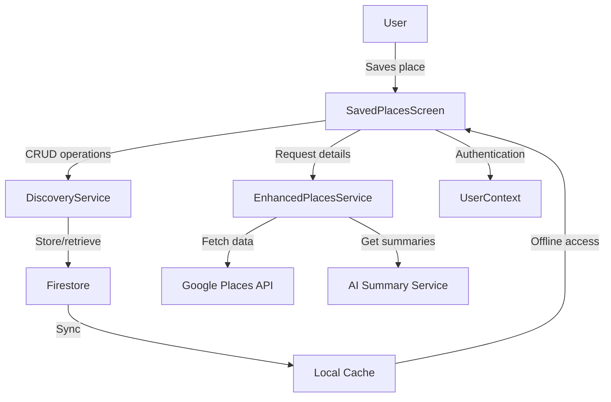

# Design Document: Saved Places Feature

## Overview

The Saved Places feature is a personal collection management system that allows users to bookmark and organize interesting locations they discover during their walks. This feature transforms the app from a passive discovery tool into an active collection builder, creating lasting value for users by maintaining a personalized list of places they want to visit or remember.

The design focuses on providing a seamless experience for saving, viewing, and managing places with rich details including photos, reviews, and AI-powered summaries. The system integrates with Google Places API for comprehensive place information and supports offline access through local caching.

## Architecture

The Saved Places feature follows a layered architecture pattern:

1. **Presentation Layer**
   - SavedPlacesScreen.js - Main UI component for displaying and managing saved places
   - Place detail modal/component - For showing detailed information about a specific place

2. **Service Layer**
   - DiscoveryService.js - Core service for CRUD operations on saved places
   - EnhancedPlacesService.js - Service for fetching rich place data with AI summaries
   - NewPlacesService.js - Service for Google Places API integration

3. **Data Layer**
   - Firestore - Cloud storage for saved places under user profiles
   - Local cache - For offline access to saved places data

4. **Context Layer**
   - UserContext.js - Provides user authentication and profile data

### Data Flow



## Components and Interfaces

### SavedPlacesScreen Component

The main interface for users to view and manage their saved places.

**Props:**
- `navigation` - React Navigation prop for screen navigation
- `route` - React Navigation route information

**State:**
- `allPlaces` - Array of saved place objects
- `filterType` - Current filter selection (null for all places)
- `loading` - Boolean indicating loading state
- `selectedPlace` - Currently selected place for detail view (null if none)

**Key Methods:**
- `loadSavedPlaces()` - Fetches saved places from DiscoveryService
- `handleRemove(placeId)` - Removes a place from saved collection
- `handleFilter(type)` - Filters places by type
- `handlePlaceSelect(place)` - Shows detailed view of selected place
- `handleRefresh()` - Refreshes data from server

### Place Detail Component

Modal or screen for displaying detailed information about a saved place.

**Props:**
- `place` - Place object with details
- `onClose` - Function to close the detail view
- `onRemove` - Function to remove place from saved collection

**Key Features:**
- Display place photos in a gallery/carousel
- Show place information (name, address, type, etc.)
- Display ratings and reviews
- Show AI-powered or editorial summaries
- Provide options to open in maps, share, or remove

### DiscoveryService Interface

Service for managing saved places in Firestore.

**Key Methods:**
- `getSavedPlaces(userId)` - Retrieves all saved places for a user
- `updateDiscovery(userId, discoveryId, updates)` - Updates a discovery (e.g., to mark as saved/unsaved)
- `unsavePlace(userId, placeId)` - Removes a place from saved collection

### EnhancedPlacesService Interface

Service for fetching rich place details with AI summaries.

**Key Methods:**
- `getEnhancedPlaceDetails(placeId, language)` - Gets detailed place information with AI summaries
- `getPlacePhotoUrl(photoReference, maxWidth)` - Generates URLs for place photos

## Data Models

### Saved Place Object

```javascript
{
  id: String,              // Unique identifier for the discovery
  placeId: String,         // Google Place ID
  placeName: String,       // Name of the place
  placeType: String,       // Category/type of the place
  saved: Boolean,          // Flag indicating if place is saved (always true for saved places)
  createdAt: Timestamp,    // When the discovery was created
  updatedAt: Timestamp,    // When the discovery was last updated
  userId: String,          // ID of the user who saved this place
  journeyId: String,       // Optional: ID of the journey where this place was discovered
  placeData: {             // Rich place data from Google Places API
    name: String,
    formatted_address: String,
    types: Array<String>,
    rating: Number,
    user_ratings_total: Number,
    photos: Array<PhotoObject>,
    reviews: Array<ReviewObject>,
    // Other place details from Google Places API
  },
  summaries: {             // AI and editorial summaries
    generativeSummary: Object,  // AI-generated summary with Gemini attribution
    editorialSummary: Object,   // Editorial summary from Google
    topReview: Object           // Top review for quick reference
  }
}
```

### Photo Object

```javascript
{
  photoReference: String,  // Reference ID for the photo in Google Places API
  width: Number,           // Width of the photo
  height: Number           // Height of the photo
}
```

### Review Object

```javascript
{
  authorName: String,      // Name of the reviewer
  rating: Number,          // Rating given (1-5)
  text: String,            // Review text
  time: Number,            // Timestamp of the review
  profilePhoto: String     // URL to reviewer's profile photo
}
```

## Error Handling

1. **Network Errors**
   - Implement retry logic for failed API requests
   - Display appropriate error messages to users
   - Fall back to cached data when network is unavailable

2. **API Errors**
   - Handle Google Places API errors gracefully
   - Implement fallback to basic place information when enhanced data is unavailable
   - Log errors for debugging and monitoring

3. **Authentication Errors**
   - Redirect to sign-in screen if user authentication fails
   - Preserve unsaved changes when possible

4. **Data Consistency**
   - Implement optimistic updates for better UX
   - Reconcile local and server state after network operations

## Testing Strategy

1. **Unit Tests**
   - Test individual components and services in isolation
   - Mock external dependencies (Firestore, Google Places API)
   - Verify correct behavior for all key methods

2. **Integration Tests**
   - Test interaction between components and services
   - Verify data flow from UI to Firestore and back
   - Test synchronization between online and offline states

3. **UI Tests**
   - Verify rendering of saved places list in different states (empty, loading, populated)
   - Test filtering functionality
   - Verify place detail view displays all information correctly

4. **API Tests**
   - Test integration with Google Places API
   - Verify correct handling of API responses and errors
   - Test platform-specific API key selection

5. **Performance Tests**
   - Measure loading times for saved places screen
   - Test performance with large numbers of saved places
   - Verify efficient use of network resources

## Security Considerations

1. **User Data Protection**
   - Ensure saved places are only accessible to the user who saved them
   - Implement proper Firestore security rules
   - Sanitize all user inputs

2. **API Key Protection**
   - Use platform-specific API keys
   - Implement proper key restrictions in Google Cloud Console
   - Monitor API usage for unusual patterns

3. **Data Privacy**
   - Only store necessary place information
   - Provide clear privacy policy regarding saved place data
   - Implement data deletion when users remove saved places

## Performance Optimization

1. **Field Masking**
   - Request only needed fields from Google Places API to reduce payload size
   - Implement selective loading of place details

2. **Image Optimization**
   - Use appropriate image sizes based on device screen
   - Implement lazy loading for images
   - Cache images locally for faster loading

3. **Pagination**
   - Implement pagination for users with large numbers of saved places
   - Load additional data on demand (infinite scroll)

4. **Caching Strategy**
   - Cache saved places data for offline access
   - Implement intelligent cache invalidation
   - Prioritize critical data for offline availability