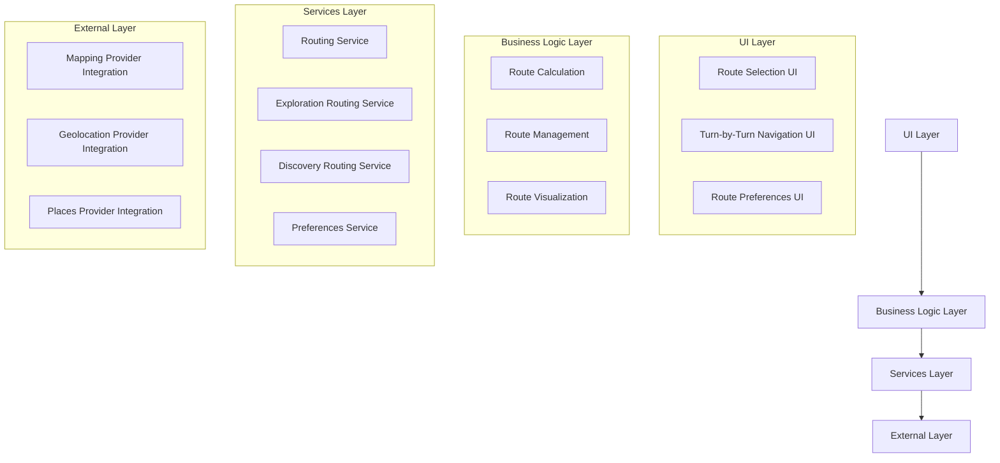

# Design Document: Destination Routing

## Overview

The Destination Routing feature enhances the Hero's Path app by providing users with multiple routing options to reach destinations. This feature transforms the app from a passive exploration tool to an active navigation system that still maintains the core exploration and discovery values. The design focuses on creating an intuitive, flexible routing system that balances practical navigation needs with the app's unique exploration-focused experience.

## Architecture

The Destination Routing feature will be implemented using a layered architecture that separates concerns and promotes maintainability:



### Key Components

1. **UI Layer**: Handles user interactions and displays routing information
2. **Business Logic Layer**: Manages route calculations, preferences, and state
3. **Services Layer**: Provides specialized services for different routing modes
4. **External Layer**: Integrates with external APIs and services

## Components and Interfaces

### 1. Routing Service

The core service responsible for managing routes and coordinating between different routing modes.

```javascript
// RoutingService.js
class RoutingService {
  // Core methods
  async calculateRoutes(origin, destination, preferences) { /* ... */ }
  async getOptimalRoute(origin, destination, preferences) { /* ... */ }
  async startNavigation(routeId) { /* ... */ }
  async stopNavigation() { /* ... */ }
  async recalculateRoute(currentPosition, destination) { /* ... */ }
  
  // Event handlers
  onRouteDeviation(callback) { /* ... */ }
  onRouteProgress(callback) { /* ... */ }
  onRouteCompletion(callback) { /* ... */ }
  
  // Helper methods
  estimateRouteTime(route, travelMode) { /* ... */ }
  estimateRouteDistance(route) { /* ... */ }
}
```

### 2. Exploration Routing Service

Specialized service for generating routes that prioritize unexplored areas.

```javascript
// ExplorationRoutingService.js
class ExplorationRoutingService {
  async calculateExplorationRoute(origin, destination, preferences) { /* ... */ }
  async getUnexploredSegments(boundingBox) { /* ... */ }
  async calculateExplorationScore(route) { /* ... */ }
  async optimizeForExploration(baseRoute, maxDeviation) { /* ... */ }
}
```

### 3. Discovery Routing Service

Specialized service for generating routes that prioritize areas with high POI density.

```javascript
// DiscoveryRoutingService.js
class DiscoveryRoutingService {
  async calculateDiscoveryRoute(origin, destination, preferences) { /* ... */ }
  async getPOIDensity(boundingBox) { /* ... */ }
  async calculateDiscoveryScore(route) { /* ... */ }
  async optimizeForDiscovery(baseRoute, maxDeviation, poiPreferences) { /* ... */ }
}
```

### 4. Route Preferences Service

Manages user preferences for routing.

```javascript
// RoutePreferencesService.js
class RoutePreferencesService {
  async getUserPreferences() { /* ... */ }
  async updatePreferences(preferences) { /* ... */ }
  async getDefaultPreferences() { /* ... */ }
  validatePreferences(preferences) { /* ... */ }
}
```

### 5. UI Components

#### Destination Search Component

```javascript
// components/DestinationSearch.js
const DestinationSearch = (props) => {
  // State
  const [searchQuery, setSearchQuery] = useState('');
  const [searchResults, setSearchResults] = useState([]);
  
  // Methods
  const handleSearch = async (query) => { /* ... */ };
  const handleSelectDestination = (destination) => { /* ... */ };
  
  // Render
  return (
    <View>
      <SearchInput value={searchQuery} onChangeText={setSearchQuery} />
      <SearchResultsList results={searchResults} onSelect={handleSelectDestination} />
    </View>
  );
};
```

#### Route Options Component

```javascript
// components/RouteOptions.js
const RouteOptions = (props) => {
  // State
  const [selectedRouteIndex, setSelectedRouteIndex] = useState(0);
  const { routes } = props;
  
  // Methods
  const handleRouteSelect = (index) => { /* ... */ };
  const handleStartNavigation = () => { /* ... */ };
  
  // Render
  return (
    <View>
      <RouteList routes={routes} selectedIndex={selectedRouteIndex} onSelect={handleRouteSelect} />
      <RouteDetails route={routes[selectedRouteIndex]} />
      <Button title="Start Navigation" onPress={handleStartNavigation} />
    </View>
  );
};
```

#### Turn-by-Turn Navigation Component

```javascript
// components/TurnByTurnNavigation.js
const TurnByTurnNavigation = (props) => {
  // State
  const [currentStep, setCurrentStep] = useState(0);
  const { route, onCancel } = props;
  
  // Methods
  const handleNextStep = () => { /* ... */ };
  const handlePreviousStep = () => { /* ... */ };
  
  // Render
  return (
    <View>
      <NavigationHeader onCancel={onCancel} />
      <CurrentStepDisplay step={route.steps[currentStep]} />
      <UpcomingStepsPreview steps={route.steps.slice(currentStep + 1, currentStep + 3)} />
      <RouteProgressIndicator current={currentStep} total={route.steps.length} />
    </View>
  );
};
```

### 6. Screens

#### Route Planner Screen

```javascript
// screens/RoutePlannerScreen.js
const RoutePlannerScreen = ({ navigation }) => {
  // State
  const [destination, setDestination] = useState(null);
  const [routes, setRoutes] = useState([]);
  const [preferences, setPreferences] = useState({});
  
  // Effects
  useEffect(() => {
    if (destination) {
      calculateRoutes();
    }
  }, [destination, preferences]);
  
  // Methods
  const calculateRoutes = async () => { /* ... */ };
  const handleStartNavigation = (routeId) => { /* ... */ };
  
  // Render
  return (
    <View>
      <DestinationSearch onSelectDestination={setDestination} />
      {destination && <RouteOptions routes={routes} onStartNavigation={handleStartNavigation} />}
      <PreferencesButton onPress={() => navigation.navigate('RoutePreferences')} />
    </View>
  );
};
```

#### Active Navigation Screen

```javascript
// screens/ActiveNavigationScreen.js
const ActiveNavigationScreen = ({ navigation, route }) => {
  // State
  const [activeRoute, setActiveRoute] = useState(route.params.routeData);
  const [userLocation, setUserLocation] = useState(null);
  const [deviationDetected, setDeviationDetected] = useState(false);
  
  // Effects
  useEffect(() => {
    // Set up location tracking and route monitoring
  }, []);
  
  // Methods
  const handleRouteDeviation = () => { /* ... */ };
  const handleRouteCompletion = () => { /* ... */ };
  const handleStopNavigation = () => { /* ... */ };
  
  // Render
  return (
    <View>
      <MapView route={activeRoute} userLocation={userLocation} />
      <TurnByTurnNavigation route={activeRoute} onCancel={handleStopNavigation} />
      {deviationDetected && <RouteDeviationAlert onRecalculate={() => {}} onIgnore={() => {}} />}
    </View>
  );
};
```

## Data Models

### Route Model

```javascript
/**
 * Represents a calculated route
 */
class Route {
  id;                // Unique identifier
  origin;            // Starting point {lat, lng}
  destination;       // Ending point {lat, lng}
  waypoints;         // Array of intermediate points [{lat, lng}]
  steps;             // Array of navigation steps
  distance;          // Total distance in meters
  duration;          // Estimated duration in seconds
  routeType;         // 'optimal', 'exploration', or 'discovery'
  polyline;          // Encoded polyline string
  explorationScore;  // Score indicating exploration potential (0-100)
  discoveryScore;    // Score indicating discovery potential (0-100)
  poiAlongRoute;     // Points of interest along the route
  accessibility;     // Accessibility information
  
  // Methods
  getSegment(startIndex, endIndex) { /* ... */ }
  getRemainingSteps(currentPosition) { /* ... */ }
  estimateTimeToDestination(currentPosition, speed) { /* ... */ }
}
```

### Navigation Step Model

```javascript
/**
 * Represents a single navigation instruction
 */
class NavigationStep {
  index;             // Step index in the route
  instruction;       // Human-readable instruction
  distance;          // Distance for this step in meters
  duration;          // Estimated duration for this step in seconds
  startLocation;     // Starting point {lat, lng}
  endLocation;       // Ending point {lat, lng}
  maneuver;          // Type of maneuver (turn-right, turn-left, etc.)
  polyline;          // Encoded polyline for this step
  landmarks;         // Notable landmarks for this step
}
```

### Route Preferences Model

```javascript
/**
 * User preferences for route calculation
 */
class RoutePreferences {
  maxDeviation;      // Maximum deviation from optimal route (minutes)
  poiCategories;     // Preferred POI categories for discovery mode
  explorationFocus;  // 'recent' or 'completeness'
  accessibility;     // Accessibility requirements
  avoidFeatures;     // Features to avoid (stairs, hills, etc.)
  timeConstraint;    // Time available for journey (minutes)
  travelMode;        // 'walking', 'cycling', etc.
}
```

## Error Handling

### Error Types

1. **RoutingError**: Base error class for all routing-related errors
2. **DestinationNotFoundError**: Error when a destination cannot be found
3. **RouteCalculationError**: Error during route calculation
4. **NavigationError**: Error during active navigation
5. **PreferencesValidationError**: Error when preferences are invalid

### Error Handling Strategy

1. **UI Level**: Display user-friendly error messages with actionable suggestions
2. **Service Level**: Log detailed errors, attempt recovery strategies
3. **Network Level**: Handle API failures with retries and fallbacks

### Example Error Handling

```javascript
try {
  const routes = await routingService.calculateRoutes(origin, destination, preferences);
  setRoutes(routes);
} catch (error) {
  if (error instanceof DestinationNotFoundError) {
    showAlert('Destination not found', 'Please try a different search term.');
  } else if (error instanceof RouteCalculationError) {
    showAlert('Unable to calculate route', 'Please try again or adjust your preferences.');
    logError('Route calculation failed', error);
  } else {
    showAlert('Something went wrong', 'Please try again later.');
    logError('Unknown routing error', error);
  }
}
```

## Testing Strategy

### Unit Testing

1. **Service Tests**: Test individual service methods with mocked dependencies
2. **Model Tests**: Validate model behavior and constraints
3. **Utility Tests**: Test helper functions and algorithms

### Integration Testing

1. **Service Integration**: Test interaction between different services
2. **API Integration**: Test integration with external mapping and places APIs
3. **Context Integration**: Test integration with existing app contexts (ExplorationContext, etc.)

### UI Testing

1. **Component Tests**: Test individual UI components with mocked data
2. **Screen Tests**: Test screen behavior and user interactions
3. **Navigation Tests**: Test navigation flow between screens

### End-to-End Testing

1. **Route Calculation**: Test end-to-end route calculation with real data
2. **Navigation Simulation**: Simulate navigation with predefined location updates
3. **Error Scenarios**: Test error handling and recovery

## Integration with Existing Features

### Map Navigation & GPS

The Destination Routing feature will build upon the existing Map Navigation & GPS functionality, extending it with:

1. Route visualization on the map
2. Turn-by-turn navigation overlay
3. Enhanced location tracking for route progress

### Journey Tracking

Integration with Journey Tracking will include:

1. Recording navigated routes as part of journey history
2. Updating exploration statistics based on navigated routes
3. Distinguishing between free exploration and guided navigation in journey records

### Exploration Context

The feature will interact with the ExplorationContext to:

1. Access user's exploration history for generating exploration routes
2. Update exploration data as the user navigates routes
3. Calculate exploration scores for potential routes

### Discovery Services

Integration with discovery-related services will include:

1. Incorporating POI data for discovery route calculation
2. Notifying users of discoveries along active routes
3. Updating discovery statistics based on navigated routes

## Performance Considerations

### Route Calculation Optimization

1. **Caching**: Cache route calculations for common origin-destination pairs
2. **Progressive Calculation**: Calculate optimal route first, then enhance for exploration/discovery
3. **Background Processing**: Perform complex route calculations in background threads

### Memory Management

1. **Efficient Data Structures**: Use efficient data structures for route representation
2. **Lazy Loading**: Load detailed route information only when needed
3. **Resource Cleanup**: Properly dispose of resources when navigation ends

### Battery Usage Optimization

1. **Location Updates**: Optimize frequency of location updates based on route complexity
2. **Geofencing**: Use geofencing to trigger instructions instead of continuous monitoring
3. **Background Mode**: Implement efficient background mode for navigation

## Accessibility Considerations

1. **Screen Reader Support**: Ensure all navigation UI elements are properly labeled for screen readers
2. **Voice Guidance**: Provide clear voice guidance for navigation instructions
3. **High Contrast Mode**: Support high contrast mode for map and navigation UI
4. **Customizable Text Size**: Allow users to adjust text size for navigation instructions
5. **Accessible Route Options**: Provide routes that avoid stairs, steep inclines, and other barriers