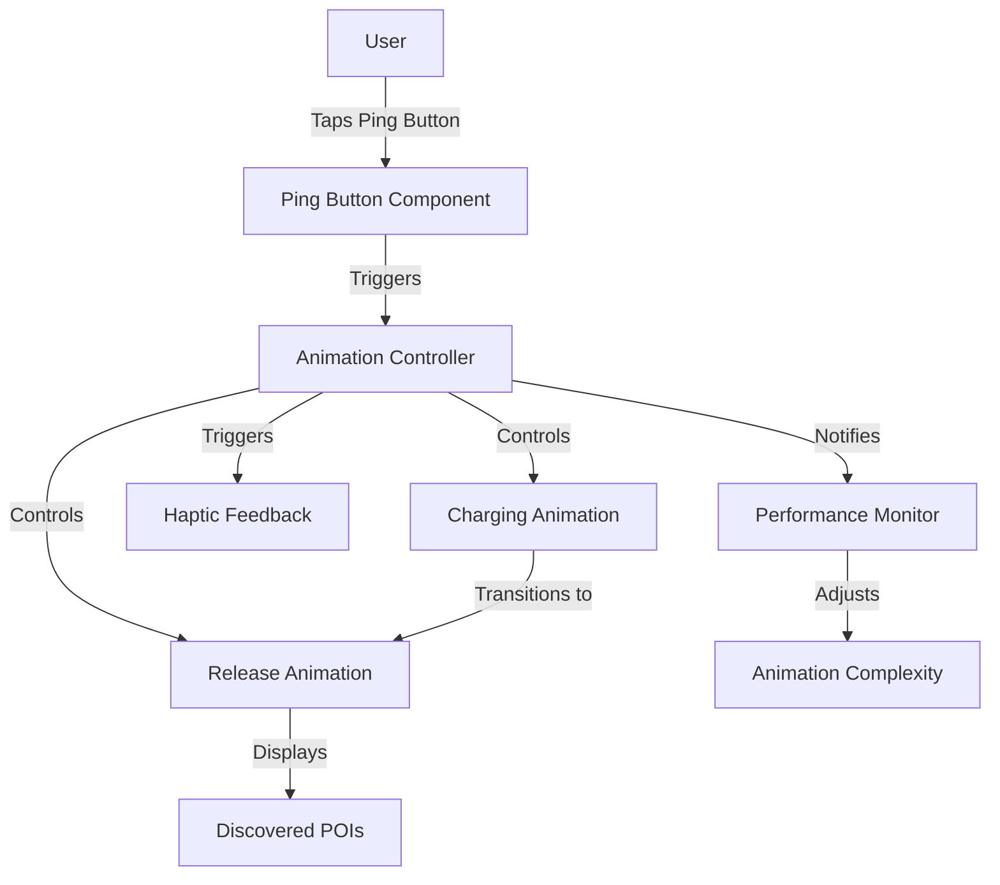

# Design Document: Enhanced Ping Animation

## Overview

The Enhanced Ping Animation feature will transform the current ping functionality into a more engaging, gamified experience that provides users with clear visual feedback when discovering points of interest during their walks. This design document outlines the technical approach, architecture, components, and implementation details for creating a visually impactful "special power" animation that enhances the user's exploration experience.

## Architecture

The enhanced ping animation will be implemented using a layered architecture that separates concerns and ensures maintainability:

1. **Presentation Layer**: React Native components that render the animation and handle user interaction
2. **Animation Logic Layer**: Manages animation sequences, timing, and coordination
3. **Haptic Feedback Layer**: Controls device vibration based on animation state
4. **Performance Optimization Layer**: Monitors and adjusts animation complexity based on device capabilities

### System Context Diagram



## Components and Interfaces

### 1. Enhanced PingAnimation Component

This will be the main component responsible for rendering the animation sequence.

```javascript
// components/EnhancedPingAnimation.js
import React, { useRef, useEffect } from 'react';
import { View, StyleSheet, Animated } from 'react-native';
import { useTheme } from '../contexts/ThemeContext';
import { usePingAnimation } from '../hooks/usePingAnimation';
import { triggerHapticFeedback } from '../utils/HapticFeedback';

const EnhancedPingAnimation = ({ 
  isActive, 
  onAnimationComplete,
  position, // { x, y } coordinates on screen
  reducedMotion = false
}) => {
  // Implementation details...
};
```

#### Key Features:
- Charging animation (1-2 seconds)
- Release animation (2-3 seconds)
- Theme-aware coloring
- Accessibility support
- Performance optimization

### 2. Animation Hook

A custom hook to manage animation state and sequences:

```javascript
// hooks/usePingAnimation.js
import { useRef, useState, useEffect } from 'react';
import { Animated, Easing, Platform } from 'react-native';
import { useTheme } from '../contexts/ThemeContext';

export function usePingAnimation(isActive, reducedMotion = false) {
  // Animation values and state management
  // Returns animation values and control functions
}
```

### 3. Haptic Feedback Utility

A utility to handle haptic feedback across different devices:

```javascript
// utils/HapticFeedback.js
import * as Haptics from 'expo-haptics';
import { Platform } from 'react-native';

export const triggerHapticFeedback = (intensity = 'light') => {
  // Implementation with platform checks and fallbacks
};
```

### 4. Performance Monitor

A utility to monitor and optimize animation performance:

```javascript
// utils/PerformanceMonitor.js
import { Platform } from 'react-native';
import * as Battery from 'expo-battery';

export const getOptimalAnimationSettings = async () => {
  // Check device capabilities and battery status
  // Return appropriate animation settings
};
```

## Data Models

### Animation State Model

```javascript
{
  phase: 'idle' | 'charging' | 'releasing' | 'completed',
  progress: {
    charging: 0-1, // Animation progress values
    release: 0-1
  },
  performance: {
    complexity: 'high' | 'medium' | 'low',
    particleCount: Number,
    useBlur: Boolean
  },
  haptics: {
    enabled: Boolean,
    nextTrigger: 'light' | 'medium' | 'heavy' | null
  }
}
```

## Animation Design

### Charging Phase
1. **Initial State**: Small pulsing circle at the user's location
2. **Build-up**: Circle pulses with increasing intensity
3. **Peak**: Circle reaches maximum brightness/size before release
4. **Visual Cues**: Particles begin to gather around the circle
5. **Duration**: 1-2 seconds total

### Release Phase
1. **Initial Burst**: Rapid expansion from center point
2. **Wave Effect**: Circular wave emanates outward
3. **Particle Effects**: Particles scatter in the direction of the wave
4. **Highlight POIs**: Points of interest within range are highlighted as the wave passes over them
5. **Fade Out**: Animation gradually fades out rather than abruptly disappearing
6. **Duration**: 2-3 seconds total

### Visual Style

The animation will use a consistent visual language that matches the app's existing design system:

- **Colors**: Uses the app's theme colors with appropriate opacity variations
- **Glow Effects**: Soft glow effects that match the "magical discovery" theme
- **Particles**: Small, subtle particles that enhance the effect without overwhelming
- **Transitions**: Smooth, fluid transitions between animation phases

## Error Handling

### Potential Failure Points and Mitigations

1. **Performance Issues**
   - **Detection**: Monitor frame rate during animation
   - **Mitigation**: Dynamically reduce particle count, disable blur effects
   - **Fallback**: Ultra-simplified animation for low-end devices

2. **Haptic Feedback Failures**
   - **Detection**: Try-catch around haptic calls
   - **Mitigation**: Silently fail if haptics unavailable
   - **Logging**: Log failures for analytics

3. **Animation Interruptions**
   - **Detection**: Track component unmount during animation
   - **Mitigation**: Properly clean up animation values
   - **Recovery**: Ensure animation can be safely interrupted

## Testing Strategy

### Unit Tests

- Test animation timing calculations
- Test haptic feedback utility with mocks
- Test performance monitoring utility

### Integration Tests

- Test animation with different theme settings
- Test animation with accessibility features enabled
- Test animation with different performance profiles

### User Testing

- Test with users on various device types
- Gather feedback on animation impact and satisfaction
- Measure engagement metrics before and after implementation

## Accessibility Considerations

1. **Reduced Motion Support**
   - Detect system reduced motion setting
   - Provide simplified animation without rapid movements
   - Ensure information is still conveyed clearly

2. **Screen Reader Support**
   - Announce animation start: "Searching for discoveries nearby"
   - Announce discoveries found: "Found 3 new places nearby"
   - Ensure all interactive elements have proper accessibility labels

3. **Visual Accessibility**
   - Don't rely solely on color to convey information
   - Ensure sufficient contrast for all visual elements
   - Support dynamic text sizes

## Performance Considerations

1. **Animation Optimization**
   - Use native driver for animations when possible
   - Limit redraws and component updates during animation
   - Use requestAnimationFrame for custom animations

2. **Device-Specific Adjustments**
   - Detect device capabilities on startup
   - Adjust particle count and effects based on device tier
   - Monitor battery level and reduce effects in low power mode

3. **Memory Management**
   - Properly clean up animation resources
   - Avoid memory leaks from animation callbacks
   - Minimize image assets by using procedural generation where possible

## Implementation Plan

The implementation will follow these phases:

1. **Core Animation Framework**
   - Implement basic animation components
   - Set up animation timing and sequencing
   - Create theme integration

2. **Visual Effects Enhancement**
   - Add particle systems
   - Implement glow effects
   - Create POI highlighting

3. **Haptic Integration**
   - Add haptic feedback triggers
   - Implement platform-specific optimizations
   - Add user controls for haptics

4. **Performance Optimization**
   - Implement performance monitoring
   - Create tiered animation complexity
   - Add battery awareness

5. **Accessibility Features**
   - Add reduced motion support
   - Implement screen reader announcements
   - Test with accessibility tools

## Integration Points

### MapScreen Integration

The enhanced ping animation will be integrated into the MapScreen component, centered on the user's Link sprite and with map snapping functionality:

```javascript
// screens/MapScreen.js
import EnhancedPingAnimation from '../components/EnhancedPingAnimation';
import { useRef } from 'react';

// Within the MapScreen component:
const mapRef = useRef(null);

const handlePingPress = useCallback(() => {
  // Snap map to user's current location
  if (mapRef.current && currentPosition) {
    mapRef.current.animateToRegion({
      latitude: currentPosition.latitude,
      longitude: currentPosition.longitude,
      latitudeDelta: 0.005, // Appropriate zoom level
      longitudeDelta: 0.005,
    }, 300); // Animation duration in ms
  }
  
  // Activate ping animation
  setPinging(true);
}, [currentPosition]);

return (
  <View style={styles.mapContainer}>
    <MapView 
      ref={mapRef}
      // other map props 
    />
    
    {/* User's Link sprite */}
    <Animated.View style={[styles.spriteContainer, spritePosition]}>
      <Image source={require('../assets/link_sprites/link_walking.gif')} style={styles.sprite} />
      
      {/* Animation positioned relative to sprite */}
      {isPinging && (
        <EnhancedPingAnimation 
          isActive={isPinging}
          spriteRef={spriteRef} // Reference to sprite for positioning
          onAnimationComplete={handlePingComplete}
          reducedMotion={useReducedMotion}
        />
      )}
    </Animated.View>
    
    <PingButton 
      onPress={handlePingPress}
      disabled={!canPing || isPinging}
      cooldown={pingCooldown}
      credits={pingCredits}
    />
  </View>
);
```

The animation component will be positioned relative to the sprite and will follow it if the user moves during the animation. The z-index will be managed to ensure the animation appears to emanate from the sprite while still being visible above other map elements.

### Settings Integration

Add haptic feedback toggle to the Settings screen:

```javascript
// screens/SettingsScreen.js
<SettingsSection title="Ping Settings">
  <SettingsToggle
    label="Haptic Feedback"
    value={settings.pingHaptics}
    onValueChange={value => updateSettings({ pingHaptics: value })}
  />
</SettingsSection>
```

## Future Enhancements

While not part of the initial implementation, these enhancements could be considered for future iterations:

1. **Sound Effects**: Add optional sound effects synchronized with the animation
2. **Custom Themes**: Allow the animation to have special effects for each theme (especially Adventure theme)
3. **Achievement Integration**: Tie animation effects to user achievements or level
4. **AR Integration**: Extend the animation into AR space for a more immersive experience
5. **Animation Unlocks**: Allow users to unlock more dramatic animations through continued use