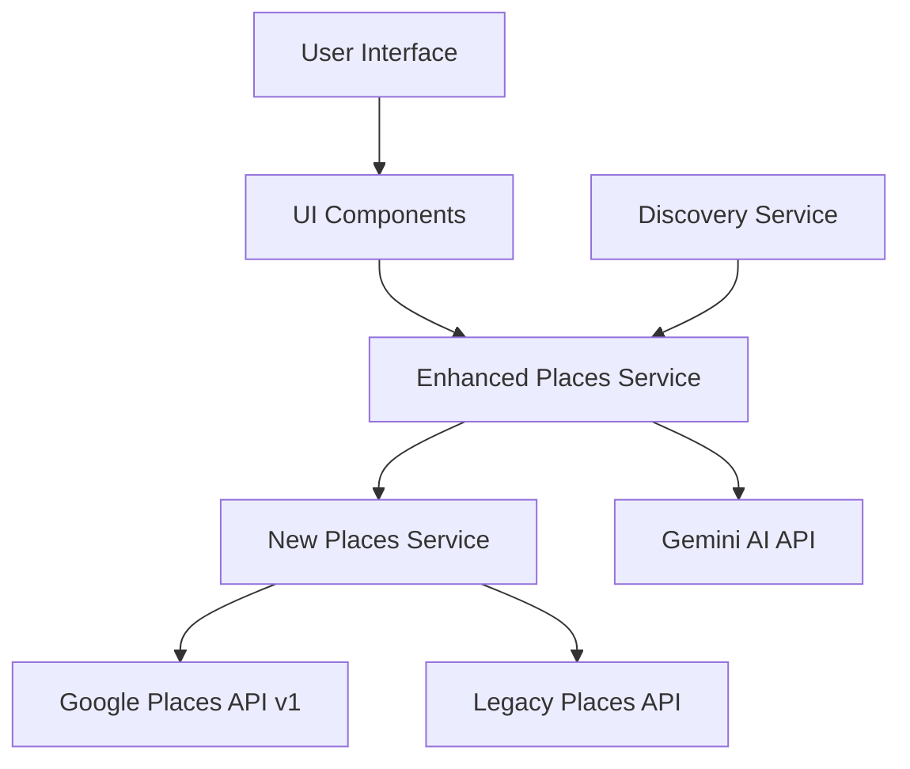
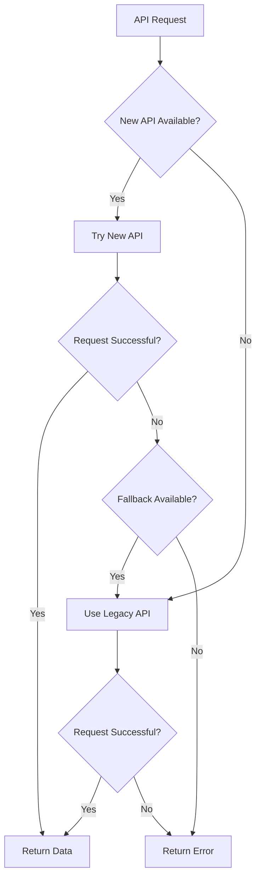

# Design Document: Enhanced Places Integration

## Overview

The Enhanced Places Integration feature provides a comprehensive solution for integrating Google Places API v1 into Hero's Path, with advanced capabilities including AI-powered place summaries, enhanced photo handling, and comprehensive metadata. This design document outlines the architecture, components, interfaces, data models, error handling, and testing strategy for implementing this feature.

The integration follows a layered approach with a unified API interface that abstracts the complexity of working with multiple API versions. It includes automatic fallback mechanisms to ensure reliability, field masking for optimized performance, and consistent data structures across all endpoints.

## Architecture

The Enhanced Places Integration follows a service-oriented architecture with clear separation of concerns:



### Key Components:

1. **New Places Service**: Core service that provides a unified interface to both Google Places API v1 and legacy API, handling automatic fallback and response transformation.

2. **Enhanced Places Service**: Advanced features wrapper that extends the New Places Service with AI summaries, editorial content, and advanced filtering.

3. **Discovery Service**: Orchestrates the Search Along Route (SAR) feature using the Enhanced Places Service to find interesting places along user walking routes.

4. **UI Components**: Display place information to users, including summaries, photos, and metadata.

## Components and Interfaces

### 1. New Places Service (services/NewPlacesService.js)

Primary service with unified API interface for both new and legacy Google Places APIs.

#### Key Functions:

```javascript
// Search for nearby places using either new or legacy API
export async function searchNearbyPlaces(latitude, longitude, radius, type, options = {})

// Get detailed information about a specific place
export async function getPlaceDetails(placeId, language = 'en', useNewAPI = true)

// Get place summaries using the new Places API
export async function getPlaceSummaries(placeId, language = 'en')

// Test API connectivity and determine which API to use
export async function testAPIConnectivity()

// Test place summaries with a well-known place
export async function testAISummaries()
```

#### Internal Functions:

```javascript
// Search nearby places using the new Places API (New)
async function searchNearbyPlacesNew(latitude, longitude, radius, type, maxResults, apiKey, options = {})

// Search nearby places using the legacy Places API (fallback)
async function searchNearbyPlacesLegacy(latitude, longitude, radius, type, maxResults, apiKey, options = {})

// Get place details using the new Places API (New)
async function getPlaceDetailsNew(placeId, language = 'en')

// Get place details using the legacy Places API (fallback)
async function getPlaceDetailsLegacy(placeId, language = 'en')

// Transform new API place response to standard format
function transformNewPlaceResponse(place)

// Transform legacy API place response to standard format
function transformLegacyPlaceResponse(place)
```

### 2. Enhanced Places Service (services/EnhancedPlacesService.js)

Advanced features wrapper that extends the New Places Service with AI summaries, editorial content, and advanced filtering.

#### Key Functions:

```javascript
// Get enhanced place details including AI summaries
export async function getEnhancedPlaceDetails(placeId, language = 'en')

// Get nearby places with enhanced filtering and sorting
export async function getNearbyPlacesEnhanced(latitude, longitude, radius, options = {})

// Generate a photo URL for a place
export function getPlacePhotoUrl(photoReference, maxWidth = 400)
```

### 3. Discoveries Service (services/DiscoveriesService.js)

Orchestrates the Search Along Route (SAR) feature using the Enhanced Places Service to find interesting places along user walking routes.

#### Key Functions:

```javascript
// Get place suggestions for a route using user preferences
export async function getSuggestionsForRoute(routeCoords, preferences, language = 'en', userId = null)

// Get user's discovery preferences from AsyncStorage
export async function getUserDiscoveryPreferences()

// Reset discovery preferences to defaults (all enabled)
export async function resetDiscoveryPreferences()
```

## Data Models

### 1. Standardized Place Object

```javascript
{
  placeId: String,            // Unique Google Place ID
  name: String,               // Place name
  category: String,           // Primary place type
  types: Array<String>,       // All place types
  description: String,        // Short description or address
  thumbnail: String,          // URL to place photo
  rating: Number,             // Place rating (0-5)
  userRatingsTotal: Number,   // Number of ratings
  latitude: Number,           // Latitude coordinate
  longitude: Number,          // Longitude coordinate
  priceLevel: Number,         // Price level (0-4)
  address: String,            // Full address
  shortAddress: String,       // Short address
  formatted_address: String,  // Formatted address
  attributions: Array         // Data attributions
}
```

### 2. Enhanced Place Details Object

```javascript
{
  // All fields from Standardized Place Object
  // Plus:
  website: String,            // Website URL
  phoneNumber: String,        // Contact phone number
  openingHours: Array<String>, // Opening hours by day
  currentOpeningHours: Array<String>, // Current opening hours
  isOpen: Boolean,            // Whether place is currently open
  photos: Array<Object>,      // Array of photo objects
  reviews: Array<Object>,     // Array of review objects
  editorialSummary: String,   // Editorial summary
  summaries: {                // Enhanced summaries
    generativeSummary: Object, // AI-generated summary
    editorialSummary: Object,  // Editorial summary
    topReview: Object          // Top user review
  }
}
```

### 3. Photo Object

```javascript
{
  photoReference: String,     // Photo reference ID
  width: Number,              // Photo width
  height: Number              // Photo height
}
```

### 4. Review Object

```javascript
{
  authorName: String,         // Reviewer name
  rating: Number,             // Review rating
  text: String,               // Review text
  time: Number,               // Review timestamp
  profilePhoto: String        // Reviewer profile photo URL
}
```

## Error Handling

The Enhanced Places Integration implements a comprehensive error handling strategy:

1. **Automatic Fallback**: When the new Google Places API fails or is unavailable, the system automatically falls back to the legacy API.

2. **Graceful Degradation**: If enhanced features like AI summaries are unavailable, the system gracefully degrades to basic functionality.

3. **Logging**: All API calls and errors are logged with detailed information for debugging purposes.

4. **User Feedback**: User-friendly error messages are displayed when all API attempts fail.

5. **Retry Logic**: Critical API calls include retry logic to handle transient failures.

6. **Validation**: Input parameters are validated before making API calls to prevent errors.

7. **Default Values**: Sensible default values are provided when data is missing or unavailable.

### Error Handling Flow:



## Testing Strategy

The Enhanced Places Integration will be tested using a comprehensive approach:

### 1. Unit Testing

- Test each function in isolation with mock API responses
- Verify transformation functions correctly normalize data
- Test error handling and fallback mechanisms
- Validate field masking implementation

### 2. Integration Testing

- Test interaction between services (NewPlacesService, EnhancedPlacesService, DiscoveriesService)
- Verify automatic fallback between API versions
- Test end-to-end flows from user input to UI display

### 3. API Testing

- Test connectivity to both new and legacy Google Places APIs
- Verify API key management for different platforms
- Test field masking optimization
- Validate response handling for different API versions

### 4. UI Testing

- Test display of place information in UI components
- Verify proper disclosure of AI-generated content
- Test photo display and handling
- Validate error message display

### 5. Performance Testing

- Measure API call performance with and without field masking
- Test response times for different API versions
- Verify memory usage with large result sets

### 6. Platform-Specific Testing

- Test on both iOS and Android devices
- Verify platform-specific API key selection
- Test fallback mechanisms on both platforms

## Implementation Considerations

1. **API Key Security**: API keys must be securely stored and not exposed in client-side code.

2. **Backward Compatibility**: The implementation must maintain backward compatibility with existing code.

3. **Performance Optimization**: Field masking and response transformation must be optimized for performance.

4. **User Experience**: Error handling must prioritize user experience and provide helpful feedback.

5. **Accessibility**: All UI components must be accessible and follow best practices.

6. **Internationalization**: The implementation must support multiple languages and regions.

7. **Privacy**: User data must be handled according to privacy best practices and regulations.

8. **Documentation**: All code must be well-documented with clear comments and examples.