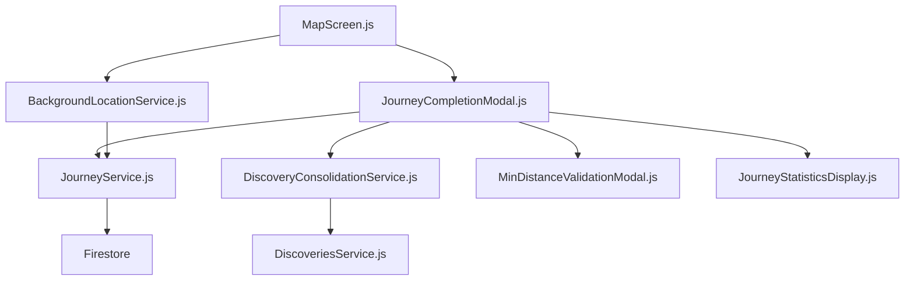
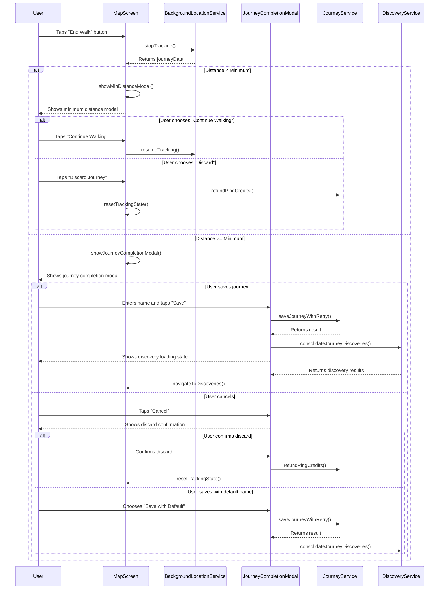
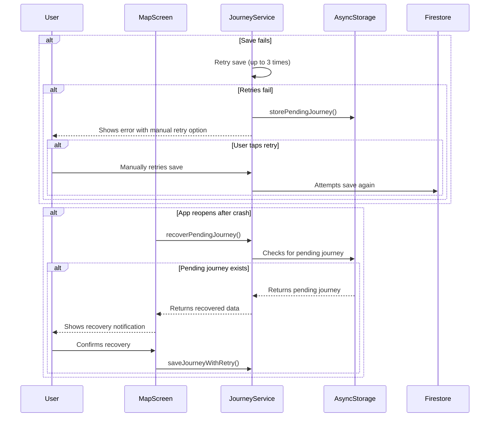

# Design Document: Journey Completion Enhancement

## Overview

The Journey Completion Enhancement builds upon the existing journey tracking functionality in Hero's Path to provide a more polished and user-friendly experience when concluding walks. This enhancement focuses on improving the journey naming workflow, providing better statistics visualization, implementing robust minimum distance validation, and ensuring seamless integration with the discovery process.

This design document outlines the technical approach for implementing these enhancements, ensuring they integrate well with the existing journey tracking system while providing a significantly improved user experience at the critical moment when users complete their walks.

## Architecture

The Journey Completion Enhancement will build upon the existing architecture of the journey tracking system, enhancing specific components rather than replacing them:



### Key Components to Enhance:

1. **New Components**:
   - JourneyCompletionModal.js: A new full-screen modal for journey naming and statistics display
   - MinDistanceValidationModal.js: A dedicated modal for minimum distance validation
   - JourneyStatisticsDisplay.js: A component for visualizing journey statistics

2. **Enhanced Components**:
   - MapScreen.js: Updated to use the new modals and workflow
   - JourneyService.js: Enhanced with better error handling and recovery
   - BackgroundLocationService.js: Improved integration with the completion workflow

3. **Integration Points**:
   - DiscoveryConsolidationService.js: Better feedback during the discovery process
   - Firestore: Enhanced error handling and retry mechanisms

## Components and Interfaces

### 1. JourneyCompletionModal

A new full-screen modal component for naming journeys and displaying statistics.

```typescript
interface JourneyCompletionModalProps {
  isVisible: boolean;
  journeyData: JourneyData;
  defaultName: string;
  onSave: (name: string) => Promise<void>;
  onCancel: () => void;
  onDismiss: () => void;
}

interface JourneyCompletionModalState {
  journeyName: string;
  isSaving: boolean;
  saveError: string | null;
  showDiscardConfirmation: boolean;
}
```

The modal will include:
- A text input field for the journey name with the smart default pre-filled
- A map preview showing the route (if feasible)
- Journey statistics display (distance, duration, pings used)
- Save and cancel buttons
- Loading state during save operation
- Error display and retry option

### 2. MinDistanceValidationModal

A dedicated modal for handling journeys that don't meet minimum distance requirements.

```typescript
interface MinDistanceValidationModalProps {
  isVisible: boolean;
  currentDistance: number;
  minimumDistance: number;
  pingsUsed: number;
  onContinue: () => void;
  onDiscard: () => void;
}
```

The modal will include:
- Clear explanation of why the journey can't be saved
- Current distance vs. minimum required distance
- Information about ping credit refunds
- Options to continue walking or discard the journey
- Visual design consistent with app styling

### 3. JourneyStatisticsDisplay

A reusable component for displaying journey statistics.

```typescript
interface JourneyStatisticsDisplayProps {
  distance: number;
  duration: number;
  pingsUsed: number;
  compact?: boolean;
  showMap?: boolean;
  routeCoordinates?: LocationCoordinates[];
}
```

The component will:
- Format distance in appropriate units (m/km)
- Format duration in hours and minutes
- Show ping usage statistics
- Optionally display a small map preview
- Support compact and expanded display modes

### 4. Enhanced MapScreen

Updates to the MapScreen component to integrate the new journey completion workflow.

```typescript
// New methods to add to MapScreen
interface MapScreenEnhancements {
  handleJourneyEnd(): void;
  showJourneyCompletionModal(journeyData: JourneyData): void;
  validateMinimumDistance(distance: number): boolean;
  showMinDistanceModal(distance: number): void;
  handleJourneySave(name: string): Promise<void>;
  handleJourneyDiscard(): void;
  refundPingCredits(count: number): Promise<void>;
  showDiscoveryLoadingState(): void;
  navigateToDiscoveries(journeyId: string): void;
}
```

### 5. Enhanced JourneyService

Improvements to the JourneyService for better error handling and recovery.

```typescript
// New methods to add to JourneyService
interface JourneyServiceEnhancements {
  saveJourneyWithRetry(userId: string, journeyData: JourneyData, maxRetries?: number): Promise<r>;
  recoverPendingJourney(userId: string): Promise<JourneyData | null>;
  storePendingJourney(userId: string, journeyData: JourneyData): Promise<void>;
  clearPendingJourney(userId: string): Promise<void>;
}
```

## Data Models

### 1. Enhanced JourneyData Model

Extending the existing JourneyData model with additional fields for the enhanced completion workflow.

```typescript
interface EnhancedJourneyData extends JourneyData {
  pingsUsed: number;
  suggestedName: string;
  startLocationName?: string;
  endLocationName?: string;
  saveAttempts?: number;
  lastSaveAttempt?: number;
}
```

### 2. JourneyCompletionState Model

A new model to track the state of the journey completion process.

```typescript
interface JourneyCompletionState {
  journeyData: JourneyData;
  status: 'naming' | 'saving' | 'discovery' | 'complete' | 'error';
  error?: string;
  retryCount: number;
  discoveryStatus?: 'pending' | 'processing' | 'complete' | 'error';
  discoveryResults?: {
    placesFound: number;
    journeyId: string;
  };
}
```

### 3. PendingJourney Model

A model for storing journey data that failed to save for later recovery.

```typescript
interface PendingJourney {
  journeyData: JourneyData;
  userId: string;
  timestamp: number;
  saveAttempts: number;
  lastError?: string;
}
```

## User Interface Design

### 1. Journey Completion Modal

The journey completion modal will be a full-screen modal with the following layout:

```
┌────────────────────────────────────────┐
│  Name Your Journey                     │
│                                        │
│  ┌──────────────────────────────────┐  │
│  │ [Default journey name text field]│  │
│  └──────────────────────────────────┘  │
│                                        │
│  Journey Statistics                    │
│  ┌──────────────────────────────────┐  │
│  │ Distance: 1.2 km                 │  │
│  │ Duration: 25 minutes             │  │
│  │ Pings Used: 3                    │  │
│  └──────────────────────────────────┘  │
│                                        │
│  ┌──────────────────────────────────┐  │
│  │         [Map Preview]            │  │
│  │                                  │  │
│  └──────────────────────────────────┘  │
│                                        │
│  [Cancel]                [Save Journey]│
└────────────────────────────────────────┘
```

### 2. Minimum Distance Modal

The minimum distance modal will have the following layout:

```
┌────────────────────────────────────────┐
│  Journey Too Short                     │
│                                        │
│  Your journey is only 25 meters.       │
│  Journeys must be at least 50 meters   │
│  to be saved.                          │
│                                        │
│  ┌──────────────────────────────────┐  │
│  │ Current: 25m | Required: 50m     │  │
│  │ [Progress bar visualization]     │  │
│  └──────────────────────────────────┘  │
│                                        │
│  3 ping credits will be refunded.      │
│                                        │
│  [Discard Journey]    [Continue Walking]│
└────────────────────────────────────────┘
```

### 3. Discovery Process Feedback

The discovery process feedback will be shown after saving:

```
┌────────────────────────────────────────┐
│  Discovering Places                    │
│                                        │
│  ┌──────────────────────────────────┐  │
│  │ [Animated progress indicator]    │  │
│  └──────────────────────────────────┘  │
│                                        │
│  Searching for interesting places      │
│  along your route...                   │
│                                        │
└────────────────────────────────────────┘
```

## Workflow

### 1. Journey Completion Workflow



### 2. Error Recovery Workflow



## Error Handling

The Journey Completion Enhancement will implement comprehensive error handling:

1. **Network Errors**:
   - Automatic retry mechanism (up to 3 attempts)
   - Exponential backoff between retry attempts
   - Local storage of journey data for later recovery
   - Manual retry option with clear error information

2. **Validation Errors**:
   - Clear feedback for minimum distance validation
   - Options to continue or discard the journey
   - Proper handling of ping credit refunds

3. **App Crash Recovery**:
   - Detection of incomplete journey saves on app restart
   - Option to resume the save process
   - Clear user communication about the recovery process

4. **Discovery Process Errors**:
   - Separation of journey saving and discovery process
   - Fallback options when discovery fails
   - Retry mechanisms for discovery process

5. **UI State Management**:
   - Proper loading states during async operations
   - Error states with actionable information
   - Prevention of duplicate save attempts

## Testing Strategy

### 1. Unit Tests:
   - Test journey name generation logic
   - Test distance validation algorithms
   - Test ping credit refund calculations
   - Test error recovery mechanisms

### 2. Integration Tests:
   - Test interaction between MapScreen and new modal components
   - Test journey saving workflow with various error scenarios
   - Test discovery process integration
   - Test recovery from simulated crashes

### 3. UI Tests:
   - Test modal rendering and interactions
   - Test form validation in the naming modal
   - Test responsive design on different screen sizes
   - Test accessibility features

### 4. End-to-End Tests:
   - Test complete journey completion workflow
   - Test minimum distance validation scenarios
   - Test error recovery scenarios
   - Test discovery process integration

## Implementation Considerations

### 1. Performance Optimization:
   - Optimize map preview rendering to avoid UI lag
   - Implement efficient journey data processing
   - Use memoization for expensive calculations
   - Implement progressive loading for statistics display

### 2. Accessibility:
   - Ensure all modals are screen reader compatible
   - Provide appropriate contrast for text elements
   - Implement keyboard navigation support
   - Add descriptive labels for all interactive elements

### 3. Internationalization:
   - Support localized distance units (km/miles)
   - Format dates and times according to locale
   - Support RTL languages in the modal layout
   - Provide translatable error messages

### 4. Backward Compatibility:
   - Maintain support for journeys saved with the old system
   - Ensure the enhanced workflow gracefully degrades if needed
   - Provide migration path for any data structure changes

## Future Enhancements

1. **Journey Sharing**: Allow users to share their completed journeys with friends or on social media.
2. **Journey Templates**: Save journey names as templates for future use.
3. **Advanced Statistics**: Provide more detailed statistics like elevation changes, pace analysis, etc.
4. **Custom Categories**: Allow users to categorize their journeys (workout, exploration, etc.).
5. **Journey Photos**: Allow users to attach photos to their completed journeys.
6. **Achievement Integration**: Connect journey completion with achievement systems.
7. **Extended Recovery**: Cloud backup for pending journeys across devices.
8. **AI-Generated Names**: Use location data to suggest more meaningful journey names.
9. **Weather Integration**: Include weather data in journey metadata.
10. **Health App Integration**: Connect with health tracking apps for comprehensive fitness data.