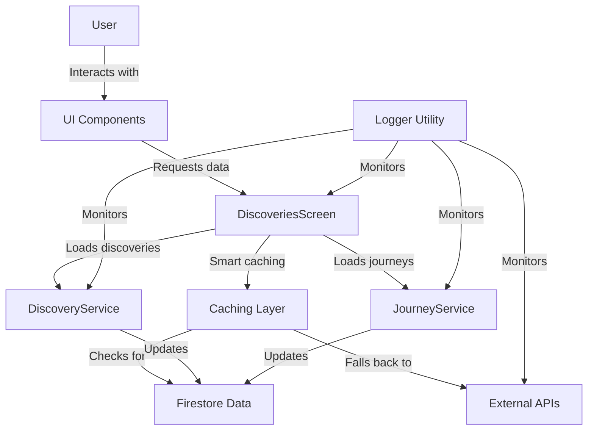

# Design Document: Performance Optimization

## Overview

The Performance Optimization feature is a technical enhancement that significantly improves the Hero's Path app's performance, responsiveness, and data consistency. This design document outlines the architectural approach, components, and implementation strategy for optimizing the app's performance through smart caching, API call reduction, real-time status updates, and data consistency improvements.

Rather than introducing new user-facing functionality, this feature enhances existing features by making them faster, more reliable, and more efficient. The primary focus is on reducing unnecessary API calls, implementing smart caching strategies, ensuring real-time status updates, and maintaining data consistency across the app.

## Architecture

The Performance Optimization feature will be implemented as enhancements to existing components rather than as new standalone components. The architecture follows these key principles:

1. **Minimize API Calls**: Only make API calls when absolutely necessary, such as for new journeys or explicit user refresh actions.
2. **Local-First Data Strategy**: Prioritize local Firestore data over external API calls whenever possible.
3. **Real-Time Status Updates**: Update journey completion status immediately when discoveries change.
4. **Data Consistency**: Maintain data integrity across all Firestore collections.
5. **Comprehensive Logging**: Implement detailed logging for performance monitoring and debugging.

### System Components Diagram



## Components and Interfaces

### 1. Smart Caching System

The smart caching system will be implemented in the DiscoveriesScreen component to reduce API calls by checking for existing data in Firestore before making external API requests.

#### Key Functions:

- `loadJourneyDiscoveries()`: Enhanced to check for existing discoveries in Firestore before making API calls.
- `onRefresh()`: Implemented to reload data from Firestore without making API calls.

#### Implementation Strategy:

```javascript
// Pseudocode for loadJourneyDiscoveries
async function loadJourneyDiscoveries(userId, journeyId) {
  // First, check if we have existing discoveries for this journey
  const existingDiscoveries = await DiscoveryService.getJourneyDiscoveries(userId, journeyId);
  
  if (existingDiscoveries.success && existingDiscoveries.discoveries.length > 0) {
    // We have existing discoveries, use them instead of making API calls
    Logger.performance('DISCOVERIES_SCREEN', 'Using cached discoveries', {
      journeyId,
      count: existingDiscoveries.discoveries.length
    });
    return processExistingDiscoveries(existingDiscoveries.discoveries);
  } else {
    // No existing discoveries, make API calls to get new ones
    Logger.performance('DISCOVERIES_SCREEN', 'Making API calls for new journey', { journeyId });
    return fetchDiscoveriesFromAPI(userId, journeyId);
  }
}
```

### 2. API Call Optimization

API call optimization will focus on reducing unnecessary API calls during user interactions with discoveries, such as saving, dismissing, and undoing actions.

#### Key Functions:

- `handleSave()`: Updated to avoid API calls when saving a place.
- `dismissPlace()`: Updated to avoid API calls when dismissing a place.
- `handleUndoDismiss()`: Updated to avoid API calls when undoing a dismiss action.
- `handleUndoSave()`: Updated to avoid API calls when undoing a save action.

#### Implementation Strategy:

```javascript
// Pseudocode for handleUndoDismiss
async function handleUndoDismiss(place) {
  try {
    // Update local state first for immediate UI feedback
    setSuggestions(prev => [...prev, place]);
    
    // Update Firestore directly without API calls
    await DiscoveryService.undismissPlace(userId, place.placeId);
    
    // Show success message
    Toast.show('Place restored!', {
      duration: Toast.durations.SHORT,
      position: Toast.positions.BOTTOM,
    });
  } catch (error) {
    Logger.error('DISCOVERIES_SCREEN', 'Error undoing dismiss', error);
    // Handle error and show message
  }
}
```

### 3. Real-Time Status Updates

Real-time status updates will ensure that journey completion status is updated immediately when discoveries change, without requiring additional database queries.

#### Key Functions:

- `updateJourneyCompletionStatus()`: Enhanced in DiscoveryService to update journey status in real-time.
- `updateJourneyStatus()`: New function in DiscoveryService to update journey status in Firestore.

#### Implementation Strategy:

```javascript
// Pseudocode for updateJourneyCompletionStatus
async function updateJourneyCompletionStatus(userId, journeyId) {
  try {
    // Get all discoveries for this journey
    const discoveriesResult = await getDiscoveriesByJourney(userId, journeyId);
    
    if (!discoveriesResult.success) {
      return { success: false, error: 'No discoveries found' };
    }
    
    const discoveries = discoveriesResult.discoveries;
    const totalDiscoveries = discoveries.length;
    
    if (totalDiscoveries === 0) {
      // No discoveries means journey is complete (nothing to review)
      await updateJourneyStatus(userId, journeyId, true, 0, 0);
      return { success: true, completed: true, reviewedCount: 0, totalCount: 0 };
    }
    
    // Count reviewed discoveries (saved or dismissed)
    const reviewedDiscoveries = discoveries.filter(discovery => 
      discovery.saved || discovery.dismissed
    );
    const reviewedCount = reviewedDiscoveries.length;
    const isCompleted = reviewedCount === totalDiscoveries;
    
    // Update journey status
    await updateJourneyStatus(userId, journeyId, isCompleted, reviewedCount, totalDiscoveries);
    
    return { 
      success: true, 
      completed: isCompleted, 
      reviewedCount, 
      totalCount: totalDiscoveries 
    };
  } catch (error) {
    Logger.error('DISCOVERY_SERVICE', 'Error updating journey completion status', error);
    throw error;
  }
}
```

### 4. Data Consistency Improvements

Data consistency improvements will ensure that all discovery data remains consistent across Firestore collections, preventing data discrepancies and loss.

#### Key Functions:

- `createDiscovery()`: Enhanced to ensure data consistency when creating a discovery.
- `dismissPlace()`: Enhanced to ensure data consistency when dismissing a place.
- `undismissPlace()`: Enhanced to ensure data consistency when undoing a dismiss action.
- `unsavePlace()`: Enhanced to ensure data consistency when unsaving a place.

#### Implementation Strategy:

```javascript
// Pseudocode for dismissPlace
async function dismissPlace(userId, placeId, dismissData = {}) {
  try {
    const dismissedRef = getUserDismissedRef(userId);
    const dismissedDoc = doc(dismissedRef, placeId);
    
    const dismissedPlace = {
      placeId,
      dismissedAt: serverTimestamp(),
      dismissedForever: dismissData.dismissedForever || false,
      reason: dismissData.reason || null,
      ...dismissData,
      
      // NEW: Migration framework support
      schemaVersion: 2.0,
      lastMigrationAt: null,
      migrationHistory: [],
      
      // NEW: Developer tools support
      devMode: false,
      mockData: false,
      
      // NEW: Performance optimization
      lastUpdated: serverTimestamp(),
      cacheKey: null,
      
      // NEW: Extension points for future features
      metadata: {},
      extensions: {}
    };

    await setDoc(dismissedDoc, dismissedPlace);
    
    // Also update the original discovery record to set dismissed: true
    try {
      const discoveriesRef = getUserDiscoveriesRef(userId);
      const discoveryQuery = query(discoveriesRef, where('placeId', '==', placeId));
      const discoverySnap = await getDocs(discoveryQuery);
      
      if (!discoverySnap.empty) {
        const discoveryDoc = discoverySnap.docs[0];
        await updateDoc(discoveryDoc.ref, { 
          dismissed: true,
          updatedAt: serverTimestamp()
        });
      }
    } catch (updateError) {
      Logger.warn('DISCOVERY_SERVICE', 'Failed to update discovery record after dismiss', { placeId, error: updateError.message });
    }
    
    // Update journey completion status if this dismissal affects a journey
    if (dismissData.journeyId) {
      try {
        await updateJourneyCompletionStatus(userId, dismissData.journeyId);
      } catch (statusError) {
        Logger.warn('DISCOVERY_SERVICE', 'Failed to update journey status after dismissing place', { journeyId: dismissData.journeyId, error: statusError.message });
      }
    }
    
    return { success: true };
  } catch (error) {
    Logger.error('DISCOVERY_SERVICE', 'Error dismissing place', error);
    throw error;
  }
}
```

### 5. Comprehensive Debug Logging

Comprehensive debug logging will be implemented using the Logger utility to monitor, troubleshoot, and optimize the app's performance.

#### Key Functions:

- `performance()`: New function in Logger to log performance-related information.
- `apiCall()`: New function in Logger to log API call information.
- `discoveryAction()`: New function in Logger to log discovery-related actions.

#### Implementation Strategy:

```javascript
// Pseudocode for Logger utility enhancements
const Logger = {
  // Existing functions...
  
  performance: (component, action, duration, metadata = {}) => {
    if (__DEV__ || DEBUG_MODE) {
      console.log(`[PERFORMANCE] ${component} - ${action}: ${duration}ms`, metadata);
    }
  },
  
  apiCall: (service, endpoint, params, result, duration) => {
    if (__DEV__ || DEBUG_MODE) {
      console.log(`[API] ${service} - ${endpoint}`, {
        params,
        result: result ? 'success' : 'failure',
        duration: `${duration}ms`
      });
    }
  },
  
  discoveryAction: (component, action, placeId, journeyId, metadata = {}) => {
    if (__DEV__ || DEBUG_MODE) {
      console.log(`[DISCOVERY] ${component} - ${action}`, {
        placeId,
        journeyId,
        ...metadata
      });
    }
  }
};
```

### 6. Pull-to-Refresh Functionality

Pull-to-refresh functionality will be implemented in the DiscoveriesScreen component to allow users to manually refresh their discoveries when needed.

#### Key Functions:

- `onRefresh()`: Implemented to handle pull-to-refresh actions.

#### Implementation Strategy:

```javascript
// Pseudocode for onRefresh
const onRefresh = React.useCallback(async () => {
  if (!selectedRoute || !user) {
    return;
  }
  
  setRefreshing(true);
  try {
    // Reload dismissed and saved places
    await loadDismissedAndSavedCallback();
    
    // Reload suggestions for current journey from Firestore only
    const journeyDiscoveries = await DiscoveryService.getJourneyDiscoveries(user.uid, selectedRoute.id);
    
    let allSuggestions = [];
    
    if (journeyDiscoveries.success && journeyDiscoveries.discoveries) {
      const unreviewed = journeyDiscoveries.discoveries.filter(
        discovery => !discovery.saved && !discovery.dismissed
      );
      
      const firestoreSuggestions = unreviewed.map(discovery => ({
        placeId: discovery.placeId,
        name: discovery.placeData?.name || discovery.placeName || 'Unknown Place',
        types: discovery.placeData?.types || [discovery.placeType || 'unknown'],
        rating: discovery.placeData?.rating,
        photos: discovery.placeData?.photos || [],
        formatted_address: discovery.placeData?.formatted_address,
        latitude: discovery.location?.lat,
        longitude: discovery.location?.lng,
        category: discovery.placeType || 'unknown',
        fromFirestore: true,
        discoveryId: discovery.id
      }));
      
      allSuggestions = firestoreSuggestions;
    }
    
    setSuggestions(allSuggestions);
    
    Toast.show('Refreshed discoveries', {
      duration: Toast.durations.SHORT,
      position: Toast.positions.BOTTOM,
    });
  } catch (error) {
    Logger.error('DISCOVERIES_SCREEN', 'Error refreshing discoveries', error);
    Toast.show('Failed to refresh', {
      duration: Toast.durations.SHORT,
      position: Toast.positions.BOTTOM,
    });
  } finally {
    setRefreshing(false);
  }
}, [selectedRoute, user, loadDismissedAndSavedCallback]);
```

## Data Models

The Performance Optimization feature will enhance existing data models rather than introducing new ones. The key data models involved are:

### Journey Model

```javascript
{
  id: String,                    // Unique identifier for the journey
  name: String,                  // User-friendly name for the journey
  route: Array,                  // Array of coordinates representing the route
  distance: Number,              // Distance of the journey in meters
  duration: Number,              // Duration of the journey in seconds
  startLocation: Object,         // Starting location of the journey
  endLocation: Object,           // Ending location of the journey
  createdAt: Timestamp,          // When the journey was created
  updatedAt: Timestamp,          // When the journey was last updated
  isCompleted: Boolean,          // Whether all discoveries have been reviewed
  reviewedDiscoveriesCount: Number, // Number of reviewed discoveries
  totalDiscoveriesCount: Number, // Total number of discoveries
  completionPercentage: Number,  // Percentage of reviewed discoveries
  lastStatusUpdate: Timestamp    // When the status was last updated
}
```

### Discovery Model

```javascript
{
  id: String,                    // Unique identifier for the discovery
  journeyId: String,             // ID of the associated journey
  placeId: String,               // Google Places API place ID
  placeName: String,             // Name of the place
  placeType: String,             // Type of the place
  location: {                    // Location of the place
    lat: Number,                 // Latitude
    lng: Number                  // Longitude
  },
  discoveredAt: Timestamp,       // When the place was discovered
  dismissed: Boolean,            // Whether the place has been dismissed
  saved: Boolean,                // Whether the place has been saved
  placeData: Object,             // Full place data from Google Places API
  createdAt: Timestamp,          // When the discovery was created
  updatedAt: Timestamp           // When the discovery was last updated
}
```

### Dismissed Place Model

```javascript
{
  placeId: String,               // Google Places API place ID
  dismissedAt: Timestamp,        // When the place was dismissed
  dismissedForever: Boolean,     // Whether the place is dismissed forever
  reason: String,                // Reason for dismissal
  journeyId: String,             // ID of the associated journey
  placeData: Object              // Place data for display in history
}
```

## Error Handling

The Performance Optimization feature will implement comprehensive error handling to ensure that the app remains stable and responsive even when errors occur.

### Error Handling Strategy:

1. **Graceful Degradation**: When an error occurs, the app will attempt to continue functioning with reduced capabilities rather than crashing.
2. **User Feedback**: Users will be informed of errors through toast messages or other UI elements.
3. **Error Logging**: All errors will be logged using the Logger utility for debugging and monitoring.
4. **Recovery Mechanisms**: The app will implement recovery mechanisms to handle common error scenarios.

### Common Error Scenarios:

1. **Network Errors**: When network requests fail, the app will retry with exponential backoff or fall back to cached data.
2. **Firestore Errors**: When Firestore operations fail, the app will attempt to use AsyncStorage as a fallback.
3. **Data Consistency Errors**: When data consistency issues are detected, the app will attempt to reconcile the data.
4. **API Rate Limiting**: When API rate limits are reached, the app will queue requests and retry later.

## Dependencies and Extensions

### Dependent Features
- [Theme & Map Style](../theme-map-style/design.md) - Uses performance optimization for theme loading and rendering
- [Enhanced Places Integration](../enhanced-places-integration/design.md) - Relies on caching and optimization strategies
- [Journey Completion](../journey-completion/design.md) - Benefits from performance optimization during completion processing
- [Custom Lists](../custom-lists/design.md) - Uses optimization for list data management

### Extension Points

#### Smart Caching
Intelligent data caching strategies for improved performance across all features.
- **Used by**: All data-dependent features
- **Implementation**: Multi-layer caching with intelligent invalidation and background updates
- **Features**: Predictive caching, memory optimization, offline capability, smart prefetching

#### Batch Operations  
Efficient bulk data processing for improved performance and reduced resource usage.
- **Used by**: [Enhanced Places Integration](../enhanced-places-integration/design.md), [Custom Lists](../custom-lists/design.md)
- **Implementation**: Batch processing algorithms with queue management and priority handling
- **Features**: Bulk API operations, transaction optimization, parallel processing, resource pooling

#### UI Rendering
Optimized UI rendering techniques for smooth user experience.
- **Used by**: [Theme & Map Style](../theme-map-style/design.md), [Journey Completion](../journey-completion/design.md)
- **Implementation**: Virtual scrolling, lazy loading, render optimization, animation performance
- **Features**: 60fps performance, memory-efficient rendering, progressive loading, smooth transitions

#### Developer Tools
Performance monitoring and analysis tools for development and optimization.
- **Used by**: All features requiring performance analysis
- **Implementation**: Performance profiling, metrics collection, bottleneck identification, optimization recommendations
- **Features**: Real-time monitoring, performance analytics, automated optimization, debugging tools

### Migration Considerations
- **Schema Version**: 2.0
- **Migration Requirements**: Performance data structure updates, caching system migration
- **Backward Compatibility**: Legacy performance data support with automatic migration

### Developer Tools Integration
- **Testing Support**: Performance testing utilities, load testing, optimization validation
- **Mock Data Support**: Performance scenario simulation, stress testing data
- **Simulation Capabilities**: Performance bottleneck simulation, resource constraint testing

### Performance Optimization
- **Caching Strategy**: Multi-layer intelligent caching with predictive algorithms
- **Optimization Hooks**: Background processing, memory management, resource optimization
- **Performance Considerations**: Real-time monitoring, automatic optimization, resource efficiency

## Testing Strategy

The Performance Optimization feature will be tested using a combination of unit tests, integration tests, and manual testing.

### Unit Tests:

1. **Smart Caching**: Test that the caching system correctly identifies existing discoveries and avoids unnecessary API calls.
2. **API Call Optimization**: Test that user interactions with discoveries do not trigger unnecessary API calls.
3. **Real-Time Status Updates**: Test that journey completion status is updated correctly when discoveries change.
4. **Data Consistency**: Test that data remains consistent across Firestore collections during various operations.

### Integration Tests:

1. **End-to-End Workflow**: Test the complete discovery workflow from journey creation to discovery review.
2. **Error Recovery**: Test that the app recovers gracefully from various error scenarios.
3. **Performance Metrics**: Test that the app meets performance targets for API call reduction and response time.

### Manual Testing:

1. **User Experience**: Test that the app remains responsive and provides appropriate feedback during operations.
2. **Edge Cases**: Test edge cases such as very large journeys, network interruptions, and concurrent operations.
3. **Performance Verification**: Verify that the app achieves the target 95% reduction in API calls.

## Performance Metrics

The Performance Optimization feature will be evaluated based on the following performance metrics:

1. **API Call Reduction**: Target of 95% reduction in API calls for existing journeys.
2. **Load Time**: Target of instant loading for cached journeys from Firestore.
3. **Status Update Time**: Target of immediate status updates with no additional database queries.
4. **Data Consistency**: Target of 100% reliable data across all operations.
5. **API Success Rate**: Target of 100% success rate for Google Places API calls.

These metrics will be tracked using the Logger utility and reported in the development status documentation.