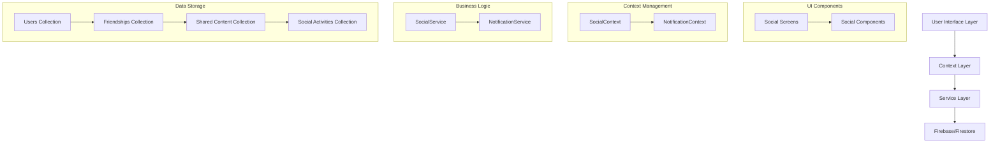

# Design Document: Social Sharing

## Overview

The Social Sharing feature transforms Hero's Path from a solo exploration app into a social experience by enabling users to connect with friends, share their journeys and discoveries, and engage in social interactions. This design document outlines the architecture, components, data models, and implementation strategy for integrating social features while maintaining the app's core exploration functionality and respecting user privacy.

The social features will be built as an enhancement layer on top of existing functionality, particularly leveraging the Custom Lists, Past Journeys, and Saved Places features. The implementation will focus on creating a seamless social experience that feels like a natural extension of the app rather than a bolted-on feature.

## Architecture

The Social Sharing feature will follow the existing app architecture patterns, with the following key components:

### High-Level Architecture



### Integration with Existing Features

The Social Sharing feature will integrate with several existing features:

1. **User Authentication** - Leverages existing user accounts for identity management
2. **Custom Lists** - Extends lists with sharing capabilities and collaborative editing
3. **Past Journeys** - Adds social sharing options to completed journeys
4. **Saved Places** - Enables sharing of discovered places with privacy controls
5. **Theme System** - Ensures consistent visual appearance across social features

## Components and Interfaces

### Screens

1. **SocialScreen.js** (Main social hub)
   - Primary entry point for social features
   - Displays friend activity feed
   - Provides navigation to other social features
   - Shows notifications and friend requests

2. **FriendsScreen.js** (Friend management)
   - Friend list with search functionality
   - Friend request management
   - Friend suggestion algorithm
   - Blocking and privacy controls

3. **FriendProfileScreen.js** (View friend profiles)
   - Friend's public journeys and discoveries
   - Shared lists and content
   - Interaction history
   - Friendship management options

4. **SocialFeedScreen.js** (Activity feed)
   - Chronological display of friend activities
   - Filtering and sorting options
   - Interaction capabilities (likes, comments)
   - Content preview with deep linking

5. **SocialSettingsScreen.js** (Privacy and preferences)
   - Privacy control dashboard
   - Notification preferences
   - Default sharing settings
   - Account visibility options

### Components

1. **FriendRequestCard.js**
   - Displays incoming/outgoing friend requests
   - Action buttons for accept/decline
   - User preview information

2. **SocialActivityCard.js**
   - Reusable component for activity items
   - Supports different content types (journeys, lists, discoveries)
   - Interaction buttons (like, comment, save)
   - Privacy indicator

3. **CommentSection.js**
   - Displays comments on shared content
   - Comment input with mention support
   - Threaded replies
   - Moderation controls

4. **PrivacySelector.js**
   - UI for selecting content privacy level
   - Visual indicators for different privacy settings
   - Explanation of privacy implications

5. **SocialNotification.js**
   - Displays social notifications
   - Supports different notification types
   - Action buttons relevant to notification type

### Services

1. **SocialService.js**
   - Core social functionality implementation
   - Friend relationship management
   - Content sharing and permissions
   - Activity tracking and feed generation

2. **NotificationService.js**
   - Social notification management
   - Push notification integration
   - Notification preferences and filtering
   - Notification grouping and prioritization

### Contexts

1. **SocialContext.js**
   - Manages social state throughout the app
   - Provides friend data and relationship status
   - Handles social activity updates
   - Manages shared content access

2. **NotificationContext.js** (Extension of existing or new)
   - Manages notification state
   - Provides notification counts and data
   - Handles notification interactions

## Data Models

### User (Extended)

```javascript
{
  uid: String,              // Firebase Auth UID
  username: String,         // Unique username for searching
  displayName: String,      // Public display name
  profilePicture: String,   // URL to profile image
  bio: String,              // Short user description
  privacySettings: {
    profileVisibility: String,     // 'public', 'friends', 'private'
    defaultSharingLevel: String,   // 'public', 'friends', 'private'
    locationPrecision: String,     // 'exact', 'neighborhood', 'city'
    activitySharing: Boolean,      // Whether to share activity in feed
    discoverySharing: Boolean      // Whether to share new discoveries
  },
  statistics: {
    placesDiscovered: Number,
    journeysCompleted: Number,
    listsCreated: Number,
    // Other statistics relevant to social features
  },
  notificationSettings: {
    friendRequests: Boolean,
    comments: Boolean,
    likes: Boolean,
    mentions: Boolean,
    friendActivity: Boolean
  }
}
```

### Friendship

```javascript
{
  id: String,               // Unique identifier
  users: [String, String],  // Array of two user IDs in the friendship
  status: String,           // 'pending', 'accepted', 'blocked'
  requestedBy: String,      // User ID who initiated the request
  requestedAt: Timestamp,   // When the request was sent
  acceptedAt: Timestamp,    // When the request was accepted (if applicable)
  lastInteractionAt: Timestamp // For sorting and relevance
}
```

### SharedContent

```javascript
{
  id: String,               // Unique identifier
  ownerId: String,          // User who owns the content
  contentType: String,      // 'journey', 'list', 'place', 'achievement'
  contentId: String,        // Reference to the original content
  privacyLevel: String,     // 'public', 'friends', 'private', 'custom'
  allowedUsers: [String],   // Array of user IDs with access (for 'custom')
  caption: String,          // User-provided description
  createdAt: Timestamp,     // When the content was shared
  updatedAt: Timestamp,     // When the sharing was last modified
  locationPrecision: String, // 'exact', 'neighborhood', 'city'
  interactions: {
    likes: Number,
    comments: Number,
    saves: Number
  }
}
```

### SocialActivity

```javascript
{
  id: String,               // Unique identifier
  userId: String,           // User who performed the activity
  activityType: String,     // 'share', 'like', 'comment', 'achievement', etc.
  targetType: String,       // 'journey', 'list', 'place', 'user', etc.
  targetId: String,         // ID of the target content
  createdAt: Timestamp,     // When the activity occurred
  metadata: {               // Additional activity-specific data
    // Varies based on activityType
  },
  visibility: String        // 'public', 'friends', 'private'
}
```

### Comment

```javascript
{
  id: String,               // Unique identifier
  contentId: String,        // ID of the shared content
  userId: String,           // User who made the comment
  text: String,             // Comment text
  createdAt: Timestamp,     // When the comment was created
  updatedAt: Timestamp,     // When the comment was last edited
  mentions: [String],       // Array of mentioned user IDs
  parentId: String,         // For threaded replies (null for top-level)
  isEdited: Boolean,        // Whether the comment has been edited
  reactions: {              // Reactions to the comment
    likes: Number,
    // Other reaction types
  }
}
```

### SocialChallenge

```javascript
{
  id: String,               // Unique identifier
  creatorId: String,        // User who created the challenge
  title: String,            // Challenge title
  description: String,      // Challenge description
  challengeType: String,    // 'discovery', 'journey', 'collection', etc.
  criteria: {               // Challenge completion criteria
    // Varies based on challengeType
  },
  startDate: Timestamp,     // When the challenge starts
  endDate: Timestamp,       // When the challenge ends
  participants: [{          // Users participating in the challenge
    userId: String,
    joinedAt: Timestamp,
    progress: Number,       // Progress percentage
    completed: Boolean,
    completedAt: Timestamp
  }],
  privacyLevel: String,     // 'public', 'friends', 'private', 'invite-only'
  status: String            // 'upcoming', 'active', 'completed'
}
```

## Error Handling

The Social Sharing feature will implement comprehensive error handling to ensure a smooth user experience:

1. **Network Connectivity Issues**
   - Offline mode for viewing previously loaded social content
   - Queue social interactions for sync when connectivity is restored
   - Clear visual indicators for pending/offline actions

2. **Permission Errors**
   - Graceful handling of content access restrictions
   - Clear messaging when content is no longer available
   - Automatic permission verification before actions

3. **Content Moderation**
   - Reporting mechanism for inappropriate content
   - Automatic content filtering for known problematic patterns
   - Temporary content hiding pending review

4. **Rate Limiting**
   - Prevent spam by implementing reasonable rate limits
   - Graceful degradation when limits are reached
   - Clear feedback when actions are rate-limited

5. **Data Consistency**
   - Optimistic UI updates with rollback on failure
   - Conflict resolution for collaborative editing
   - Version tracking for shared content

## Testing Strategy

### Unit Testing

1. **Service Layer Tests**
   - Test social relationship management functions
   - Verify privacy control enforcement
   - Test notification generation and delivery
   - Validate data transformations and formatting

2. **Component Tests**
   - Test UI components with mock data
   - Verify component state management
   - Test interaction handlers
   - Validate accessibility compliance

### Integration Testing

1. **Feature Integration Tests**
   - Test integration with existing features (Custom Lists, Journeys)
   - Verify context propagation across components
   - Test navigation flows between social features
   - Validate data consistency across screens

2. **Firebase Integration Tests**
   - Test Firestore rules for proper access control
   - Verify real-time updates and subscriptions
   - Test authentication integration with social features
   - Validate offline behavior and synchronization

### User Acceptance Testing

1. **Social Interaction Scenarios**
   - Friend request workflows
   - Content sharing and privacy settings
   - Social feed interactions
   - Notification management

2. **Performance Testing**
   - Load testing with large friend networks
   - Response time for feed generation
   - Notification delivery latency
   - Bandwidth usage optimization

3. **Privacy Compliance Testing**
   - Verify privacy settings are respected
   - Test data visibility across different relationship types
   - Validate content removal and access revocation
   - Test privacy setting changes and propagation

## Implementation Considerations

### Performance Optimization

1. **Feed Generation**
   - Implement pagination for activity feeds
   - Use server-side filtering for relevant content
   - Cache frequently accessed friend data
   - Implement incremental loading for comments and interactions

2. **Real-time Updates**
   - Use Firebase listeners efficiently with appropriate queries
   - Implement debouncing for rapid updates
   - Batch updates when possible to reduce re-renders

### Security

1. **Data Access Control**
   - Implement Firestore security rules for social data
   - Validate permissions on both client and server
   - Implement rate limiting for social actions
   - Sanitize user-generated content

2. **Privacy Protection**
   - Implement multiple layers of privacy controls
   - Provide clear visibility indicators for shared content
   - Implement proper data deletion for revoked content
   - Respect location precision preferences

### Scalability

1. **Data Structure**
   - Design collections for horizontal scaling
   - Implement efficient querying patterns
   - Use denormalization strategically for common access patterns
   - Consider sharding for users with large social networks

2. **Background Processing**
   - Move intensive operations to cloud functions
   - Implement queue-based processing for notifications
   - Use batched writes for activity updates

### Accessibility

1. **UI Considerations**
   - Ensure all social components meet WCAG standards
   - Implement proper focus management for interactive elements
   - Provide alternative text for social content
   - Support screen readers for notifications and activities

2. **Inclusive Design**
   - Support different network sizes and usage patterns
   - Provide options for reduced animation and data usage
   - Ensure color contrast for privacy indicators
   - Support keyboard navigation for all social interactions

## Phased Implementation Approach

The Social Sharing feature will be implemented in phases to allow for iterative development and testing:

### Phase 1: Core Social Framework
- Friend relationship management
- Basic profile viewing
- Privacy settings infrastructure
- Social data models and services

### Phase 2: Content Sharing
- Journey and list sharing capabilities
- Privacy controls for shared content
- Activity feed implementation
- Basic interactions (likes, saves)

### Phase 3: Enhanced Social Features
- Comments and rich interactions
- Notifications system
- Social recommendations
- Collaborative lists

### Phase 4: Advanced Social Features
- Social challenges and gamification
- Leaderboards and achievements
- Advanced privacy controls
- Analytics and social insights