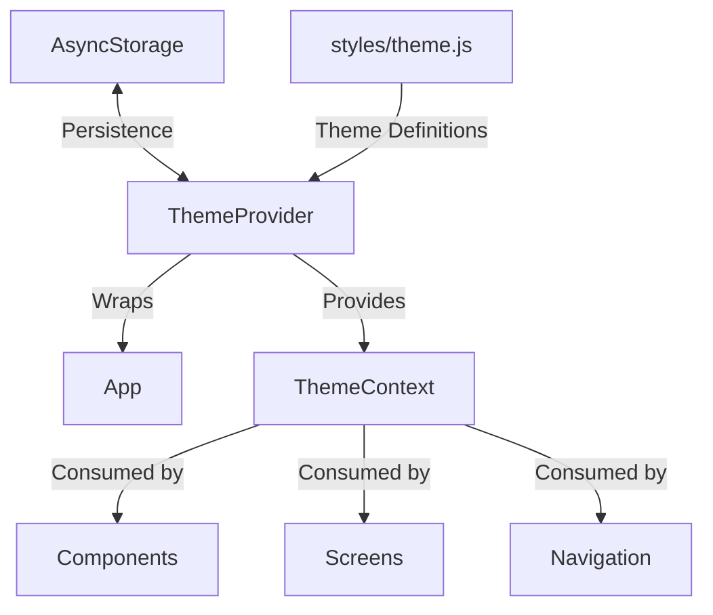
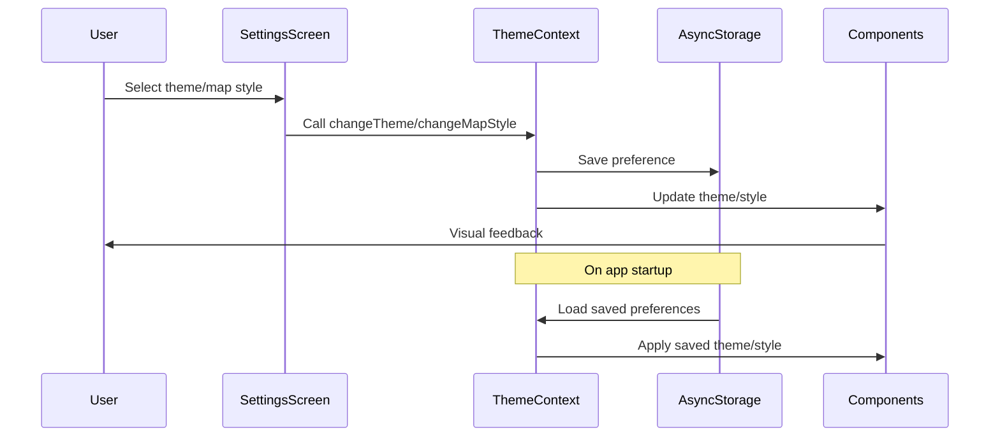

# Design Document: Theme & Map Style System

## Overview

The Theme & Map Style system provides a comprehensive theming solution for the Hero's Path app, enabling users to personalize their experience through multiple UI themes and map styles. This design document outlines the architecture, components, data models, and implementation strategy for this feature.

The system is built on React Context for centralized theme management, uses AsyncStorage for persistent user preferences, and integrates with React Navigation for consistent navigation styling. It provides three UI themes (Light, Dark, and Adventure) and five map styles (Standard, Satellite, Terrain, Night, and Adventure), each with complete color schemes and styling configurations.

## Architecture

### High-Level Architecture

The theming system follows a provider-consumer architecture pattern using React Context:



### Key Components

1. **ThemeProvider**: A React Context provider that wraps the entire application and manages theme state.
2. **ThemeContext**: The context object that holds theme state and functions.
3. **useTheme Hook**: A custom hook that provides access to the theme context.
4. **Theme Definitions**: Comprehensive color palettes and styling configurations for each theme.
5. **Map Style Configurations**: Custom styling arrays for Google Maps.
6. **Settings Interface**: UI components for theme and map style selection.
7. **Persistence Layer**: AsyncStorage integration for saving user preferences.

### Data Flow



## Components and Interfaces

### ThemeProvider Component

The `ThemeProvider` component is the core of the theming system. It:

1. Initializes theme state with default values
2. Loads saved preferences from AsyncStorage
3. Provides theme change functions
4. Handles theme loading states
5. Provides the theme context to the entire app

```javascript
// Simplified ThemeProvider structure
export const ThemeProvider = ({ children }) => {
  const [currentTheme, setCurrentTheme] = useState(DEFAULT_THEME);
  const [currentMapStyle, setCurrentMapStyle] = useState(DEFAULT_MAP_STYLE);
  const [isLoading, setIsLoading] = useState(true);

  // Load saved preferences
  useEffect(() => {
    loadSavedPreferences();
  }, []);

  // Theme change functions
  const changeTheme = async (themeType) => { /* implementation */ };
  const changeMapStyle = async (mapStyle) => { /* implementation */ };
  
  // Theme utility functions
  const getCurrentThemeColors = () => { /* implementation */ };
  const getCurrentMapStyleConfig = () => { /* implementation */ };
  const getNavigationTheme = () => { /* implementation */ };
  
  // Context value
  const value = {
    currentTheme,
    currentMapStyle,
    isLoading,
    changeTheme,
    changeMapStyle,
    getCurrentThemeColors,
    getCurrentMapStyleConfig,
    getNavigationTheme,
    // Additional properties and functions
  };

  return (
    <ThemeContext.Provider value={value}>
      {children}
    </ThemeContext.Provider>
  );
};
```

### useTheme Hook

The `useTheme` hook provides a convenient way to access the theme context:

```javascript
export const useTheme = () => {
  const context = useContext(ThemeContext);
  
  if (!context) {
    throw new Error('useTheme must be used within a ThemeProvider');
  }
  
  return context;
};
```

### Theme Selection Interface

The Settings screen provides a user-friendly interface for theme and map style selection:

1. Theme options displayed as buttons with icons and labels
2. Map style options with descriptions
3. Visual indicators for currently selected options
4. Reset to defaults functionality
5. Immediate visual feedback on selection

```javascript
// Simplified theme selection component
const ThemeSelector = () => {
  const { currentTheme, changeTheme, themeTypes } = useTheme();
  
  const themeOptions = [
    { type: themeTypes.LIGHT, name: 'Light', icon: 'light-mode' },
    { type: themeTypes.DARK, name: 'Dark', icon: 'dark-mode' },
    { type: themeTypes.ADVENTURE, name: 'Adventure', icon: 'explore' },
  ];
  
  return (
    <View style={styles.themeContainer}>
      {themeOptions.map((theme) => (
        <ThemeButton
          key={theme.type}
          theme={theme}
          isSelected={currentTheme === theme.type}
          onPress={() => changeTheme(theme.type)}
        />
      ))}
    </View>
  );
};
```

## Data Models

### Theme Types

```javascript
export const THEME_TYPES = {
  LIGHT: 'light',
  DARK: 'dark',
  ADVENTURE: 'adventure'
};
```

### Map Style Types

```javascript
export const MAP_STYLES = {
  STANDARD: 'standard',
  SATELLITE: 'satellite',
  TERRAIN: 'terrain',
  NIGHT: 'night',
  ADVENTURE: 'adventure'
};
```

### Theme Color Palette

Each theme includes a comprehensive color palette with at least 30 color variables:

```javascript
const lightTheme = {
  primary: '#007AFF',
  secondary: '#5856D6',
  background: '#FFFFFF',
  surface: '#F2F2F7',
  text: '#000000',
  textSecondary: '#8E8E93',
  
  // NEW: Migration framework support
  schemaVersion: 2.0,
  lastMigrationAt: null,
  migrationHistory: [],
  
  // NEW: Developer tools support
  devMode: false,
  mockData: false,
  
  // NEW: Performance optimization
  lastUpdated: new Date().toISOString(),
  cacheKey: null,
  
  // NEW: Extension points for future features
  metadata: {},
  extensions: {},
  
  // Additional color variables
};

const darkTheme = {
  primary: '#0A84FF',
  secondary: '#5E5CE6',
  background: '#000000',
  surface: '#1C1C1E',
  text: '#FFFFFF',
  textSecondary: '#8E8E93',
  
  // NEW: Migration framework support
  schemaVersion: 2.0,
  lastMigrationAt: null,
  migrationHistory: [],
  
  // NEW: Developer tools support
  devMode: false,
  mockData: false,
  
  // NEW: Performance optimization
  lastUpdated: new Date().toISOString(),
  cacheKey: null,
  
  // NEW: Extension points for future features
  metadata: {},
  extensions: {},
  
  // Additional color variables
};

const adventureTheme = {
  primary: '#4A90E2',
  accent: '#F6AF3C',
  background: '#FFF7EA',
  surface: '#F5E9D6',
  text: '#2C5530',
  textSecondary: '#739E82',
  
  // NEW: Migration framework support
  schemaVersion: 2.0,
  lastMigrationAt: null,
  migrationHistory: [],
  
  // NEW: Developer tools support
  devMode: false,
  mockData: false,
  
  // NEW: Performance optimization
  lastUpdated: new Date().toISOString(),
  cacheKey: null,
  
  // NEW: Extension points for future features
  metadata: {},
  extensions: {},
  
  // Additional color variables
};
```

### Map Style Configuration

Each map style includes configuration data and styling arrays:

```javascript
export const MAP_STYLE_CONFIGS = {
  [MAP_STYLES.STANDARD]: {
    name: 'Standard',
    description: 'Classic map view with roads and landmarks',
    icon: 'map',
    style: null, // Uses default map style
    // REMOVED: provider - expo-maps handles providers automatically
    
    // NEW: Migration framework support
    schemaVersion: 2.0,
    lastMigrationAt: null,
    migrationHistory: [],
    
    // NEW: Developer tools support
    devMode: false,
    mockData: false,
    
    // NEW: Performance optimization
    lastUpdated: new Date().toISOString(),
    cacheKey: null,
    
    // NEW: Extension points for future features
    metadata: {},
    extensions: {}
  },
  [MAP_STYLES.SATELLITE]: {
    name: 'Satellite',
    description: 'Aerial view with satellite imagery',
    icon: 'satellite',
    // REMOVED: provider - expo-maps uses platform-specific components
    style: [
      // Style array for expo-maps (AppleMaps/GoogleMaps)
    ],
    
    // NEW: Migration framework support
    schemaVersion: 2.0,
    lastMigrationAt: null,
    migrationHistory: [],
    
    // NEW: Developer tools support
    devMode: false,
    mockData: false,
    
    // NEW: Performance optimization
    lastUpdated: new Date().toISOString(),
    cacheKey: null,
    
    // NEW: Extension points for future features
    metadata: {},
    extensions: {}
  },
  // Additional map styles
};
```

### Storage Keys

```javascript
const THEME_STORAGE_KEY = '@user_ui_theme';
const MAP_STYLE_STORAGE_KEY = '@user_map_style';
```

## Error Handling

The theming system includes robust error handling to ensure a consistent user experience:

1. **Fallback Theme**: If the selected theme cannot be loaded, the system falls back to a default theme.
2. **Loading States**: The system handles loading states to prevent rendering with incomplete theme data.
3. **Error Logging**: Errors are logged using the Logger utility for debugging and tracking.
4. **Context Validation**: The useTheme hook validates that it's used within a ThemeProvider.
5. **Input Validation**: Theme and map style change functions validate inputs before applying changes.

```javascript
// Fallback theme example
export const getFallbackTheme = () => {
  const fallback = {
    ...lightTheme,
    // Ensure all properties are available
    secondaryText: lightTheme.textSecondary,
    onPrimary: '#FFFFFF',
    onSecondary: '#FFFFFF',
    onError: '#FFFFFF'
  };
  
  return fallback;
};

// Error handling in useTheme
export const useTheme = () => {
  const context = useContext(ThemeContext);
  
  if (!context) {
    Logger.error('THEME_CONTEXT', 'useTheme called outside ThemeProvider');
    throw new Error('useTheme must be used within a ThemeProvider');
  }
  
  return context;
};
```

## Testing Strategy

### Unit Tests

1. **Theme Context Tests**:
   - Test theme initialization with default values
   - Test theme loading from AsyncStorage
   - Test theme change functions
   - Test map style change functions
   - Test fallback theme functionality

2. **Theme Utility Tests**:
   - Test getCurrentThemeColors function
   - Test getCurrentMapStyleConfig function
   - Test getNavigationTheme function

3. **Component Tests**:
   - Test theme button components
   - Test map style selection components
   - Test theme reset functionality

### Integration Tests

1. **Theme Persistence**:
   - Test saving and loading theme preferences
   - Test theme persistence across app restarts

2. **Navigation Integration**:
   - Test navigation theme integration
   - Test consistent styling across navigation components

3. **Map Style Integration**:
   - Test map style application to Google Maps
   - Test map style consistency across platforms

### Manual Tests

1. **Visual Inspection**:
   - Verify all UI elements update correctly with theme changes
   - Verify map styles apply correctly
   - Verify consistent styling across all screens

2. **Cross-Platform Testing**:
   - Test on iOS devices
   - Test on Android devices
   - Verify consistent behavior across platforms

3. **Accessibility Testing**:
   - Test contrast ratios for all themes
   - Test touch target sizes for theme selection buttons
   - Test screen reader compatibility

## Platform-Specific Considerations

### iOS

1. **Map Component**: Use `AppleMaps` component from expo-maps (not react-native-maps with PROVIDER_GOOGLE)
2. **Native UI Elements**: Ensure iOS-specific UI elements (e.g., status bar) adapt to theme changes.
3. **Performance**: Monitor theme change performance on iOS devices.
4. **Map Styling**: Custom styles applied through expo-maps style arrays

### Android

1. **Map Component**: Use `GoogleMaps` component from expo-maps (not react-native-maps with provider prop)
2. **Map Styling**: Ensure Google Maps styling works correctly through expo-maps API
3. **Material Design**: Adapt theme colors to match Material Design guidelines where appropriate.
4. **Device Fragmentation**: Test on various Android devices to ensure consistent theming.

### ⚠️ Migration Considerations (Dec 2024)

**CRITICAL ISSUE RESOLVED**: The theme system was designed for react-native-maps but the app uses expo-maps.

**Key Differences**:
- **expo-maps**: Platform-specific components, no provider prop needed
- **react-native-maps**: Single MapView with provider configuration
- **Style Application**: expo-maps uses different style format than react-native-maps
- **Provider Logic**: expo-maps handles providers automatically, no manual configuration needed

**Updated Implementation**:
- Removed getCurrentMapProvider() logic (expo-maps handles providers)
- Updated MAP_STYLE_CONFIGS to work with expo-maps format
- Platform detection now determines AppleMaps vs GoogleMaps component usage

## Integration with Existing Features

### Map Navigation & GPS (tier-1-critical)

The theming system integrates with the Map Navigation feature by:
1. **UPDATED**: Applying map styles to expo-maps components (AppleMaps/GoogleMaps)
2. Theming route lines and markers through polylines/markers props
3. Ensuring consistent styling of map controls and overlays
4. **NEW**: Providing platform-specific theme configurations for expo-maps

### User Authentication (tier-1-critical)

The theming system integrates with User Authentication by:
1. Persisting theme preferences per user account
2. Applying themes to authentication screens
3. Ensuring consistent styling of user profile elements

### Journey Tracking (tier-1-critical)

The theming system integrates with Journey Tracking by:
1. Theming journey visualization elements
2. Applying consistent styling to journey cards and lists
3. Ensuring route lines and markers match the selected theme

## Performance Considerations

1. **Memoization**: Use React.memo and useMemo to prevent unnecessary re-renders.
2. **Lazy Loading**: Consider lazy loading theme assets for improved startup time.
3. **Render Optimization**: Optimize component rendering during theme changes.
4. **Storage Efficiency**: Minimize AsyncStorage operations for theme persistence.

## Security Considerations

1. **Input Validation**: Validate theme and map style inputs to prevent injection attacks.
2. **Error Handling**: Ensure errors don't expose sensitive information.
3. **Storage Security**: Use secure storage practices for user preferences.

## Accessibility Considerations

1. **Contrast Ratios**: Ensure all themes meet WCAG contrast guidelines.
2. **Touch Targets**: Ensure theme selection buttons meet minimum size requirements.
3. **Screen Reader Support**: Provide appropriate accessibility labels for theme options.
4. **Keyboard Navigation**: Support keyboard navigation for theme selection.

## Dependencies and Extensions

### Dependent Features
- [Gamification](../gamification/design.md) - Uses theme system for achievement displays and progress indicators
- [Enhanced Places Integration](../enhanced-places-integration/design.md) - Applies themes to place cards and detail views
- [Journey Completion](../journey-completion/design.md) - Uses themes for completion celebrations and visualizations
- [Custom Lists](../custom-lists/design.md) - Applies theme styling to list interfaces

### Extension Points

#### Dynamic Theme System
Support for runtime theme switching and advanced theme management capabilities.
- **Used by**: [Gamification](../gamification/design.md), [Journey Completion](../journey-completion/design.md)
- **Implementation**: Dynamic theme context management with real-time updates
- **Features**: System theme detection, time-based switching, accessibility themes

#### Custom Map Styles  
User-defined map appearance customization with advanced styling options.
- **Used by**: [Destination Routing](../destination-routing/design.md), [Enhanced Places Integration](../enhanced-places-integration/design.md)
- **Implementation**: Extensible map style framework with custom style editor
- **Features**: Style sharing, location-based themes, seasonal themes

#### Performance Optimization
Theme caching and optimization for smooth user experience.
- **Used by**: All features requiring theme integration
- **Implementation**: Intelligent caching strategies, optimized theme loading, render optimization
- **Features**: Theme preloading, style memoization, transition animations

#### Developer Tools
Theme testing and preview utilities for development and testing.
- **Used by**: [Performance Optimization](../performance-optimization/design.md)
- **Implementation**: Theme simulation tools, visual debugging, accessibility testing
- **Features**: Theme previews, contrast testing, accessibility validation

### Migration Considerations
- **Schema Version**: 2.0
- **Migration Requirements**: Theme data structure updates, new extension point support
- **Backward Compatibility**: Legacy theme support with automatic migration

### Developer Tools Integration
- **Testing Support**: Theme preview tools, accessibility validation
- **Mock Data Support**: Mock theme configurations for testing
- **Simulation Capabilities**: Theme switching simulation, performance testing

### Performance Optimization
- **Caching Strategy**: Theme definition caching, map style optimization
- **Optimization Hooks**: Theme loading optimization, render performance monitoring
- **Performance Considerations**: Memory usage optimization, battery impact minimization

## Future Enhancements

1. **System Theme Detection**: Automatically match device dark/light mode.
2. **Time-Based Themes**: Switch to dark mode at night.
3. **Custom Theme Creation**: Allow users to create and save custom themes.
4. **Theme Sharing**: Enable sharing themes between users.
5. **Accessibility Themes**: Add high-contrast themes for vision impairment.
6. **Seasonal Themes**: Special themes for holidays or seasons.
7. **Location-Based Themes**: Themes that match the current environment.
8. **Theme Animations**: Smooth transitions when switching themes.
9. **Font Theming**: Different typography options for themes.
10. **Dynamic Themes**: Themes that change based on activity or time.