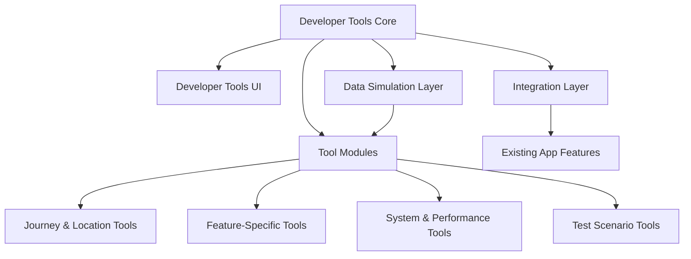
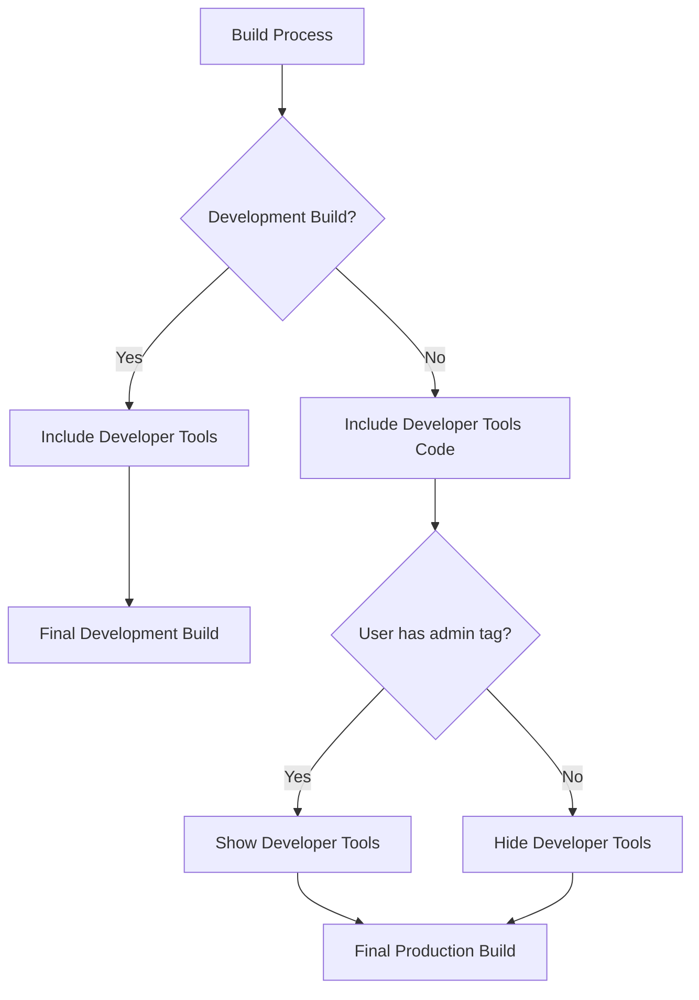

# Design Document: Developer Tools

## Overview

The Developer Tools feature provides a comprehensive suite of testing and debugging utilities for the Hero's Path application. These tools enable developers to efficiently test all app features without needing to physically complete the requirements of each feature. The tools are organized into priority tiers based on the criticality of the features they support, ensuring that the most important app functionality can be thoroughly tested.

This design document outlines the architecture, components, interfaces, and implementation details for the Developer Tools feature. The goal is to create a flexible, extensible system that can grow alongside the application while maintaining a clear separation between development and production code.

## Architecture

The Developer Tools feature will follow a modular architecture that allows for easy extension as new features are added to the application. The architecture consists of the following key components:

1. **Developer Tools Core**: Central management system that handles tool registration, activation, and deactivation
2. **Developer Tools UI**: User interface components for accessing and controlling the tools
3. **Tool Modules**: Individual tool implementations organized by feature area
4. **Data Simulation Layer**: Utilities for generating and managing synthetic data
5. **Integration Layer**: Connections between developer tools and existing app features

### High-Level Architecture Diagram



### Build Configuration and User Access Integration

The Developer Tools will be conditionally included based on build configuration and user permissions:



## Components and Interfaces

### 1. Developer Tools Core

The core module serves as the central management system for all developer tools.

#### Key Responsibilities:

- Tool registration and discovery
- Tool activation and deactivation
- Configuration management
- Access control
- Event logging

#### Interface:

```javascript
class DeveloperToolsCore {
  constructor(config) { ... }

  // Tool registration
  registerTool(tool) { ... }
  unregisterTool(toolId) { ... }
  getRegisteredTools() { ... }

  // Tool activation
  activateTool(toolId, config) { ... }
  deactivateTool(toolId) { ... }
  isToolActive(toolId) { ... }

  // Configuration
  saveConfiguration(name, config) { ... }
  loadConfiguration(name) { ... }
  exportConfiguration(name) { ... }
  importConfiguration(data) { ... }

  // Access control
  isEnabled() { ... }
  enable() { ... }
  disable() { ... }

  // Event logging
  logEvent(toolId, eventType, data) { ... }
  getEventLog(toolId) { ... }
}
```

### 2. Developer Tools UI

The UI components provide access to the developer tools through a dedicated interface.

#### Key Components:

- Developer Tools Menu
- Tool Categories
- Tool Configuration Panels
- Active Tool Indicators
- Test Scenario Manager

#### Interface:

```javascript
class DeveloperToolsUI {
  constructor(core) { ... }

  // UI management
  show() { ... }
  hide() { ... }
  isVisible() { ... }

  // Tool UI
  renderToolUI(toolId) { ... }
  updateToolStatus(toolId, status) { ... }

  // Navigation
  navigateToCategory(category) { ... }
  navigateToTool(toolId) { ... }

  // Activation methods
  registerActivationGesture(gesture) { ... }
  registerActivationButton() { ... }
}
```

### 3. Tool Modules

Individual tool implementations organized by feature area.

#### Base Tool Interface:

```javascript
class DeveloperTool {
  constructor(id, name, category, description) { ... }

  // Core methods
  getId() { ... }
  getName() { ... }
  getCategory() { ... }
  getDescription() { ... }

  // Lifecycle methods
  onActivate(config) { ... }
  onDeactivate() { ... }
  isActive() { ... }

  // UI methods
  renderConfigUI() { ... }
  renderActiveUI() { ... }

  // Configuration
  getDefaultConfig() { ... }
  validateConfig(config) { ... }

  // Events
  onAppStateChange(state) { ... }
}
```

#### 3.1 Journey and Location Tools

Tools for simulating user journeys and location data.

```javascript
class JourneySimulator extends DeveloperTool {
  constructor() {
    super('journey-simulator', 'Journey Simulator', 'location', 'Simulate user journeys');
  }

  // Journey simulation
  generateJourney(pattern, options) { ... }
  startSimulation(journey, speed) { ... }
  pauseSimulation() { ... }
  resumeSimulation() { ... }
  stopSimulation() { ... }

  // Journey patterns
  getStraightLineJourney(start, end, points) { ... }
  getLoopJourney(center, radius, points) { ... }
  getComplexJourney(waypoints, points) { ... }

  // Edge cases
  simulateGpsLoss(duration) { ... }
  simulateErraticMovement(duration, intensity) { ... }
}

class LocationSimulator extends DeveloperTool {
  constructor() {
    super('location-simulator', 'Location Simulator', 'location', 'Override device location');
  }

  // Location override
  setLocation(latitude, longitude, accuracy) { ... }
  followPath(path, speed) { ... }
  simulateAccuracyChange(accuracy) { ... }

  // Background simulation
  enableBackgroundSimulation() { ... }
  disableBackgroundSimulation() { ... }
}
```

#### 3.2 Feature-Specific Tools

Tools for testing specific app features.

```javascript
class SearchAlongRouteTester extends DeveloperTool { ... }
class DiscoveryInjector extends DeveloperTool { ... }
class PreferenceOverride extends DeveloperTool { ... }
class AuthenticationBypass extends DeveloperTool { ... }
class PingCreditManager extends DeveloperTool { ... }
class JourneyHistoryManipulator extends DeveloperTool { ... }
class CustomListGenerator extends DeveloperTool { ... }
class SocialInteractionSimulator extends DeveloperTool { ... }
class GamificationStateManager extends DeveloperTool { ... }
class RouteGenerator extends DeveloperTool { ... }
```

#### 3.3 System and Performance Tools

Tools for testing system-level functionality and performance.

```javascript
class DatabaseViewer extends DeveloperTool { ... }
class NetworkConditionSimulator extends DeveloperTool { ... }
class PerformanceAnalyzer extends DeveloperTool { ... }
class NotificationTester extends DeveloperTool { ... }
class CrossPlatformTester extends DeveloperTool { ... }
```

#### 3.4 Test Scenario Tools

Tools for managing test scenarios.

```javascript
class TestScenarioManager extends DeveloperTool {
  constructor() {
    super('test-scenario-manager', 'Test Scenarios', 'system', 'Manage test scenarios');
  }

  // Scenario management
  saveScenario(name, description, toolConfigs) { ... }
  loadScenario(name) { ... }
  deleteScenario(name) { ... }
  listScenarios() { ... }

  // Import/Export
  exportScenario(name) { ... }
  importScenario(data) { ... }

  // Execution
  runScenario(name) { ... }
  stopScenario() { ... }
}
```

### 4. Data Simulation Layer

Utilities for generating and managing synthetic data.

```javascript
class DataSimulator {
  // User data
  generateUserProfile(options) { ... }
  generateUserPreferences(options) { ... }

  // Journey data
  generateJourneyData(options) { ... }
  generateDiscoveryData(options) { ... }

  // Social data
  generateFriendConnections(count, options) { ... }
  generateSocialInteractions(options) { ... }

  // Gamification data
  generateExperiencePoints(min, max) { ... }
  generateAchievements(options) { ... }

  // Location data
  generateLocationPoint(bounds) { ... }
  generateLocationPath(start, end, points) { ... }
}
```

### 5. Integration Layer

Connections between developer tools and existing app features.

```javascript
class FeatureIntegration {
  constructor(featureId) { ... }

  // Integration methods
  injectData(data) { ... }
  overrideMethod(methodName, implementation) { ... }
  restoreMethod(methodName) { ... }

  // State management
  captureState() { ... }
  restoreState() { ... }

  // Event handling
  onFeatureEvent(callback) { ... }
}
```

## Data Models

### Tool Configuration

```javascript
{
  id: String,           // Unique identifier for the tool
  active: Boolean,      // Whether the tool is currently active
  config: Object,       // Tool-specific configuration
  lastActivated: Date,  // When the tool was last activated
  category: String,     // Tool category
  
  // NEW: Migration framework support
  schemaVersion: 2.0,   // Schema version for migration tracking
  lastMigrationAt: String, // Timestamp of last migration
  migrationHistory: Array, // Array of migration records
  
  // NEW: Developer tools support
  devMode: Boolean,     // Whether in developer mode
  mockData: Boolean,    // Whether using mock data
  
  // NEW: Performance optimization
  lastUpdated: String,  // Last update timestamp
  cacheKey: String,     // Cache key for optimization
  
  // NEW: Extension points for future features
  metadata: Object,     // Extensible metadata
  extensions: Object    // Extension points for future features
}
```

### Test Scenario

```javascript
{
  id: String,           // Unique identifier for the scenario
  name: String,         // Display name
  description: String,  // Description of the scenario
  created: Date,        // Creation timestamp
  modified: Date,       // Last modified timestamp
  tools: [              // Tools included in the scenario
    {
      id: String,       // Tool identifier
      config: Object    // Tool configuration
    }
  ],
  tags: [String],       // Categorization tags
  
  // NEW: Migration framework support
  schemaVersion: 2.0,   // Schema version for migration tracking
  lastMigrationAt: String, // Timestamp of last migration
  migrationHistory: Array, // Array of migration records
  
  // NEW: Developer tools support
  devMode: Boolean,     // Whether in developer mode
  mockData: Boolean,    // Whether using mock data
  
  // NEW: Performance optimization
  lastUpdated: String,  // Last update timestamp
  cacheKey: String,     // Cache key for optimization
  
  // NEW: Extension points for future features
  metadata: Object,     // Extensible metadata
  extensions: Object    // Extension points for future features
}
```

### Simulated Journey

```javascript
{
  id: String,           // Unique identifier
  name: String,         // Display name
  pattern: String,      // Journey pattern type
  points: [             // Array of location points
    {
      latitude: Number,
      longitude: Number,
      timestamp: Number,
      accuracy: Number
    }
  ],
  options: {
    speed: Number,      // Simulation speed multiplier
    gpsLoss: [          // GPS loss segments
      {
        startIndex: Number,
        endIndex: Number
      }
    ],
    erraticMovement: [  // Erratic movement segments
      {
        startIndex: Number,
        endIndex: Number,
        intensity: Number
      }
    ]
  },
  
  // NEW: Migration framework support
  schemaVersion: 2.0,   // Schema version for migration tracking
  lastMigrationAt: String, // Timestamp of last migration
  migrationHistory: Array, // Array of migration records
  
  // NEW: Developer tools support
  devMode: Boolean,     // Whether in developer mode
  mockData: Boolean,    // Whether using mock data
  
  // NEW: Performance optimization
  lastUpdated: String,  // Last update timestamp
  cacheKey: String,     // Cache key for optimization
  
  // NEW: Extension points for future features
  metadata: Object,     // Extensible metadata
  extensions: Object    // Extension points for future features
}
```

## Error Handling

The Developer Tools feature will implement comprehensive error handling to prevent tool failures from affecting the main application:

1. **Isolation**: Each tool will run in an isolated context to prevent errors from propagating
2. **Graceful Degradation**: If a tool fails, other tools will continue to function
3. **Error Reporting**: Detailed error information will be logged for debugging
4. **Recovery**: Tools will have reset functionality to recover from error states
5. **Validation**: Input validation will prevent invalid configurations

### Error Types

```javascript
class ToolActivationError extends Error { ... }
class ToolConfigurationError extends Error { ... }
class SimulationError extends Error { ... }
class IntegrationError extends Error { ... }
```

## Testing Strategy

The Developer Tools feature will be tested using the following approaches:

1. **Unit Tests**: Individual tool functionality
2. **Integration Tests**: Interaction between tools and app features
3. **UI Tests**: Developer Tools interface functionality
4. **Cross-Platform Tests**: Verify functionality on both iOS and Android
5. **Performance Tests**: Ensure minimal impact on app performance

### Test Cases

1. Tool registration and discovery
2. Tool activation and deactivation
3. Configuration saving and loading
4. UI rendering and interaction
5. Journey and location simulation
6. Feature-specific tool functionality
7. System and performance tool accuracy
8. Test scenario management
9. Error handling and recovery
10. Production build verification (tools should be excluded)

## Security Considerations

1. **Access Control**: Developer tools will only be available in development builds
2. **Data Isolation**: Simulated data will be clearly marked to prevent confusion
3. **Authentication**: Sensitive tools may require additional authentication
4. **Firestore Rules**: Database tools will respect existing security rules
5. **API Limits**: Tools will respect API rate limits to prevent abuse

## Implementation Plan

The Developer Tools feature will be implemented in phases, prioritizing tools based on the criticality of the features they support:

### Phase 1: Core Infrastructure

- Developer Tools Core
- Developer Tools UI (basic)
- Tool registration system
- Build configuration integration

### Phase 2: Tier 1 Tools

- Journey Simulator
- Location Simulator
- Search Along Route Tester
- Authentication Bypass

### Phase 3: Tier 2 Tools

- Ping Credit Manager
- Discovery Injector
- Preference Override
- Journey History Manipulator

### Phase 4: Tier 3 Tools

- Theme & Style Tester
- Performance Analyzer
- Custom List Generator
- Social Interaction Simulator
- Gamification State Manager
- Route Generator

### Phase 5: Tier 4 Tools

- Database Viewer/Editor
- Network Condition Simulator
- Notification Tester
- Cross-Platform Tester

### Phase 6: Advanced Features

- Test Scenario Manager
- Enhanced UI
- Documentation and examples

## Dependencies and Extensions

### Dependent Features
This is the final tier feature - no features depend on Developer Tools (Enhanced) as all foundational features are complete.

### Extension Points

#### Cross-Platform Testing
Platform-specific testing utilities and automation for comprehensive app validation.
- **Used by**: Final implementation - provides comprehensive testing across all platforms and devices
- **Implementation**: Platform-specific testing frameworks, automated testing pipelines, device simulation
- **Features**: iOS/Android specific testing, device capability testing, platform compatibility validation

#### Network Simulation
Network condition simulation and testing tools for robust app development.
- **Used by**: Final implementation - provides comprehensive network testing capabilities
- **Implementation**: Network condition simulation, connectivity testing, offline scenario testing
- **Features**: Network speed simulation, connectivity loss testing, API failure simulation

#### Performance Analytics
Comprehensive performance monitoring and analysis for optimization.
- **Used by**: Final implementation - provides complete performance monitoring across all app features
- **Implementation**: Real-time performance monitoring, bottleneck detection, optimization recommendations
- **Features**: Memory usage tracking, CPU monitoring, battery usage analysis, performance reporting

#### Advanced Testing
Complex scenario testing and edge case validation for comprehensive quality assurance.
- **Used by**: Final implementation - provides advanced testing capabilities for complex scenarios
- **Implementation**: Automated testing scenarios, edge case simulation, stress testing, regression testing
- **Features**: Multi-user testing, complex journey simulation, integration testing, load testing

### Migration Considerations
- **Schema Version**: 2.0
- **Migration Requirements**: Developer tools configuration updates, test scenario migration, tool compatibility updates
- **Backward Compatibility**: Legacy developer tools support with automatic migration to new framework

### Developer Tools Integration
- **Testing Support**: Advanced testing framework with comprehensive automation
- **Mock Data Support**: Enhanced mock data generation for all app features
- **Simulation Capabilities**: Complete app scenario simulation with realistic data and conditions

### Performance Optimization
- **Caching Strategy**: Developer tools data caching, test scenario optimization, tool performance monitoring
- **Optimization Hooks**: Developer tools performance optimization, testing efficiency improvements
- **Performance Considerations**: Minimal impact on app performance, efficient testing execution, resource usage optimization
