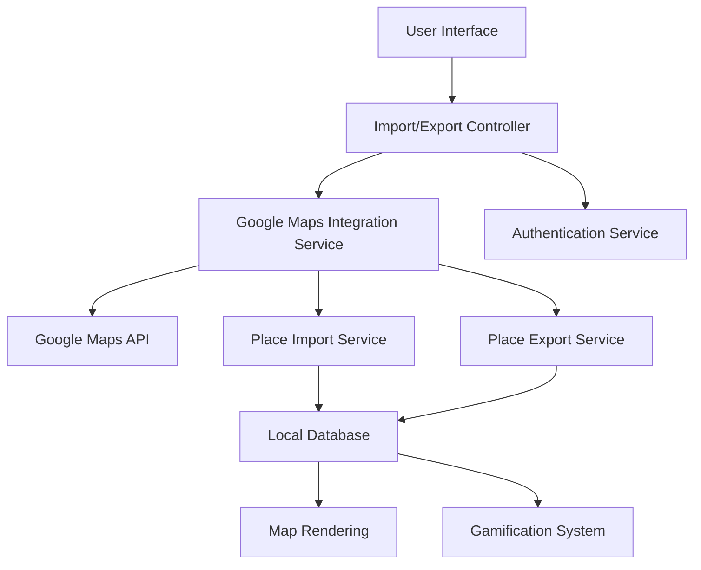
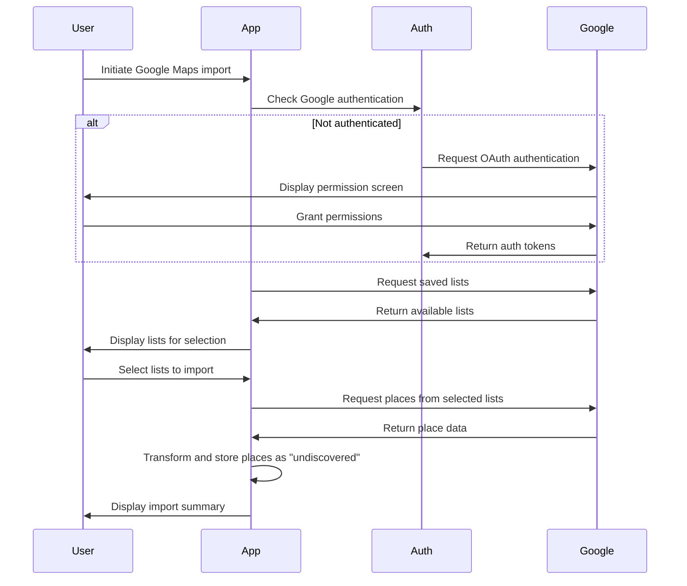
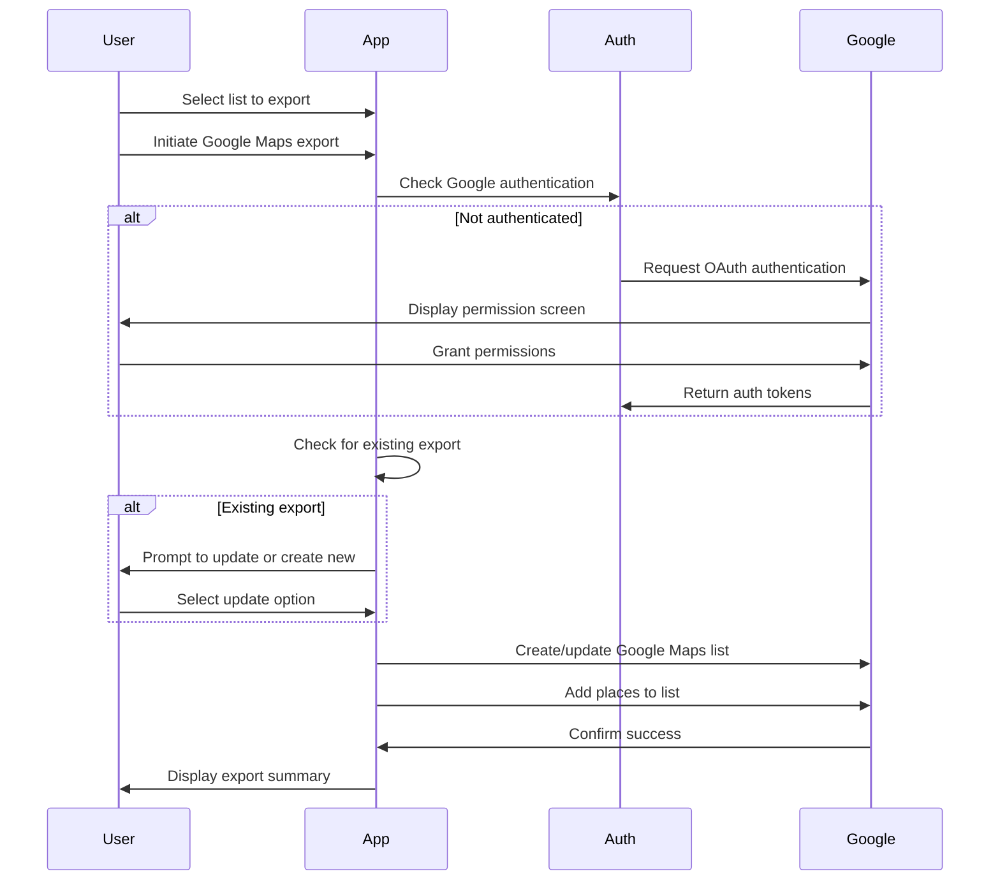

# Design Document: Google Maps Import/Export

## Overview

The Google Maps Import/Export feature enables bidirectional data transfer between Hero's Path and Google Maps. This design document outlines the architecture, components, data models, and implementation strategies for this integration. The feature will allow users to export their custom lists to Google Maps and import Google Maps saved places as "undiscovered" locations in Hero's Path, maintaining the integrity of the app's exploration-based gameplay.

## Architecture

The feature will follow a service-oriented architecture pattern, with dedicated services handling Google Maps API integration, authentication, data transformation, and synchronization. These services will integrate with the existing app architecture while maintaining separation of concerns.

### High-Level Architecture



### Integration Points

1. **Custom Lists Feature**: Integration with existing custom lists functionality for export source data
2. **Map Screen**: Display of imported places with distinct styling
3. **User Authentication**: Extension of auth system to include Google OAuth
4. **Place Data Model**: Extension to support "undiscovered" imported places
5. **Gamification System**: Rules to maintain gameplay integrity with imported places

## Components and Interfaces

### 1. Google Maps Integration Service

Primary service responsible for coordinating communication with Google Maps API.

```javascript
// GoogleMapsIntegrationService.js
class GoogleMapsIntegrationService {
  constructor() {
    this.authService = new GoogleAuthService();
    this.importService = new PlaceImportService();
    this.exportService = new PlaceExportService();
  }

  async authenticateWithGoogle() { /* ... */ }
  async fetchGoogleMapsLists() { /* ... */ }
  async fetchPlacesFromList(listId) { /* ... */ }
  async createGoogleMapsList(name, description) { /* ... */ }
  async addPlacesToGoogleList(listId, places) { /* ... */ }
}
```

### 2. Authentication Service

Handles OAuth 2.0 authentication with Google and token management.

```javascript
// GoogleAuthService.js
class GoogleAuthService {
  constructor() {
    this.authConfig = {
      clientId: CONFIG.GOOGLE_CLIENT_ID,
      scopes: ['https://www.googleapis.com/auth/maps.saved-places']
    };
  }

  async signIn() { /* ... */ }
  async signOut() { /* ... */ }
  async refreshToken() { /* ... */ }
  isAuthenticated() { /* ... */ }
  getAccessToken() { /* ... */ }
}
```

### 3. Place Import Service

Manages the import of places from Google Maps to Hero's Path.

```javascript
// PlaceImportService.js
class PlaceImportService {
  constructor(db, googleMapsService) {
    this.db = db;
    this.googleMapsService = googleMapsService;
  }

  async importList(googleListId, importName) { /* ... */ }
  async transformGooglePlaceToAppPlace(googlePlace) { /* ... */ }
  async saveImportedPlaces(places, importId) { /* ... */ }
  async getImportHistory() { /* ... */ }
  async deleteImport(importId) { /* ... */ }
}
```

### 4. Place Export Service

Manages the export of places from Hero's Path to Google Maps.

```javascript
// PlaceExportService.js
class PlaceExportService {
  constructor(db, googleMapsService) {
    this.db = db;
    this.googleMapsService = googleMapsService;
  }

  async exportList(appListId) { /* ... */ }
  async transformAppPlaceToGooglePlace(appPlace) { /* ... */ }
  async checkForExistingExport(listId) { /* ... */ }
  async updateExistingExport(exportId, places) { /* ... */ }
}
```

### 5. Import/Export UI Components

User interface components for managing imports and exports.

```javascript
// ImportExportScreen.js
// Main screen for import/export operations

// ImportedPlacesToggle.js
// Component for toggling visibility of imported places

// ImportHistoryList.js
// Component for displaying and managing past imports

// ExportListSelector.js
// Component for selecting lists to export
```

## Data Models

### 1. Imported Place

Extension of the existing Place model to support imported places.

```javascript
{
  id: String,                // Unique identifier
  name: String,              // Place name
  location: {                // Geographic coordinates
    latitude: Number,
    longitude: Number
  },
  googlePlaceId: String,     // Google Maps place ID
  importId: String,          // Reference to the import batch
  importSource: String,      // "google_maps"
  importDate: Timestamp,     // When the place was imported
  discoveryStatus: String,   // "undiscovered" or "discovered"
  discoveryDate: Timestamp,  // When the place was discovered (if applicable)
  category: String,          // Place category
  address: String,           // Formatted address
  metadata: Object           // Additional data from Google Maps
}
```

### 2. Import Record

Tracks batches of imported places.

```javascript
{
  id: String,                // Unique identifier
  name: String,              // User-provided name for this import
  source: String,            // "google_maps"
  sourceListId: String,      // ID of the source list in Google Maps
  sourceListName: String,    // Name of the source list in Google Maps
  importDate: Timestamp,     // When the import occurred
  userId: String,            // User who performed the import
  placeCount: Number,        // Number of places in this import
  visible: Boolean           // Whether places from this import are visible on the map
}
```

### 3. Export Record

Tracks exports to Google Maps.

```javascript
{
  id: String,                // Unique identifier
  appListId: String,         // ID of the Hero's Path list that was exported
  googleListId: String,      // ID of the created Google Maps list
  exportDate: Timestamp,     // When the export occurred
  userId: String,            // User who performed the export
  placeCount: Number,        // Number of places exported
  lastSyncDate: Timestamp    // When the export was last updated
}
```

## Error Handling

### Authentication Errors

1. **Invalid Credentials**: Prompt user to re-authenticate
2. **Expired Tokens**: Implement automatic token refresh
3. **Permission Denied**: Clear error messages explaining required permissions

### API Errors

1. **Rate Limiting**: Implement exponential backoff and retry logic
2. **Service Unavailable**: Queue operations for retry when service is available
3. **Invalid Data**: Validation and sanitization of data before API calls

### Data Synchronization Errors

1. **Conflict Resolution**: Strategy for handling conflicting place data
2. **Partial Success**: Handling cases where only some places were imported/exported
3. **Duplicate Detection**: Preventing duplicate places during import/export

## Testing Strategy

### Unit Tests

1. **Service Methods**: Test individual service methods with mock API responses
2. **Data Transformations**: Verify correct transformation between Google and app data models
3. **Error Handling**: Test error cases and recovery mechanisms

### Integration Tests

1. **Authentication Flow**: Test complete OAuth flow with Google
2. **Import Process**: Test end-to-end import process with mock Google API
3. **Export Process**: Test end-to-end export process with mock Google API

### UI Tests

1. **Import/Export Screens**: Test user flows for importing and exporting
2. **Visibility Controls**: Test toggling visibility of imported places
3. **Import Management**: Test viewing and deleting past imports

### Manual Testing

1. **Real Google Account**: Test with actual Google accounts and real data
2. **Performance Testing**: Test with large datasets to ensure performance
3. **Network Conditions**: Test under various network conditions

## Security Considerations

1. **OAuth Best Practices**: Follow OAuth 2.0 best practices for authentication
2. **Token Storage**: Secure storage of authentication tokens
3. **Minimal Permissions**: Request only necessary Google API permissions
4. **Data Privacy**: Clear user communication about data usage
5. **Secure API Communication**: HTTPS for all API calls

## User Experience Flow

### Import Flow



### Export Flow



## Implementation Considerations

### Google Maps API Limitations

1. **Rate Limits**: Implement rate limiting and queuing to stay within API quotas
2. **Place Field Limitations**: Handle differences in available place data fields
3. **List Size Limitations**: Handle pagination for large lists

### Performance Optimization

1. **Batch Processing**: Process places in batches to optimize performance
2. **Background Processing**: Handle long-running operations in background tasks
3. **Caching**: Cache Google Maps data to reduce API calls

### Offline Support

1. **Queue Operations**: Queue import/export operations when offline
2. **Sync on Reconnect**: Automatically sync when connection is restored
3. **Partial Progress**: Save partial progress for large operations

### Visual Design

1. **Imported Place Markers**: Distinct visual style for imported place markers
2. **Status Indicators**: Clear visual indicators of discovery status
3. **Import Controls**: Intuitive UI for managing imports and visibility

## Dependencies

1. **Google Maps API**: For accessing Google Maps place data
2. **Google Sign-In**: For OAuth authentication
3. **Custom Lists Feature**: For selecting lists to export
4. **Map Rendering System**: For displaying imported places
5. **Local Database**: For storing imported place data
6. **Gamification System**: For integrating with discovery mechanics